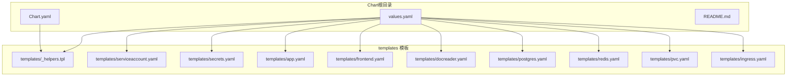
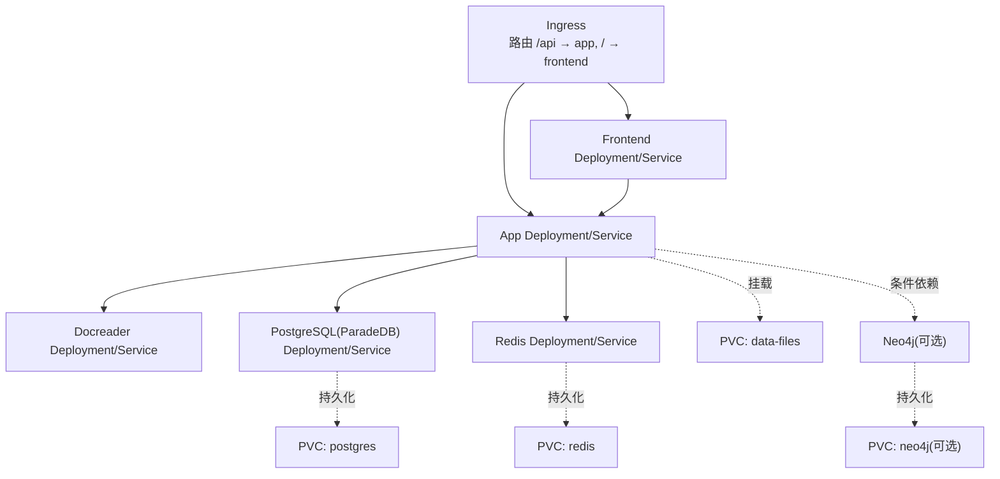
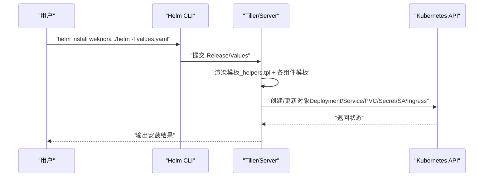
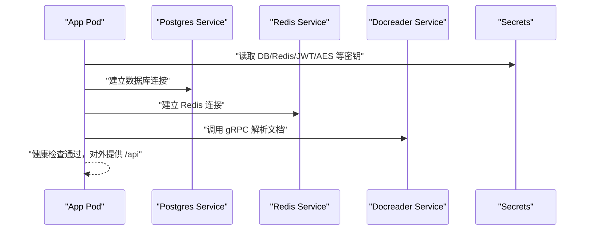
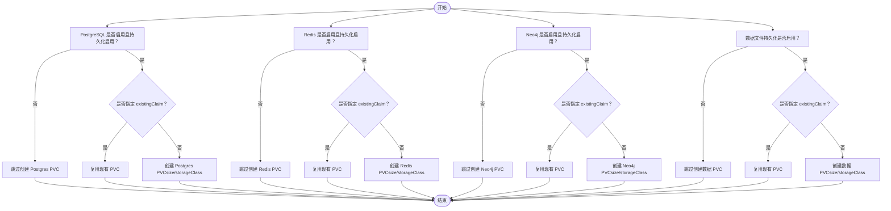
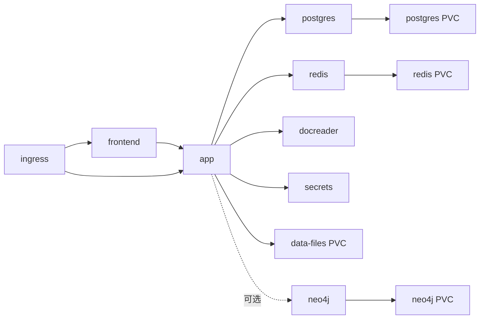

# Helm Chart配置

<cite>
**本文引用的文件**
- [Chart.yaml](file://helm/Chart.yaml)
- [values.yaml](file://helm/values.yaml)
- [_helpers.tpl](file://helm/templates/_helpers.tpl)
- [app.yaml](file://helm/templates/app.yaml)
- [frontend.yaml](file://helm/templates/frontend.yaml)
- [docreader.yaml](file://helm/templates/docreader.yaml)
- [postgres.yaml](file://helm/templates/postgres.yaml)
- [redis.yaml](file://helm/templates/redis.yaml)
- [ingress.yaml](file://helm/templates/ingress.yaml)
- [pvc.yaml](file://helm/templates/pvc.yaml)
- [secrets.yaml](file://helm/templates/secrets.yaml)
- [serviceaccount.yaml](file://helm/templates/serviceaccount.yaml)
- [README.md](file://helm/README.md)
</cite>

## 目录
1. [简介](#简介)
2. [项目结构](#项目结构)
3. [核心组件](#核心组件)
4. [架构总览](#架构总览)
5. [详细组件分析](#详细组件分析)
6. [依赖关系分析](#依赖关系分析)
7. [性能考量](#性能考量)
8. [故障排查指南](#故障排查指南)
9. [结论](#结论)
10. [附录](#附录)

## 简介
本文件系统性解析 WeKnora 的 Helm Chart 配置与模板渲染机制，覆盖 Chart.yaml 元数据、values.yaml 参数、模板条件渲染、组件交互与部署场景，并提供验证与调试方法，帮助在开发、测试与生产环境中正确安装与运维。

## 项目结构
Helm Chart 位于 helm 目录，采用“按组件拆分模板”的结构：每个核心服务（后端、前端、文档解析器、数据库、缓存、Ingress、PVC、Secrets、ServiceAccount）均独立模板文件；通过 _helpers.tpl 提供命名、标签、镜像与安全上下文等可复用逻辑。

图表来源
- [Chart.yaml](file://helm/Chart.yaml)
- [values.yaml](file://helm/values.yaml)
- [_helpers.tpl](file://helm/templates/_helpers.tpl)
- [app.yaml](file://helm/templates/app.yaml)
- [frontend.yaml](file://helm/templates/frontend.yaml)
- [docreader.yaml](file://helm/templates/docreader.yaml)
- [postgres.yaml](file://helm/templates/postgres.yaml)
- [redis.yaml](file://helm/templates/redis.yaml)
- [pvc.yaml](file://helm/templates/pvc.yaml)
- [ingress.yaml](file://helm/templates/ingress.yaml)
- [secrets.yaml](file://helm/templates/secrets.yaml)
- [serviceaccount.yaml](file://helm/templates/serviceaccount.yaml)

章节来源
- [Chart.yaml](file://helm/Chart.yaml)
- [values.yaml](file://helm/values.yaml)
- [README.md](file://helm/README.md)

## 核心组件
- 全局配置（global）：统一存储类、镜像拉取密钥、默认 Pod/容器安全上下文。
- 服务账号（serviceAccount）：创建或复用 ServiceAccount，并支持注解与标签。
- 应用（app）：后端 API 服务器，含副本数、镜像、资源、探针、节点选择与亲和性、环境变量与额外环境变量。
- 前端（frontend）：Web UI，含镜像、资源、探针与卷挂载。
- 文档解析器（docreader）：gRPC 服务，负责文档解析。
- 数据库（postgresql）：ParadeDB，提供向量与 BM25 检索能力。
- 缓存（redis）：用于流与任务队列。
- 存储（dataFiles）：上传文件持久化。
- Ingress：外部访问入口，路由 /api 到后端、/ 到前端。
- Secrets：数据库、Redis、JWT、租户与系统加密密钥，支持现有 Secret 复用。
- 可选组件：MinIO（对象存储）、Neo4j（知识图谱）、Qdrant（向量库）、Jaeger（分布式追踪）。

章节来源
- [values.yaml](file://helm/values.yaml)

## 架构总览
下图展示各组件在集群内的部署关系与依赖：

图表来源
- [ingress.yaml](file://helm/templates/ingress.yaml)
- [frontend.yaml](file://helm/templates/frontend.yaml)
- [app.yaml](file://helm/templates/app.yaml)
- [docreader.yaml](file://helm/templates/docreader.yaml)
- [postgres.yaml](file://helm/templates/postgres.yaml)
- [redis.yaml](file://helm/templates/redis.yaml)
- [pvc.yaml](file://helm/templates/pvc.yaml)

## 详细组件分析

### Chart.yaml 元数据与版本管理
- 类型与版本：应用类型为 application，Chart 版本与应用版本分别定义，便于区分 Chart 发布与应用版本。
- 兼容性：声明最低 Kubernetes 版本要求。
- 资源与关键字：包含主页、图标、源码地址与关键词，便于包仓库展示与检索。
- 注解：标注许可证信息。

章节来源
- [Chart.yaml](file://helm/Chart.yaml)

### values.yaml 参数详解
- 全局（global）
  - storageClass：PVC 默认存储类；传入“-”时显式清空 storageClassName。
  - imagePullSecrets：全局镜像拉取凭据。
  - podSecurityContext/containerSecurityContext：默认安全上下文合并策略。
- 服务账号（serviceAccount）
  - 控制是否创建、名称、注解、标签与自动挂载令牌。
- 应用（app）
  - 启用开关、副本数、镜像仓库/标签/拉取策略。
  - 资源请求/限制、Pod/容器安全上下文。
  - 环境变量（GIN_MODE、RETRIEVE_DRIVER、STORAGE_TYPE、LOCAL_STORAGE_BASE_DIR、STREAM_MANAGER_TYPE、CONCURRENCY_POOL_SIZE、ENABLE_GRAPH_RAG、TZ 等）。
  - 额外环境变量列表（extraEnv）。
  - 服务类型与端口、存活/就绪探针。
  - 节点选择、容忍度、亲和性。
- 前端（frontend）
  - 启用开关、副本数、镜像与拉取策略。
  - 资源请求/限制、容器安全上下文。
  - 服务类型与端口。
  - 节点选择、容忍度、亲和性。
- 文档解析器（docreader）
  - 启用开关、副本数、镜像与拉取策略。
  - 资源请求/限制、容器安全上下文。
  - 环境变量（STORAGE_TYPE）。
  - 服务类型与端口。
  - 节点选择、容忍度、亲和性。
- PostgreSQL（postgresql）
  - 启用开关、镜像仓库/标签。
  - 资源请求/限制、容器安全上下文。
  - 持久化（启用、大小、复用现有 PVC）。
  - 节点选择、容忍度、亲和性。
- Redis（redis）
  - 启用开关、镜像仓库/标签。
  - 资源请求/limit、容器安全上下文。
  - 持久化（启用、大小、复用现有 PVC）。
  - 节点选择、容忍度、亲和性。
- 数据文件（dataFiles）
  - 持久化（启用、大小、复用现有 PVC）。
- Ingress（ingress）
  - 启用开关、类名、主机名、TLS 开关与证书名。
  - 自定义注解（如代理超时、缓冲区大小等）。
- Secrets（secrets）
  - 数据库用户名/密码/库名、Redis 用户名/密码、JWT 密钥、租户与系统 AES 密钥。
  - 支持复用现有 Secret（existingSecret）。
- 可选组件（minio、neo4j、qdrant、jaeger）
  - 对应启用开关、镜像与持久化配置（如适用）。
  - Neo4j 启用时需提供密码。

章节来源
- [values.yaml](file://helm/values.yaml)

### Helm 模板渲染与条件渲染
- 条件渲染
  - 组件启用控制：各组件模板顶部以 .Values.<component>.enabled 判断是否渲染。
  - Neo4j 条件注入：当启用时，后端会注入 Neo4j 连接相关环境变量。
- 名称与标签
  - _helpers.tpl 提供 chart 名称、完整名称、标签、选择器标签、组件标签、服务账号名称、Secret 名称、镜像拼装、镜像拉取密钥、存储类处理、合并安全上下文等。
- 安全上下文
  - 全局默认与组件覆盖合并，确保最小权限与合规。
- 探针与健康检查
  - 应用与前端使用 HTTP 探针；PostgreSQL/Redis 使用 exec 探针；docreader 使用 gRPC 健康探测工具。
- 卷与 PVC
  - PVC 模板按组件条件创建；若指定 existingClaim，则直接复用；否则按 size 与 storageClass 创建。

章节来源
- [_helpers.tpl](file://helm/templates/_helpers.tpl)
- [app.yaml](file://helm/templates/app.yaml)
- [postgres.yaml](file://helm/templates/postgres.yaml)
- [redis.yaml](file://helm/templates/redis.yaml)
- [docreader.yaml](file://helm/templates/docreader.yaml)
- [pvc.yaml](file://helm/templates/pvc.yaml)

### 关键流程与序列图

#### 安装与渲染序列

图表来源
- [_helpers.tpl](file://helm/templates/_helpers.tpl)
- [app.yaml](file://helm/templates/app.yaml)
- [frontend.yaml](file://helm/templates/frontend.yaml)
- [docreader.yaml](file://helm/templates/docreader.yaml)
- [postgres.yaml](file://helm/templates/postgres.yaml)
- [redis.yaml](file://helm/templates/redis.yaml)
- [pvc.yaml](file://helm/templates/pvc.yaml)
- [secrets.yaml](file://helm/templates/secrets.yaml)
- [serviceaccount.yaml](file://helm/templates/serviceaccount.yaml)
- [ingress.yaml](file://helm/templates/ingress.yaml)

#### 后端启动与依赖连接

图表来源
- [app.yaml](file://helm/templates/app.yaml)
- [postgres.yaml](file://helm/templates/postgres.yaml)
- [redis.yaml](file://helm/templates/redis.yaml)
- [docreader.yaml](file://helm/templates/docreader.yaml)
- [secrets.yaml](file://helm/templates/secrets.yaml)

### 复杂逻辑流程图（PVC 创建决策）

图表来源
- [pvc.yaml](file://helm/templates/pvc.yaml)

## 依赖关系分析
- 组件耦合
  - app 依赖 postgres、redis、docreader、secrets；当启用 neo4j 时，app 注入 Neo4j 连接参数。
  - frontend 依赖 app；ingress 将 /api 路由到 app、/ 路由到 frontend。
  - PVC 与 stateful 组件（postgres、redis、neo4j、dataFiles）绑定。
- 外部依赖
  - 需要具备 PVC 动态供应能力的存储后端。
  - 可选 Ingress 控制器（推荐 nginx）。
- 潜在循环依赖
  - 模板中未发现直接循环依赖；组件间通过服务名进行解耦。

图表来源
- [ingress.yaml](file://helm/templates/ingress.yaml)
- [frontend.yaml](file://helm/templates/frontend.yaml)
- [app.yaml](file://helm/templates/app.yaml)
- [postgres.yaml](file://helm/templates/postgres.yaml)
- [redis.yaml](file://helm/templates/redis.yaml)
- [docreader.yaml](file://helm/templates/docreader.yaml)
- [pvc.yaml](file://helm/templates/pvc.yaml)
- [secrets.yaml](file://helm/templates/secrets.yaml)

## 性能考量
- 资源规划
  - app/frontend/docreader 的 CPU/内存请求/限制应结合业务并发与文档处理负载合理设置。
  - postgres/redis 的持久化容量需满足数据增长与峰值写入需求。
- 探针与可用性
  - 合理设置初始延迟与周期，避免频繁重启。
  - 使用滚动更新策略，确保更新过程中的连续性。
- 存储与 IO
  - PVC 大小与存储类 IOPS/吞吐匹配业务场景。
  - dataFiles 挂载路径需与应用期望一致，避免写入失败。

## 故障排查指南
- 常见问题定位
  - Pod 处于 Pending：检查 PVC 是否绑定、存储类是否存在。
  - 连接被拒绝：等待 Pod 就绪、检查 Service Endpoints。
  - 数据库连接错误：核对 secrets 中 DB 用户/密码/库名。
- 日志与状态
  - 查看后端/前端日志，定位启动与运行异常。
  - 使用 Helm 升级/卸载命令配合调试。
- 安全与密钥
  - 生产环境禁止将 secrets 提交至 Git，优先使用外部密管或现有 Secret。

章节来源
- [README.md](file://helm/README.md)

## 结论
该 Helm Chart 通过清晰的 values.yaml 分层配置与模板化的条件渲染，实现了多组件协同部署。借助 _helpers.tpl 的通用逻辑与严格的探针/安全上下文策略，可在不同环境（开发/测试/生产）灵活切换。建议在生产中结合外部密管与合适的存储类，确保高可用与合规。

## 附录

### 不同部署场景的配置要点
- 开发环境
  - 关闭 ingress，禁用可选组件，降低资源占用。
  - 使用较小的 PVC 与较低的副本数。
- 测试环境
  - 开启 ingress 并配置域名与 TLS；启用必要的可选组件（如需要）。
  - 调整 app/frontend 的资源请求/限制以模拟真实负载。
- 生产环境
  - 明确 storageClass 与 PVC 大小；开启探针与健康检查。
  - 使用 existingSecret 或外部密管；启用 Ingress TLS 与限流/超时配置。
  - 调整 app 副本数与资源上限，结合 HPA/HPA 策略。

### 配置验证与调试清单
- 安装前
  - 确认 values 文件中必需字段（如 secrets.dbPassword、jwtSecret）已设置。
  - 确认 PVC 所需存储类存在且可用。
- 安装后
  - 检查 Pod 状态、事件与日志。
  - 验证 Service/Endpoints/Ingress 状态。
  - 进行端到端连通性测试（/api 健康、前端首页）。
- 升级与回滚
  - 使用 helm upgrade 并保留关键值；必要时回滚并修正配置。