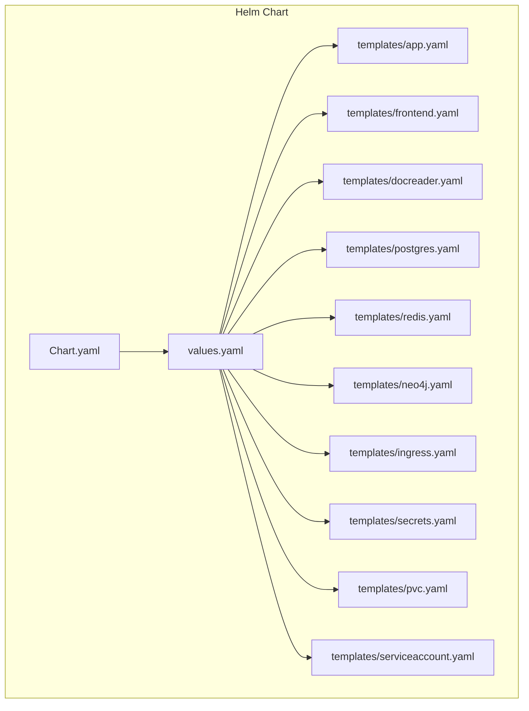
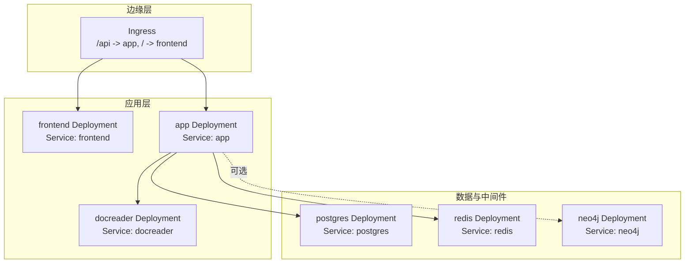
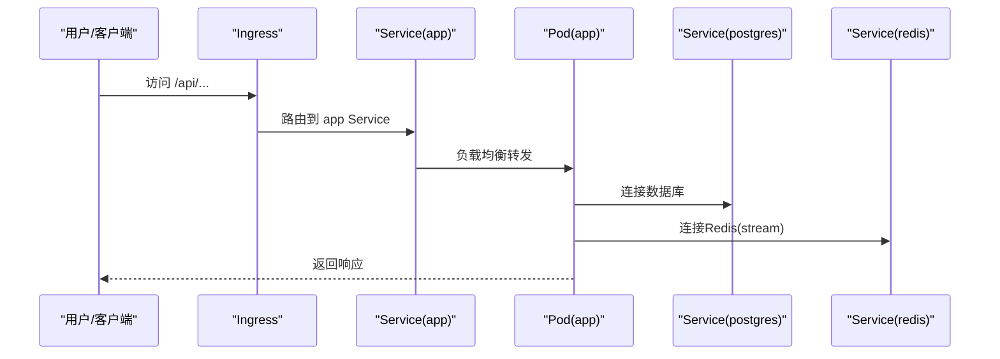
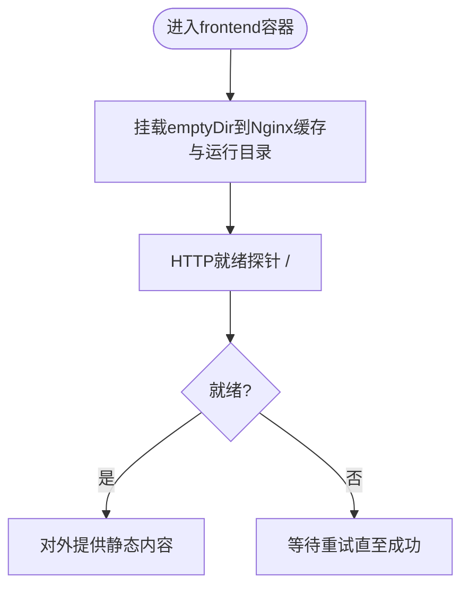
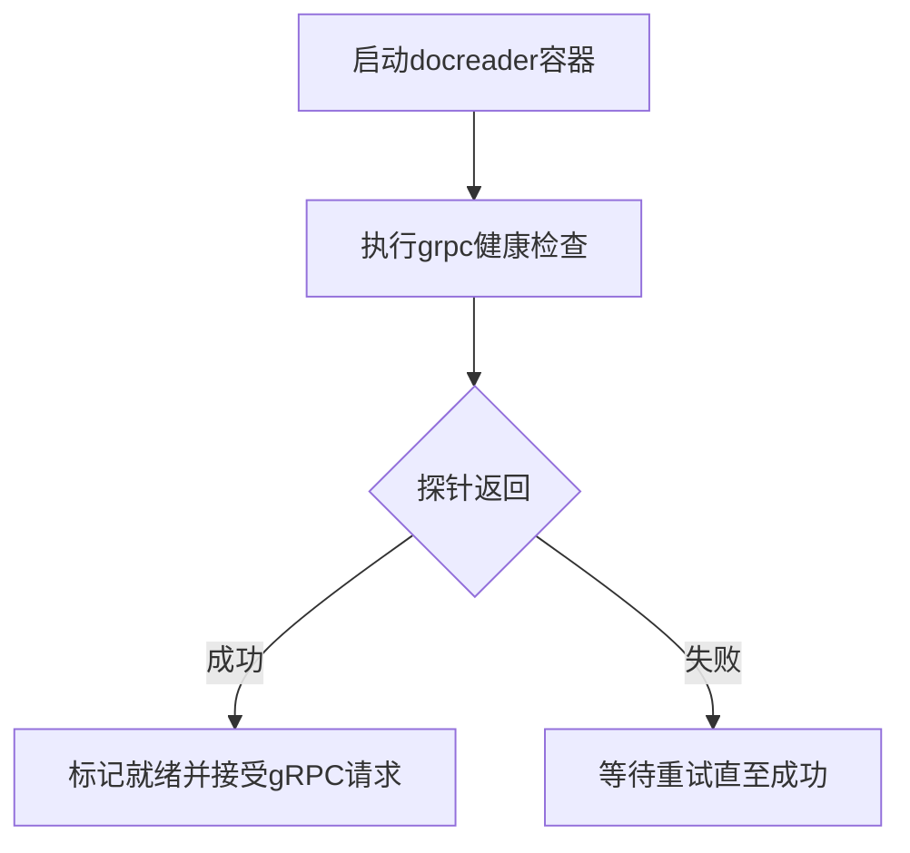
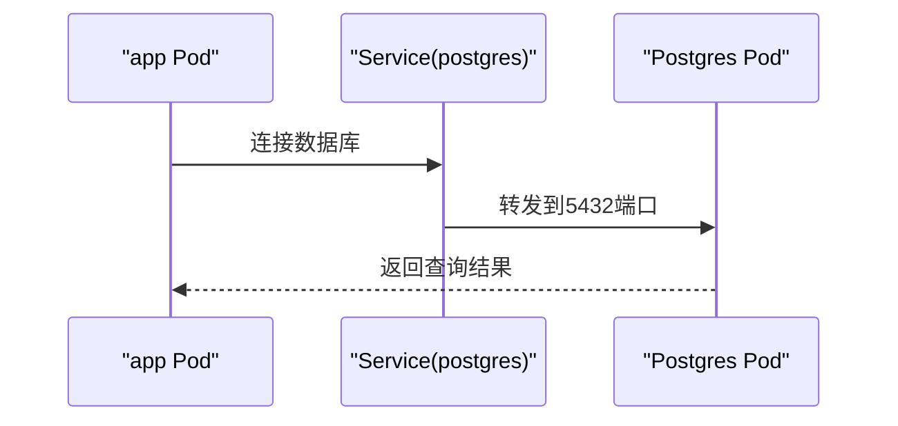
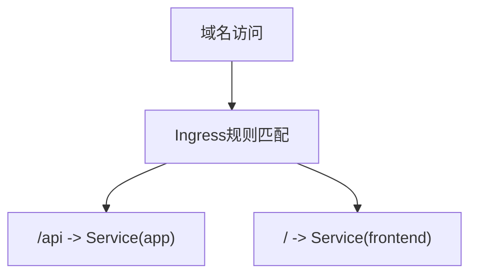
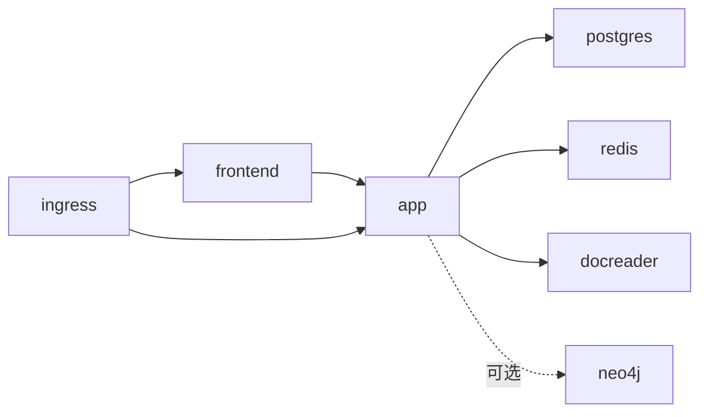

# Kubernetes资源管理

<cite>
**本文引用的文件**
- [Chart.yaml](file://helm/Chart.yaml)
- [values.yaml](file://helm/values.yaml)
- [app.yaml](file://helm/templates/app.yaml)
- [frontend.yaml](file://helm/templates/frontend.yaml)
- [docreader.yaml](file://helm/templates/docreader.yaml)
- [postgres.yaml](file://helm/templates/postgres.yaml)
- [redis.yaml](file://helm/templates/redis.yaml)
- [ingress.yaml](file://helm/templates/ingress.yaml)
- [secrets.yaml](file://helm/templates/secrets.yaml)
- [pvc.yaml](file://helm/templates/pvc.yaml)
- [serviceaccount.yaml](file://helm/templates/serviceaccount.yaml)
- [neo4j.yaml](file://helm/templates/neo4j.yaml)
- [weknora-lite.service](file://deploy/weknora-lite.service)
</cite>

## 目录
1. [简介](#简介)
2. [项目结构](#项目结构)
3. [核心组件](#核心组件)
4. [架构总览](#架构总览)
5. [详细组件分析](#详细组件分析)
6. [依赖关系分析](#依赖关系分析)
7. [性能与可用性考量](#性能与可用性考量)
8. [故障排查指南](#故障排查指南)
9. [结论](#结论)
10. [附录](#附录)

## 简介
本文件系统化梳理WeKnora项目在Kubernetes中的资源对象配置，覆盖以下主题：
- Deployment副本数、滚动更新策略与健康检查
- Service的负载均衡、端口暴露与网络策略建议
- ConfigMap与Secret的配置方法（环境变量注入与文件挂载）
- PersistentVolume与PersistentVolumeClaim的配置与管理
- Ingress控制器的配置与域名绑定
- 资源监控与日志收集的配置思路

WeKnora采用Helm Chart进行统一编排，Chart定义了应用后端、前端、文档解析器、数据库（ParadeDB）、缓存（Redis）、可选图数据库（Neo4j）等组件的Deployment、Service、PVC及Ingress等资源。

## 项目结构
WeKnora的Kubernetes编排位于helm目录，包含Chart元数据、默认参数（values.yaml）以及各组件的模板文件（templates/*.yaml）。values.yaml提供全局安全上下文、镜像仓库与标签、资源请求/限制、探针、存储、Ingress与Secrets等配置项；各模板文件根据values渲染为实际的Kubernetes资源。

图表来源
- [Chart.yaml:1-27](file://helm/Chart.yaml#L1-L27)
- [values.yaml:1-493](file://helm/values.yaml#L1-L493)
- [app.yaml:1-200](file://helm/templates/app.yaml#L1-L200)
- [frontend.yaml:1-113](file://helm/templates/frontend.yaml#L1-L113)
- [docreader.yaml:1-103](file://helm/templates/docreader.yaml#L1-L103)
- [postgres.yaml:1-129](file://helm/templates/postgres.yaml#L1-L129)
- [redis.yaml:1-125](file://helm/templates/redis.yaml#L1-L125)
- [neo4j.yaml:1-137](file://helm/templates/neo4j.yaml#L1-L137)
- [ingress.yaml:1-53](file://helm/templates/ingress.yaml#L1-L53)
- [secrets.yaml:1-40](file://helm/templates/secrets.yaml#L1-L40)
- [pvc.yaml:1-82](file://helm/templates/pvc.yaml#L1-L82)
- [serviceaccount.yaml:1-25](file://helm/templates/serviceaccount.yaml#L1-L25)

章节来源
- [Chart.yaml:1-27](file://helm/Chart.yaml#L1-L27)
- [values.yaml:1-493](file://helm/values.yaml#L1-L493)

## 核心组件
本节从Deployment副本数、滚动更新策略、健康检查、Service端口与负载均衡、ConfigMap/Secret注入、PVC管理、Ingress域名绑定等方面，结合模板与values进行说明。

- Deployment副本数与滚动更新
  - 后端、前端、文档解析器均支持通过replicaCount控制副本数，默认均为1。
  - 滚动更新策略统一采用RollingUpdate，maxSurge=1，maxUnavailable=0，确保零停机升级。
  - 数据库类组件（PostgreSQL、Redis、Neo4j）采用Recreate策略，避免多副本导致的数据不一致或损坏。

- 健康检查
  - 应用后端：HTTP GET /health，分别配置liveness和readiness探针。
  - 前端：HTTP GET /，探针较简单，适合静态页面健康判断。
  - 文档解析器：gRPC健康检查，使用grpc_health_probe探测本地50051端口。
  - PostgreSQL：pg_isready命令检查数据库就绪状态。
  - Redis：redis-cli ping校验连接密码正确与服务可用。
  - Neo4j：HTTP GET /根路径作为健康检查。

- Service与负载均衡
  - 后端Service名称固定为app，前端Service名称固定为frontend，便于Ingress与Nginx配置引用。
  - Service类型默认为ClusterIP，可通过values调整；端口映射遵循容器端口与targetPort一致的原则。
  - 前端容器需要写入权限用于Nginx缓存与运行目录，因此挂载emptyDir到/var/cache/nginx与/var/run。

- ConfigMap与Secret
  - Secret集中管理数据库、Redis、JWT、AES密钥等敏感信息，通过valueFrom.secretKeyRef注入到容器环境变量。
  - values.yaml提供secrets.*字段与existingSecret选项，支持外部密管或现有Secret。
  - ConfigMap未在模板中直接出现，但可通过Helm的--set-file或--set-json-file将配置文件注入为环境变量或挂载为卷（按需扩展）。

- PersistentVolume与PVC
  - PostgreSQL、Redis、Neo4j、数据文件目录均可启用持久化，通过values中的persistence.size与existingClaim控制。
  - PVC命名规则与Release名称关联，若指定existingClaim则复用已有PVC。
  - 存储类由全局storageClass控制，可留空使用集群默认。

- Ingress与域名绑定
  - 可选启用Ingress，支持className、host、TLS与注解（如代理超时、缓冲区大小等）。
  - Ingress路由规则将/api前缀转发至后端Service（app），根路径/转发至前端Service（frontend）。

章节来源
- [values.yaml:57-140](file://helm/values.yaml#L57-L140)
- [app.yaml:16-24](file://helm/templates/app.yaml#L16-L24)
- [app.yaml:153-160](file://helm/templates/app.yaml#L153-L160)
- [frontend.yaml:20-24](file://helm/templates/frontend.yaml#L20-L24)
- [frontend.yaml:55-70](file://helm/templates/frontend.yaml#L55-L70)
- [docreader.yaml:20-24](file://helm/templates/docreader.yaml#L20-L24)
- [docreader.yaml:53-71](file://helm/templates/docreader.yaml#L53-L71)
- [postgres.yaml:21-23](file://helm/templates/postgres.yaml#L21-L23)
- [postgres.yaml:70-89](file://helm/templates/postgres.yaml#L70-L89)
- [redis.yaml:21-23](file://helm/templates/redis.yaml#L21-L23)
- [redis.yaml:66-85](file://helm/templates/redis.yaml#L66-L85)
- [neo4j.yaml:22-24](file://helm/templates/neo4j.yaml#L22-L24)
- [neo4j.yaml:78-93](file://helm/templates/neo4j.yaml#L78-L93)
- [app.yaml:182-199](file://helm/templates/app.yaml#L182-L199)
- [frontend.yaml:95-112](file://helm/templates/frontend.yaml#L95-L112)
- [docreader.yaml:85-102](file://helm/templates/docreader.yaml#L85-L102)
- [ingress.yaml:20-51](file://helm/templates/ingress.yaml#L20-L51)
- [secrets.yaml:13-39](file://helm/templates/secrets.yaml#L13-L39)
- [pvc.yaml:8-24](file://helm/templates/pvc.yaml#L8-L24)
- [pvc.yaml:27-44](file://helm/templates/pvc.yaml#L27-L44)
- [pvc.yaml:46-63](file://helm/templates/pvc.yaml#L46-L63)
- [pvc.yaml:65-81](file://helm/templates/pvc.yaml#L65-L81)

## 架构总览
下图展示了WeKnora在Kubernetes中的典型部署拓扑：前端Nginx作为入口，Ingress负责域名与路径分发；后端API服务处理业务逻辑；文档解析器提供gRPC能力；数据库（ParadeDB）与缓存（Redis）支撑检索与流式任务；可选图数据库（Neo4j）支持GraphRAG。

图表来源
- [ingress.yaml:20-51](file://helm/templates/ingress.yaml#L20-L51)
- [frontend.yaml:95-112](file://helm/templates/frontend.yaml#L95-L112)
- [app.yaml:182-199](file://helm/templates/app.yaml#L182-L199)
- [docreader.yaml:85-102](file://helm/templates/docreader.yaml#L85-L102)
- [postgres.yaml:111-128](file://helm/templates/postgres.yaml#L111-L128)
- [redis.yaml:107-124](file://helm/templates/redis.yaml#L107-L124)
- [neo4j.yaml:115-136](file://helm/templates/neo4j.yaml#L115-L136)

## 详细组件分析

### 应用后端（app）分析
- 副本数与滚动更新
  - 通过replicaCount控制；滚动更新策略为RollingUpdate，maxSurge=1，maxUnavailable=0，保证升级过程无损。
- 健康检查
  - HTTP GET /health，分别配置存活与就绪探针，延迟与周期、超时与失败阈值已在values中设定。
- 网络与端口
  - 容器端口8080，Service端口由values.app.service.port决定，默认8080。
- 环境变量注入
  - 数据库、Redis、JWT、AES密钥等通过Secret注入；检索驱动、存储类型、并发池、GraphRAG开关等通过values.app.env注入。
- 存储
  - 挂载数据文件卷（/data/files），可选择PVC或emptyDir。
- 调度与安全
  - 支持nodeSelector、affinity、tolerations；全局与容器级securityContext在values中配置。

图表来源
- [ingress.yaml:36-44](file://helm/templates/ingress.yaml#L36-L44)
- [app.yaml:182-199](file://helm/templates/app.yaml#L182-L199)
- [postgres.yaml:111-128](file://helm/templates/postgres.yaml#L111-L128)
- [redis.yaml:107-124](file://helm/templates/redis.yaml#L107-L124)

章节来源
- [values.yaml:57-140](file://helm/values.yaml#L57-L140)
- [app.yaml:16-24](file://helm/templates/app.yaml#L16-L24)
- [app.yaml:153-160](file://helm/templates/app.yaml#L153-L160)
- [app.yaml:182-199](file://helm/templates/app.yaml#L182-L199)

### 前端（frontend）分析
- 副本数与滚动更新
  - replicaCount默认1；滚动更新策略RollingUpdate。
- 健康检查
  - HTTP GET /，探针参数在模板中预设。
- 网络与端口
  - 容器端口80，Service端口由values.frontend.service.port决定，默认80。
- 存储
  - 为Nginx挂载emptyDir到/var/cache/nginx与/var/run，满足临时文件写入需求。
- 与后端通信
  - 通过环境变量APP_HOST/APP_PORT指向后端Service（默认指向名为app的服务与默认端口）。

图表来源
- [frontend.yaml:72-81](file://helm/templates/frontend.yaml#L72-L81)
- [frontend.yaml:55-70](file://helm/templates/frontend.yaml#L55-L70)

章节来源
- [values.yaml:148-187](file://helm/values.yaml#L148-L187)
- [frontend.yaml:20-24](file://helm/templates/frontend.yaml#L20-L24)
- [frontend.yaml:55-70](file://helm/templates/frontend.yaml#L55-L70)
- [frontend.yaml:95-112](file://helm/templates/frontend.yaml#L95-L112)

### 文档解析器（docreader）分析
- 副本数与滚动更新
  - replicaCount默认1；滚动更新策略RollingUpdate。
- 健康检查
  - 使用grpc_health_probe探测本地50051端口，分别配置存活与就绪探针。
- 网络与端口
  - 容器端口50051，Service端口由values.docreader.service.port决定，默认50051。
- 环境变量
  - 存储类型等参数通过values.docreader.env注入。

图表来源
- [docreader.yaml:53-71](file://helm/templates/docreader.yaml#L53-L71)
- [docreader.yaml:85-102](file://helm/templates/docreader.yaml#L85-L102)

章节来源
- [values.yaml:195-237](file://helm/values.yaml#L195-L237)
- [docreader.yaml:20-24](file://helm/templates/docreader.yaml#L20-L24)
- [docreader.yaml:53-71](file://helm/templates/docreader.yaml#L53-L71)
- [docreader.yaml:85-102](file://helm/templates/docreader.yaml#L85-L102)

### 数据库（PostgreSQL/ParadeDB）分析
- 副本数与滚动更新
  - replicas=1；采用Recreate策略，避免多副本导致的数据损坏。
- 健康检查
  - 使用pg_isready命令检查数据库就绪状态。
- 网络与端口
  - 容器端口5432，Service端口5432。
- 存储
  - 通过PVC持久化数据目录，大小与存储类由values控制。
- 安全
  - 凭据通过Secret注入。

图表来源
- [postgres.yaml:70-89](file://helm/templates/postgres.yaml#L70-L89)
- [postgres.yaml:111-128](file://helm/templates/postgres.yaml#L111-L128)

章节来源
- [values.yaml:241-283](file://helm/values.yaml#L241-L283)
- [postgres.yaml:21-23](file://helm/templates/postgres.yaml#L21-L23)
- [postgres.yaml:70-89](file://helm/templates/postgres.yaml#L70-L89)
- [postgres.yaml:111-128](file://helm/templates/postgres.yaml#L111-L128)

### 缓存（Redis）分析
- 副本数与滚动更新
  - replicas=1；采用Recreate策略。
- 健康检查
  - 使用redis-cli ping校验连接密码正确与服务可用。
- 网络与端口
  - 容器端口6379，Service端口6379。
- 存储
  - 通过PVC持久化数据目录。
- 安全
  - 密码通过Secret注入。

章节来源
- [values.yaml:287-329](file://helm/values.yaml#L287-L329)
- [redis.yaml:21-23](file://helm/templates/redis.yaml#L21-L23)
- [redis.yaml:66-85](file://helm/templates/redis.yaml#L66-L85)
- [redis.yaml:107-124](file://helm/templates/redis.yaml#L107-L124)

### 图数据库（Neo4j）分析
- 副本数与滚动更新
  - replicas=1；采用Recreate策略。
- 健康检查
  - HTTP GET /根路径。
- 网络与端口
  - HTTP 7474与Bolt 7687端口，Service端口分别为7474与7687。
- 存储
  - 通过PVC持久化数据目录。
- 安全
  - 密码通过Secret注入；禁用严格验证以避免与K8s注入环境冲突。

章节来源
- [values.yaml:427-472](file://helm/values.yaml#L427-L472)
- [neo4j.yaml:22-24](file://helm/templates/neo4j.yaml#L22-L24)
- [neo4j.yaml:78-93](file://helm/templates/neo4j.yaml#L78-L93)
- [neo4j.yaml:115-136](file://helm/templates/neo4j.yaml#L115-L136)

### Ingress分析
- 启用与类名
  - 通过values.ingress.enabled控制；className默认nginx。
- 主机与TLS
  - host与tls.secretName由values.ingress配置；可启用TLS。
- 注解
  - 提供代理缓冲区与超时相关的注解示例。
- 路由规则
  - /api前缀转发至后端Service（app），/根路径转发至前端Service（frontend）。

图表来源
- [ingress.yaml:20-51](file://helm/templates/ingress.yaml#L20-L51)

章节来源
- [values.yaml:345-370](file://helm/values.yaml#L345-L370)
- [ingress.yaml:20-51](file://helm/templates/ingress.yaml#L20-L51)

### Secret与ConfigMap分析
- Secret
  - 默认创建包含数据库用户名/密码/库名、Redis用户名/密码、JWT与AES密钥；当启用Neo4j时同时注入Neo4j凭据。
  - values.secrets.existingSecret支持复用已存在的Secret。
- ConfigMap
  - 当前模板未直接生成ConfigMap；如需注入配置文件，可在values中新增envFrom或volumeMounts（按需扩展）。

章节来源
- [secrets.yaml:13-39](file://helm/templates/secrets.yaml#L13-L39)
- [values.yaml:382-403](file://helm/values.yaml#L382-L403)

### PVC与存储管理
- PostgreSQL、Redis、Neo4j、数据文件目录均可启用持久化。
- PVC命名与Release名称关联；若指定existingClaim则复用已有PVC。
- 存储类由global.storageClass控制，可留空使用集群默认。

章节来源
- [pvc.yaml:8-24](file://helm/templates/pvc.yaml#L8-L24)
- [pvc.yaml:27-44](file://helm/templates/pvc.yaml#L27-L44)
- [pvc.yaml:46-63](file://helm/templates/pvc.yaml#L46-L63)
- [pvc.yaml:65-81](file://helm/templates/pvc.yaml#L65-L81)
- [values.yaml:14-16](file://helm/values.yaml#L14-L16)

### ServiceAccount与RBAC
- 可创建独立的ServiceAccount，支持labels、annotations与自动挂载令牌控制。

章节来源
- [serviceaccount.yaml:8-24](file://helm/templates/serviceaccount.yaml#L8-L24)
- [values.yaml:38-48](file://helm/values.yaml#L38-L48)

## 依赖关系分析
- 组件间依赖
  - app依赖postgres、redis、docreader；可选依赖neo4j。
  - frontend依赖app（通过环境变量APP_HOST/APP_PORT）。
  - ingress依赖frontend与app的Service名称（app、frontend）。
- 资源耦合
  - 数据库与缓存采用Recreate策略，避免多副本共享状态带来的数据一致性问题。
  - 滚动更新策略在应用侧保证高可用，数据库侧保证数据安全。

图表来源
- [frontend.yaml:44-48](file://helm/templates/frontend.yaml#L44-L48)
- [app.yaml:54-121](file://helm/templates/app.yaml#L54-L121)
- [ingress.yaml:36-49](file://helm/templates/ingress.yaml#L36-L49)

章节来源
- [frontend.yaml:44-48](file://helm/templates/frontend.yaml#L44-L48)
- [app.yaml:54-121](file://helm/templates/app.yaml#L54-L121)
- [ingress.yaml:36-49](file://helm/templates/ingress.yaml#L36-L49)

## 性能与可用性考量
- 副本数与水平扩展
  - 前端与应用后端可通过replicaCount提升吞吐；需配合Ingress与Service的负载均衡策略。
- 资源配额与限制
  - 各组件在values中提供requests与limits，建议结合集群资源与QoS策略进行调优。
- 探针参数
  - 适当调整initialDelaySeconds、periodSeconds、timeoutSeconds与failureThreshold，平衡启动时间与故障检测灵敏度。
- 存储I/O
  - 数据库与缓存开启持久化时，建议选择高性能存储类并预留足够IOPS。
- 网络与Ingress
  - Ingress注解可优化大文件上传与长连接场景（如代理超时、缓冲区大小）。

## 故障排查指南
- 健康检查失败
  - 检查探针路径与端口是否与容器端口一致；确认Secret注入的凭据正确；查看Pod事件与日志。
- 无法连接数据库/缓存
  - 核对Service名称与端口；确认PVC已绑定且存储类可用；检查防火墙与网络策略。
- Ingress无法访问
  - 确认ingress.enabled=true、className与host配置正确；检查TLS证书与注解；验证路由规则优先级。
- 升级过程中断流
  - 检查滚动更新策略与探针配置；确保maxSurge与maxUnavailable设置满足SLA要求。
- 日志与监控
  - 建议在各组件容器中输出结构化日志；结合Prometheus/Grafana与日志聚合方案（如ELK/Opensearch）实现可观测性。

章节来源
- [app.yaml:153-160](file://helm/templates/app.yaml#L153-L160)
- [frontend.yaml:55-70](file://helm/templates/frontend.yaml#L55-L70)
- [docreader.yaml:53-71](file://helm/templates/docreader.yaml#L53-L71)
- [postgres.yaml:70-89](file://helm/templates/postgres.yaml#L70-L89)
- [redis.yaml:66-85](file://helm/templates/redis.yaml#L66-L85)
- [ingress.yaml:20-51](file://helm/templates/ingress.yaml#L20-L51)

## 结论
WeKnora的Helm Chart提供了完整的Kubernetes编排蓝图：通过统一的values管理全局与组件级配置，模板文件将资源对象标准化、可重复地生成。Deployment的滚动更新策略与健康检查保障了服务的高可用；Service与Ingress明确了网络边界与流量入口；Secret集中管理敏感信息，PVC为关键数据提供持久化能力。结合本文的配置建议与故障排查清单，可在生产环境中稳定运行WeKnora平台。

## 附录
- 非Kubernetes部署参考
  - 项目还包含systemd服务单元示例（weknora-lite.service），可用于非Kubernetes环境的单机部署或轻量化部署。

章节来源
- [weknora-lite.service:1-24](file://deploy/weknora-lite.service#L1-L24)