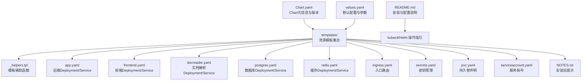
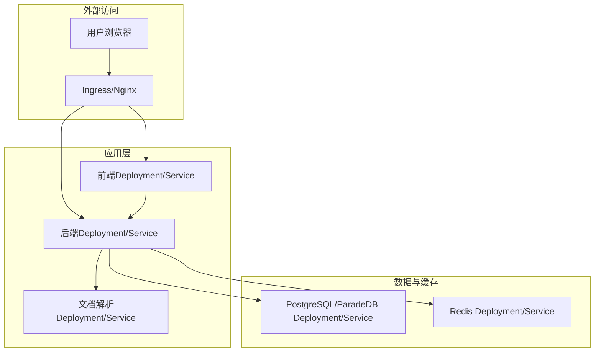
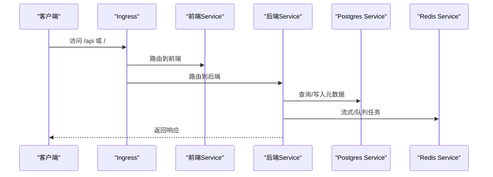
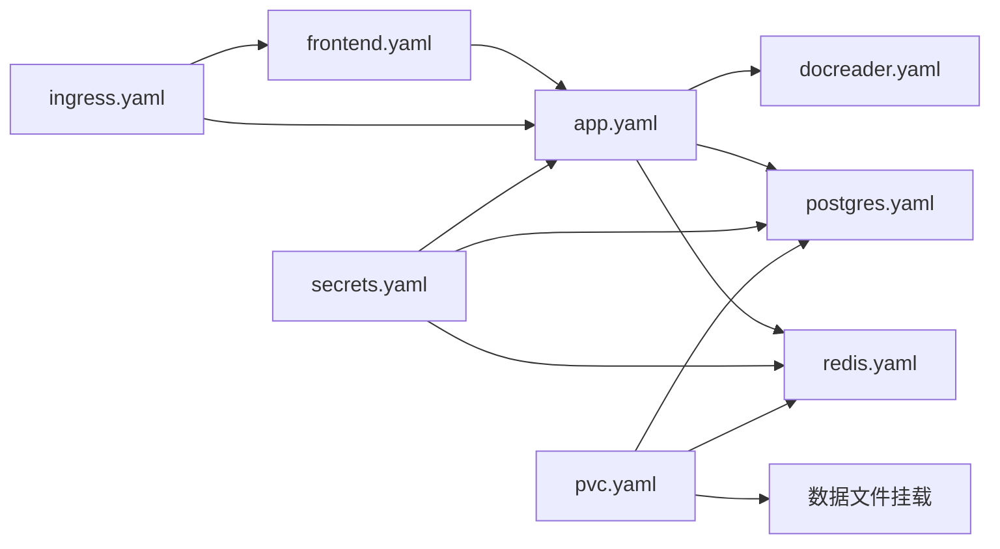

# Kubernetes部署

<cite>
**本文引用的文件**
- [Chart.yaml](file://helm/Chart.yaml)
- [values.yaml](file://helm/values.yaml)
- [README.md](file://helm/README.md)
- [_helpers.tpl](file://helm/templates/_helpers.tpl)
- [app.yaml](file://helm/templates/app.yaml)
- [frontend.yaml](file://helm/templates/frontend.yaml)
- [docreader.yaml](file://helm/templates/docreader.yaml)
- [postgres.yaml](file://helm/templates/postgres.yaml)
- [redis.yaml](file://helm/templates/redis.yaml)
- [ingress.yaml](file://helm/templates/ingress.yaml)
- [secrets.yaml](file://helm/templates/secrets.yaml)
- [pvc.yaml](file://helm/templates/pvc.yaml)
- [serviceaccount.yaml](file://helm/templates/serviceaccount.yaml)
- [NOTES.txt](file://helm/templates/NOTES.txt)
</cite>

## 目录
1. [简介](#简介)
2. [项目结构](#项目结构)
3. [核心组件](#核心组件)
4. [架构总览](#架构总览)
5. [详细组件分析](#详细组件分析)
6. [依赖关系分析](#依赖关系分析)
7. [性能与可扩展性](#性能与可扩展性)
8. [故障排查指南](#故障排查指南)
9. [结论](#结论)
10. [附录](#附录)

## 简介
本指南面向在Kubernetes上部署WeKnora项目的运维与开发人员，基于官方提供的Helm Chart，系统讲解Chart结构、Values配置、部署流程、Ingress与TLS、存储与Secret管理、以及生产级高可用与灾难恢复策略。同时提供kubectl命令行操作要点与最佳实践，帮助快速、安全地完成从单节点到多副本、多可用区的生产化部署。

## 项目结构
WeKnora的Kubernetes部署由Helm Chart提供，核心文件位于helm目录中，包含Chart元数据、默认配置、模板与说明文档。下图展示了Chart的核心组成及其职责：

图表来源
- [Chart.yaml:1-27](file://helm/Chart.yaml#L1-L27)
- [values.yaml:1-493](file://helm/values.yaml#L1-L493)
- [README.md:1-327](file://helm/README.md#L1-L327)
- [_helpers.tpl:1-196](file://helm/templates/_helpers.tpl#L1-L196)
- [app.yaml:1-200](file://helm/templates/app.yaml#L1-L200)
- [frontend.yaml:1-113](file://helm/templates/frontend.yaml#L1-L113)
- [docreader.yaml:1-103](file://helm/templates/docreader.yaml#L1-L103)
- [postgres.yaml:1-129](file://helm/templates/postgres.yaml#L1-L129)
- [redis.yaml:1-125](file://helm/templates/redis.yaml#L1-L125)
- [ingress.yaml:1-53](file://helm/templates/ingress.yaml#L1-L53)
- [secrets.yaml:1-40](file://helm/templates/secrets.yaml#L1-L40)
- [pvc.yaml:1-82](file://helm/templates/pvc.yaml#L1-L82)
- [serviceaccount.yaml:1-25](file://helm/templates/serviceaccount.yaml#L1-L25)
- [NOTES.txt:1-143](file://helm/templates/NOTES.txt#L1-L143)

章节来源
- [Chart.yaml:1-27](file://helm/Chart.yaml#L1-L27)
- [values.yaml:1-493](file://helm/values.yaml#L1-L493)
- [README.md:1-327](file://helm/README.md#L1-L327)

## 核心组件
- 应用后端（App）：提供REST API与业务逻辑，支持探针、资源限制、健康检查与持久化文件挂载。
- 前端（Frontend）：静态Web界面，通过Nginx暴露，支持探针与临时目录挂载。
- 文档解析（Docreader）：gRPC服务，负责文档解析，具备健康检查与资源限制。
- 数据库（PostgreSQL/ParadeDB）：提供向量检索与全文搜索能力，支持持久化与探针。
- 缓存（Redis）：用于流式处理与任务队列，支持密码认证与持久化。
- 路由（Ingress）：统一入口，将/api路由至后端，/路由至前端。
- 存储（PVC）：为数据库、缓存与上传文件提供持久卷。
- 安全（Secrets/ServiceAccount）：集中管理敏感配置，最小权限访问。

章节来源
- [app.yaml:1-200](file://helm/templates/app.yaml#L1-L200)
- [frontend.yaml:1-113](file://helm/templates/frontend.yaml#L1-L113)
- [docreader.yaml:1-103](file://helm/templates/docreader.yaml#L1-L103)
- [postgres.yaml:1-129](file://helm/templates/postgres.yaml#L1-L129)
- [redis.yaml:1-125](file://helm/templates/redis.yaml#L1-L125)
- [ingress.yaml:1-53](file://helm/templates/ingress.yaml#L1-L53)
- [pvc.yaml:1-82](file://helm/templates/pvc.yaml#L1-L82)
- [secrets.yaml:1-40](file://helm/templates/secrets.yaml#L1-L40)
- [serviceaccount.yaml:1-25](file://helm/templates/serviceaccount.yaml#L1-L25)

## 架构总览
下图展示了WeKnora在Kubernetes中的典型部署拓扑，包含Ingress、前端、后端、文档解析、数据库与缓存之间的交互关系。

图表来源
- [ingress.yaml:1-53](file://helm/templates/ingress.yaml#L1-L53)
- [frontend.yaml:1-113](file://helm/templates/frontend.yaml#L1-L113)
- [app.yaml:1-200](file://helm/templates/app.yaml#L1-L200)
- [docreader.yaml:1-103](file://helm/templates/docreader.yaml#L1-L103)
- [postgres.yaml:1-129](file://helm/templates/postgres.yaml#L1-L129)
- [redis.yaml:1-125](file://helm/templates/redis.yaml#L1-L125)

## 详细组件分析

### 后端应用（App）
- 部署策略：滚动更新，最大并发与不可用数按需配置。
- 探针：HTTP就绪/存活探针，路径与超时参数可配置。
- 环境变量：数据库、缓存、存储、文档解析、加密与并发控制等关键参数。
- 存储：挂载数据文件PVC或emptyDir，满足本地存储场景。
- 资源：CPU/内存请求与限制，支持全局与组件级覆盖。
- 安全：容器非特权运行，禁止提权；通过Secret注入数据库、Redis、JWT与加密密钥。

图表来源
- [ingress.yaml:32-51](file://helm/templates/ingress.yaml#L32-L51)
- [app.yaml:182-199](file://helm/templates/app.yaml#L182-L199)
- [frontend.yaml:95-112](file://helm/templates/frontend.yaml#L95-L112)
- [postgres.yaml:111-128](file://helm/templates/postgres.yaml#L111-L128)
- [redis.yaml:107-124](file://helm/templates/redis.yaml#L107-L124)

章节来源
- [app.yaml:1-200](file://helm/templates/app.yaml#L1-L200)
- [values.yaml:53-140](file://helm/values.yaml#L53-L140)

### 前端（Web UI）
- 部署策略：滚动更新，镜像与资源独立配置。
- 探针：HTTP就绪/存活探针，路径与延迟参数可配置。
- 挂载：Nginx临时目录emptyDir，确保静态站点正常运行。
- 服务：ClusterIP，端口可配置，名称固定为frontend以适配Ingress路由。

章节来源
- [frontend.yaml:1-113](file://helm/templates/frontend.yaml#L1-L113)
- [values.yaml:144-187](file://helm/values.yaml#L144-L187)

### 文档解析（Docreader）
- 协议：gRPC，端口固定，健康检查使用grpc_health_probe。
- 探针：exec方式执行健康检查，延迟与周期可配置。
- 环境：存储类型等参数，便于对接对象存储或本地存储。
- 服务：ClusterIP，名称固定为docreader供后端调用。

章节来源
- [docreader.yaml:1-103](file://helm/templates/docreader.yaml#L1-L103)
- [values.yaml:189-237](file://helm/values.yaml#L189-L237)

### 数据库（PostgreSQL/ParadeDB）
- 镜像：ParadeDB，支持向量与BM25混合检索。
- 策略：Recreate部署策略，避免数据损坏风险。
- 探针：pg_isready健康检查，延迟与周期可配置。
- 存储：PVC或emptyDir，大小可配置。
- 服务：ClusterIP，端口固定。

章节来源
- [postgres.yaml:1-129](file://helm/templates/postgres.yaml#L1-L129)
- [values.yaml:241-283](file://helm/values.yaml#L241-L283)

### 缓存（Redis）
- 策略：Recreate部署策略，避免数据损坏风险。
- 探针：redis-cli ping健康检查，支持密码认证。
- 存储：PVC或emptyDir，大小可配置。
- 服务：ClusterIP，端口固定。

章节来源
- [redis.yaml:1-125](file://helm/templates/redis.yaml#L1-L125)
- [values.yaml:287-329](file://helm/values.yaml#L287-L329)

### Ingress与TLS
- 类型：networking.k8s.io/v1，支持className与注解。
- 路由规则：/api前缀路由到后端，/路由到前端。
- TLS：可启用并指定Secret名称，主机名来自配置。
- 注解：可配置代理超时、缓冲区大小等Nginx行为。

章节来源
- [ingress.yaml:1-53](file://helm/templates/ingress.yaml#L1-L53)
- [values.yaml:345-369](file://helm/values.yaml#L345-L369)

### Secret与密钥管理
- 默认生成：若未指定existingSecret，则根据values自动生成。
- 必填项：数据库密码、Redis密码、JWT密钥等必须提供。
- 可选项：Neo4j用户名/密码（当启用GraphRAG时）。
- 生产建议：使用External Secrets Operator、Sealed Secrets或现有Secret。

章节来源
- [secrets.yaml:1-40](file://helm/templates/secrets.yaml#L1-L40)
- [values.yaml:382-403](file://helm/values.yaml#L382-L403)

### PVC与持久化
- 组件：PostgreSQL、Redis、Neo4j、数据文件。
- 支持：existingClaim复用已有PVC，或自动创建新PVC。
- 存储类：可通过global.storageClass或“-”显式禁用。

章节来源
- [pvc.yaml:1-82](file://helm/templates/pvc.yaml#L1-L82)
- [values.yaml:267-341](file://helm/values.yaml#L267-L341)

### ServiceAccount与RBAC
- 可选创建：默认创建，可设置标签、注解与令牌自动挂载。
- 最小权限：结合Pod与容器安全上下文，遵循CNCF最佳实践。

章节来源
- [serviceaccount.yaml:1-25](file://helm/templates/serviceaccount.yaml#L1-L25)
- [values.yaml:38-48](file://helm/values.yaml#L38-L48)

## 依赖关系分析
- 组件间依赖：后端依赖数据库、缓存与文档解析；前端依赖后端；Ingress依赖前后端Service。
- 命名约定：Service名称固定（如app、frontend、docreader、postgres、redis），便于跨组件引用。
- 存储依赖：数据库与缓存均通过PVC持久化，确保数据不丢失。

图表来源
- [frontend.yaml:95-112](file://helm/templates/frontend.yaml#L95-L112)
- [app.yaml:182-199](file://helm/templates/app.yaml#L182-L199)
- [docreader.yaml:85-102](file://helm/templates/docreader.yaml#L85-L102)
- [postgres.yaml:111-128](file://helm/templates/postgres.yaml#L111-L128)
- [redis.yaml:107-124](file://helm/templates/redis.yaml#L107-L124)
- [ingress.yaml:20-51](file://helm/templates/ingress.yaml#L20-L51)
- [secrets.yaml:14-39](file://helm/templates/secrets.yaml#L14-L39)
- [pvc.yaml:8-25](file://helm/templates/pvc.yaml#L8-L25)

## 性能与可扩展性
- 水平扩展
  - 后端：增加replicaCount，配合滚动更新策略实现无感扩容。
  - 前端：同理，提升静态页面服务能力。
  - 文档解析：按并发与吞吐需求调整副本数。
- 资源限制
  - 为各组件设置合理的requests/limits，避免资源争抢。
  - 数据库与缓存建议独立资源池，保障查询与缓存稳定性。
- 存储优化
  - 选择高性能存储类（如SSD），并合理设置PVC容量。
  - 对于大文件上传，建议使用对象存储（MinIO）替代本地存储。
- Ingress调优
  - 根据业务峰值调整代理超时与缓冲区大小，避免大文件上传失败。
- 可观测性
  - 可选启用Jaeger进行分布式追踪，便于定位性能瓶颈。

章节来源
- [values.yaml:111-120](file://helm/values.yaml#L111-L120)
- [values.yaml:183-192](file://helm/values.yaml#L183-L192)
- [values.yaml:203-212](file://helm/values.yaml#L203-L212)
- [values.yaml:285-329](file://helm/values.yaml#L285-L329)
- [values.yaml:485-493](file://helm/values.yaml#L485-L493)

## 故障排查指南
- 基础检查
  - 查看Pod状态与事件：确认各组件是否Ready。
  - 查看Service与Endpoints：确保Service已绑定到Pod。
  - 查看PVC状态：确认绑定成功且容量充足。
- 常见问题
  - Pod处于Pending：检查StorageClass是否存在、PVC是否Bound。
  - 连接被拒绝：等待探针通过，检查Service/Endpoints。
  - 数据库连接错误：核对Secret中的数据库凭据。
- 日志与诊断
  - 后端日志：查看后端容器日志，定位业务异常。
  - 前端日志：查看Nginx日志，定位静态资源与反向代理问题。
  - 数据库/缓存日志：检查健康检查与启动日志。

章节来源
- [README.md:282-311](file://helm/README.md#L282-L311)
- [NOTES.txt:135-141](file://helm/templates/NOTES.txt#L135-L141)

## 结论
通过Helm Chart，WeKnora可在Kubernetes上实现标准化、可重复的部署。借助完善的模板与参数体系，用户可以灵活配置Ingress、TLS、存储与密钥，并按需启用可选组件（如Neo4j、Qdrant、MinIO）。结合资源限制、持久化与可观测性，可构建高可用、可扩展且安全的生产环境。

## 附录

### Helm安装与升级
- 安装（示例）
  - 创建命名空间并安装，设置数据库、Redis与JWT密钥。
- 升级
  - 复用现有值，或通过-f指定生产配置文件。
- 卸载
  - 删除Release并可选删除PVC。

章节来源
- [README.md:25-33](file://helm/README.md#L25-L33)
- [README.md:136-141](file://helm/README.md#L136-L141)
- [README.md:273-280](file://helm/README.md#L273-L280)

### Values配置要点
- 全局参数：storageClass、镜像拉取密钥、Pod/容器安全上下文。
- 组件参数：镜像仓库/标签、副本数、资源、探针、环境变量、存储与亲和性。
- Ingress：启用、类名、主机、TLS与注解。
- Secret：数据库、Redis、JWT与AES密钥，支持existingSecret。
- 可选组件：MinIO、Neo4j、Qdrant、Jaeger。

章节来源
- [values.yaml:11-493](file://helm/values.yaml#L11-L493)

### kubectl常用命令
- 获取资源：pods、services、ingress、pvc、secret。
- 查看日志：后端与前端容器日志。
- 端口转发：对外暴露前端或数据库/缓存服务进行测试。
- 扩容/缩容：修改replicaCount并触发滚动更新。

章节来源
- [README.md:284-296](file://helm/README.md#L284-L296)
- [NOTES.txt:135-141](file://helm/templates/NOTES.txt#L135-L141)