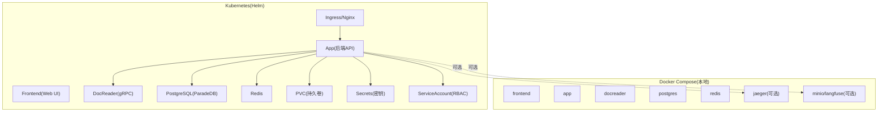
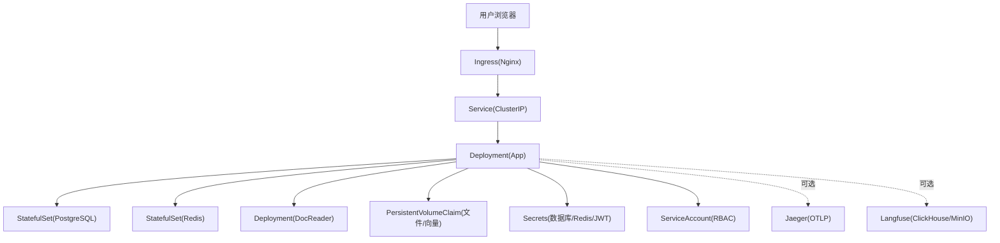
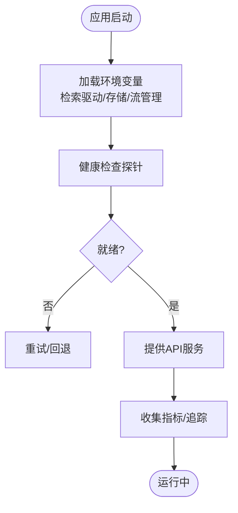
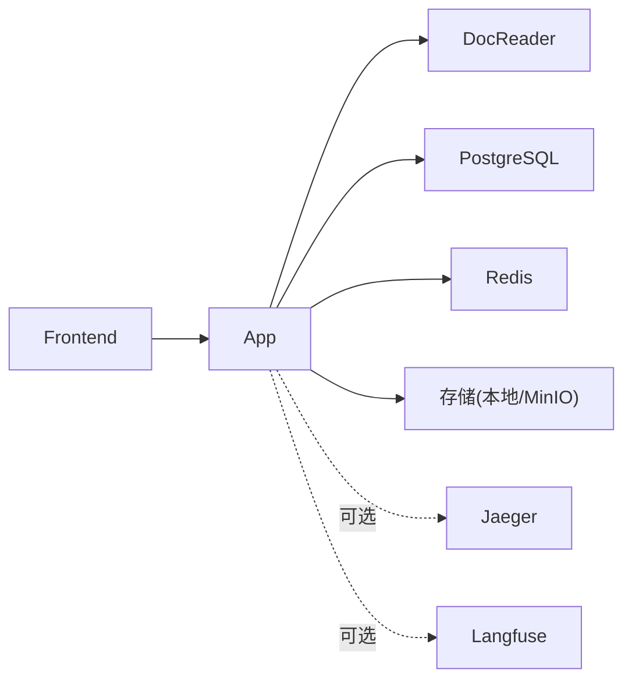

# 生产环境部署

<cite>
**本文引用的文件**
- [Chart.yaml](file://helm/Chart.yaml)
- [values.yaml](file://helm/values.yaml)
- [app.yaml](file://helm/templates/app.yaml)
- [docreader.yaml](file://helm/templates/docreader.yaml)
- [frontend.yaml](file://helm/templates/frontend.yaml)
- [ingress.yaml](file://helm/templates/ingress.yaml)
- [postgres.yaml](file://helm/templates/postgres.yaml)
- [redis.yaml](file://helm/templates/redis.yaml)
- [pvc.yaml](file://helm/templates/pvc.yaml)
- [secrets.yaml](file://helm/templates/secrets.yaml)
- [serviceaccount.yaml](file://helm/templates/serviceaccount.yaml)
- [docker-compose.yml](file://docker-compose.yml)
- [build_images.sh](file://scripts/build_images.sh)
- [start_all.sh](file://scripts/start_all.sh)
- [weknora-lite.service](file://deploy/weknora-lite.service)
- [config.yaml](file://config/config.yaml)
- [dex-config.yaml](file://misc/dex-config.yaml)
</cite>

## 目录
1. [简介](#简介)
2. [项目结构](#项目结构)
3. [核心组件](#核心组件)
4. [架构总览](#架构总览)
5. [详细组件分析](#详细组件分析)
6. [依赖关系分析](#依赖关系分析)
7. [性能考量](#性能考量)
8. [故障排查指南](#故障排查指南)
9. [结论](#结论)
10. [附录](#附录)

## 简介
本指南面向生产环境，提供WeKnora平台的完整部署方案。内容涵盖高可用架构设计与实现（多副本、负载均衡、故障转移）、资源限制与QoS配置、存储策略与备份恢复、监控与告警集成（Prometheus/Grafana/ELK）、安全加固（RBAC、网络策略、密钥管理）、以及CI/CD流水线与自动化部署流程。文档以仓库内现有配置与脚本为基础，结合Helm Chart与Docker Compose，给出可落地的生产级建议。

## 项目结构
WeKnora提供两种主要部署形态：
- Kubernetes（Helm Chart）：适用于云原生集群，支持多副本、持久化、Ingress、ServiceAccount、Secrets等生产特性。
- Docker Compose：适用于单机或小规模集群，便于快速验证与演示，同时保留可观测性组件（Jaeger、Langfuse等）的可选启用。

图表来源
- [Chart.yaml:1-27](file://helm/Chart.yaml#L1-L27)
- [values.yaml:50-493](file://helm/values.yaml#L50-L493)
- [docker-compose.yml:1-613](file://docker-compose.yml#L1-L613)

章节来源
- [Chart.yaml:1-27](file://helm/Chart.yaml#L1-L27)
- [values.yaml:1-493](file://helm/values.yaml#L1-L493)
- [docker-compose.yml:1-613](file://docker-compose.yml#L1-L613)

## 核心组件
- 应用服务（App）：后端API，负责聊天、知识检索、代理执行、向量化检索等核心能力。支持多种检索驱动与存储类型，并内置流式管理与并发池配置。
- 前端服务（Frontend）：静态Web UI，通过Nginx反向代理至后端API。
- 文档解析服务（DocReader）：gRPC文档解析器，支持多格式文档抽取与OCR。
- 数据存储：PostgreSQL（ParadeDB，支持向量与BM25检索），Redis（流与任务队列），本地/对象存储（MinIO等）。
- 可观测性：Jaeger（分布式追踪）、Langfuse（可选，复用共享PostgreSQL与Redis）。
- 安全与身份：Dex（OIDC），Helm Secrets（密钥管理）。

章节来源
- [values.yaml:53-140](file://helm/values.yaml#L53-L140)
- [values.yaml:144-187](file://helm/values.yaml#L144-L187)
- [values.yaml:191-237](file://helm/values.yaml#L191-L237)
- [values.yaml:241-283](file://helm/values.yaml#L241-L283)
- [values.yaml:287-329](file://helm/values.yaml#L287-L329)
- [docker-compose.yml:28-172](file://docker-compose.yml#L28-L172)
- [docker-compose.yml:173-221](file://docker-compose.yml#L173-L221)
- [docker-compose.yml:253-277](file://docker-compose.yml#L253-L277)

## 架构总览
WeKnora生产部署采用“微服务 + 云原生”架构：
- 多副本与水平扩展：App、Frontend、DocReader均支持replicaCount配置，结合Service与Ingress实现负载均衡。
- 存储分层：PostgreSQL与Redis持久化，文件存储通过PVC挂载，对象存储可选MinIO。
- 观测性：Jaeger采集Traces，可选Langfuse提供更丰富的指标与日志。
- 安全：ServiceAccount、Pod安全上下文、Secrets管理、Ingress TLS与限流注解。

图表来源
- [ingress.yaml](file://helm/templates/ingress.yaml)
- [app.yaml](file://helm/templates/app.yaml)
- [postgres.yaml](file://helm/templates/postgres.yaml)
- [redis.yaml](file://helm/templates/redis.yaml)
- [docreader.yaml](file://helm/templates/docreader.yaml)
- [pvc.yaml](file://helm/templates/pvc.yaml)
- [secrets.yaml](file://helm/templates/secrets.yaml)
- [serviceaccount.yaml](file://helm/templates/serviceaccount.yaml)

## 详细组件分析

### 应用服务（App）
- 多副本与探针：通过replicaCount实现高可用；liveness/readiness探针保障健康检查。
- 资源配额：requests/limits定义CPU与内存，结合节点选择器与亲和性实现资源隔离。
- 环境变量：支持多种检索驱动（PostgreSQL、Elasticsearch、Qdrant等）、存储类型（本地/MinIO/COS/TOS/S3）、流管理（Redis）、并发池大小、图RAG开关等。
- 安全上下文：禁用特权提升，允许非root运行（若镜像支持）。

图表来源
- [values.yaml:53-140](file://helm/values.yaml#L53-L140)
- [docker-compose.yml:28-172](file://docker-compose.yml#L28-L172)

章节来源
- [values.yaml:53-140](file://helm/values.yaml#L53-L140)
- [docker-compose.yml:28-172](file://docker-compose.yml#L28-L172)

### 前端服务（Frontend）
- 静态资源：Nginx提供Web UI，支持文件大小限制与反向代理至后端App。
- 负载均衡：多副本与Service实现横向扩展。
- 安全：容器安全上下文与只读文件系统（若镜像支持）。

章节来源
- [values.yaml:144-187](file://helm/values.yaml#L144-L187)
- [docker-compose.yml:2-27](file://docker-compose.yml#L2-L27)

### 文档解析服务（DocReader）
- gRPC接口：独立服务，支持多格式文档解析与OCR。
- 资源与安全：独立的requests/limits与安全上下文。
- 存储：临时目录挂载，避免写入根文件系统。

章节来源
- [values.yaml:191-237](file://helm/values.yaml#L191-L237)
- [docker-compose.yml:173-199](file://docker-compose.yml#L173-L199)

### 数据库与缓存
- PostgreSQL（ParadeDB）：向量检索与全文检索一体化，支持持久化与备份。
- Redis：键值缓存与流队列，支持持久化与ACL（可选）。

章节来源
- [values.yaml:241-283](file://helm/values.yaml#L241-L283)
- [values.yaml:287-329](file://helm/values.yaml#L287-L329)
- [docker-compose.yml:200-221](file://docker-compose.yml#L200-L221)
- [docker-compose.yml:222-228](file://docker-compose.yml#L222-L228)

### 存储与备份
- 本地存储：通过PVC挂载，适合小规模或边缘部署。
- 对象存储：MinIO作为S3兼容存储，支持桶与访问密钥管理。
- 备份策略：PostgreSQL与Redis均支持持久化卷，建议结合快照与定期导出策略。

章节来源
- [values.yaml:333-341](file://helm/values.yaml#L333-L341)
- [values.yaml:408-423](file://helm/values.yaml#L408-L423)
- [docker-compose.yml:230-252](file://docker-compose.yml#L230-L252)

### 可观测性与监控
- Jaeger：OTLP接收器，支持链路追踪与可视化。
- Langfuse：可选，复用共享PostgreSQL与Redis，增加ClickHouse与MinIO用于事件与媒体存储。
- Prometheus/Grafana：可在现有Helm Chart基础上添加Prometheus Exporter与Grafana Dashboard。

章节来源
- [docker-compose.yml:253-277](file://docker-compose.yml#L253-L277)
- [docker-compose.yml:378-594](file://docker-compose.yml#L378-L594)

### 安全加固
- RBAC：ServiceAccount与Pod安全上下文，限制特权提升与文件系统写入。
- 网络策略：建议在集群中启用NetworkPolicy限制入站/出站流量。
- 密钥管理：使用Helm Secrets或外部密管（如Vault、External Secrets Operator）管理数据库密码、Redis密码、JWT密钥、租户AES密钥等。

章节来源
- [values.yaml:36-48](file://helm/values.yaml#L36-L48)
- [values.yaml:372-403](file://helm/values.yaml#L372-L403)
- [dex-config.yaml:1-21](file://misc/dex-config.yaml#L1-L21)

### CI/CD与自动化部署
- 镜像构建：提供统一脚本，支持多平台构建与清理。
- 一键启动：提供启动脚本，支持Ollama与Docker Compose组合启动。
- 生产部署：建议使用Helm在Kubernetes集群中进行声明式部署，配合CI/CD流水线自动触发。

章节来源
- [build_images.sh:1-393](file://scripts/build_images.sh#L1-L393)
- [start_all.sh:1-773](file://scripts/start_all.sh#L1-L773)

## 依赖关系分析
组件间的依赖与耦合关系如下：

图表来源
- [docker-compose.yml:2-172](file://docker-compose.yml#L2-L172)
- [docker-compose.yml:253-594](file://docker-compose.yml#L253-L594)

章节来源
- [docker-compose.yml:1-613](file://docker-compose.yml#L1-L613)

## 性能考量
- 资源规划：根据并发与吞吐需求调整replicaCount与requests/limits；对PostgreSQL与Redis适当提高资源上限。
- 检索优化：合理设置chunk大小、重排序阈值与top_k，平衡召回与延迟。
- 存储I/O：使用高性能存储类（storageClass），开启PVC动态供应与快照。
- 网络与连接池：限制单连接并发，使用连接池与超时控制，避免资源耗尽。

## 故障排查指南
- 健康检查失败：检查探针路径与端口，确认服务监听与响应。
- 存储异常：验证PVC绑定状态与存储类可用性，检查磁盘空间与权限。
- 认证问题：核对JWT密钥、租户AES密钥与数据库凭据，确保Secrets正确注入。
- 观测性缺失：确认Jaeger/Langfuse服务可用性与端口开放，检查OTLP导出配置。

章节来源
- [values.yaml:112-131](file://helm/values.yaml#L112-L131)
- [values.yaml:372-403](file://helm/values.yaml#L372-L403)
- [docker-compose.yml:253-277](file://docker-compose.yml#L253-L277)

## 结论
WeKnora提供了从单机到云原生的完整部署路径。生产环境建议采用Helm Chart进行声明式部署，结合多副本、持久化、安全上下文与密钥管理，配合可观测性与监控体系，确保高可用与可维护性。对于特定场景，可按需启用对象存储、图数据库与Langfuse等组件。

## 附录

### A. 高可用与多副本配置要点
- 将replicaCount>1，确保至少2个实例以实现滚动升级与故障切换。
- 使用Ingress与Service实现流量分发，结合探针与就绪检查。
- 为关键组件（App、DocReader、PostgreSQL、Redis）分别设置合理的资源请求与限制。

章节来源
- [values.yaml:57-58](file://helm/values.yaml#L57-L58)
- [values.yaml:195-196](file://helm/values.yaml#L195-L196)
- [values.yaml:267-271](file://helm/values.yaml#L267-L271)
- [values.yaml:313-319](file://helm/values.yaml#L313-L319)

### B. 资源限制与QoS最佳实践
- CPU与内存：根据峰值QPS与会话复杂度设定requests/limits，避免抢占。
- PodDisruptionBudget：为关键组件设置最小可用副本，防止滚动升级期间服务中断。
- 节点选择与亲和性：将App与DocReader调度到具备足够I/O与网络带宽的节点。

章节来源
- [values.yaml:68-77](file://helm/values.yaml#L68-L77)
- [values.yaml:159-167](file://helm/values.yaml#L159-L167)
- [values.yaml:206-214](file://helm/values.yaml#L206-L214)

### C. 存储策略与备份恢复
- PostgreSQL：启用持久化卷，定期导出与快照；生产建议使用专用存储类与异地备份。
- Redis：启用AOF持久化，定期备份RDB；必要时启用主从复制。
- 文件存储：使用PVC挂载，结合对象存储（MinIO）实现跨节点共享与灾备。

章节来源
- [values.yaml:266-274](file://helm/values.yaml#L266-L274)
- [values.yaml:312-320](file://helm/values.yaml#L312-L320)
- [values.yaml:334-341](file://helm/values.yaml#L334-L341)

### D. 监控与告警集成
- Prometheus：为各组件暴露指标端点，配置抓取规则与告警策略。
- Grafana：创建仪表盘，关注CPU/内存/磁盘/网络、请求延迟与错误率。
- ELK Stack：集中收集容器日志，建立索引与可视化面板。

（本节为通用指导，不直接分析具体文件）

### E. 安全加固措施
- RBAC：为ServiceAccount授予最小权限，避免使用默认ServiceAccount。
- 网络策略：限制入站/出站流量，仅放行必要端口与服务。
- 密钥管理：使用Helm Secrets或外部密管，定期轮换密钥；禁止在配置中硬编码敏感信息。

章节来源
- [values.yaml:36-48](file://helm/values.yaml#L36-L48)
- [values.yaml:372-403](file://helm/values.yaml#L372-L403)

### F. CI/CD流水线与自动化部署
- 镜像构建：在CI中调用构建脚本，按平台打包镜像并推送至镜像仓库。
- 部署触发：Git标签或分支变更触发Helm发布，结合蓝绿/金丝雀策略降低风险。
- 验证测试：在预生产环境执行健康检查与回归测试，确保升级质量。

章节来源
- [build_images.sh:1-393](file://scripts/build_images.sh#L1-L393)
- [start_all.sh:1-773](file://scripts/start_all.sh#L1-L773)

### G. 服务清单与配置示例
- App配置：参考values.yaml中的app段，设置检索驱动、存储类型、并发池大小等。
- Frontend配置：参考values.yaml中的frontend段，设置副本数与资源限制。
- DocReader配置：参考values.yaml中的docreader段，设置gRPC端口与环境变量。
- 数据库与缓存：参考values.yaml中的postgresql与redis段，设置持久化与资源。
- Ingress与TLS：参考values.yaml中的ingress段，启用TLS与限流注解。
- 密钥与Secrets：参考values.yaml中的secrets段，使用外部密管或Helm Secrets。

章节来源
- [values.yaml:53-140](file://helm/values.yaml#L53-L140)
- [values.yaml:144-187](file://helm/values.yaml#L144-L187)
- [values.yaml:191-237](file://helm/values.yaml#L191-L237)
- [values.yaml:241-283](file://helm/values.yaml#L241-L283)
- [values.yaml:287-329](file://helm/values.yaml#L287-L329)
- [values.yaml:345-370](file://helm/values.yaml#L345-L370)
- [values.yaml:372-403](file://helm/values.yaml#L372-L403)