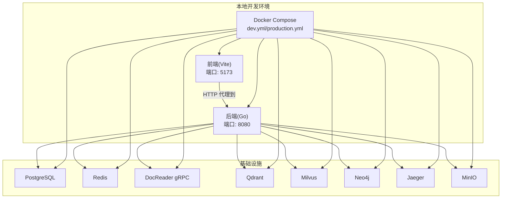
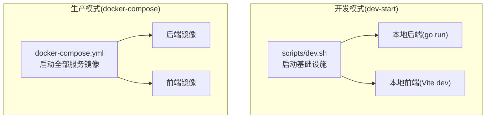
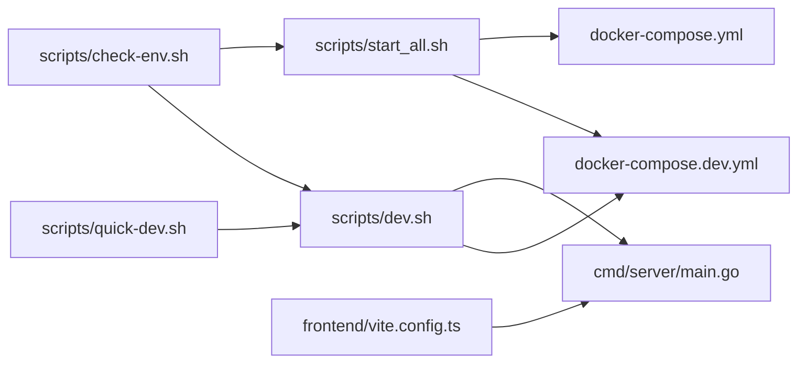
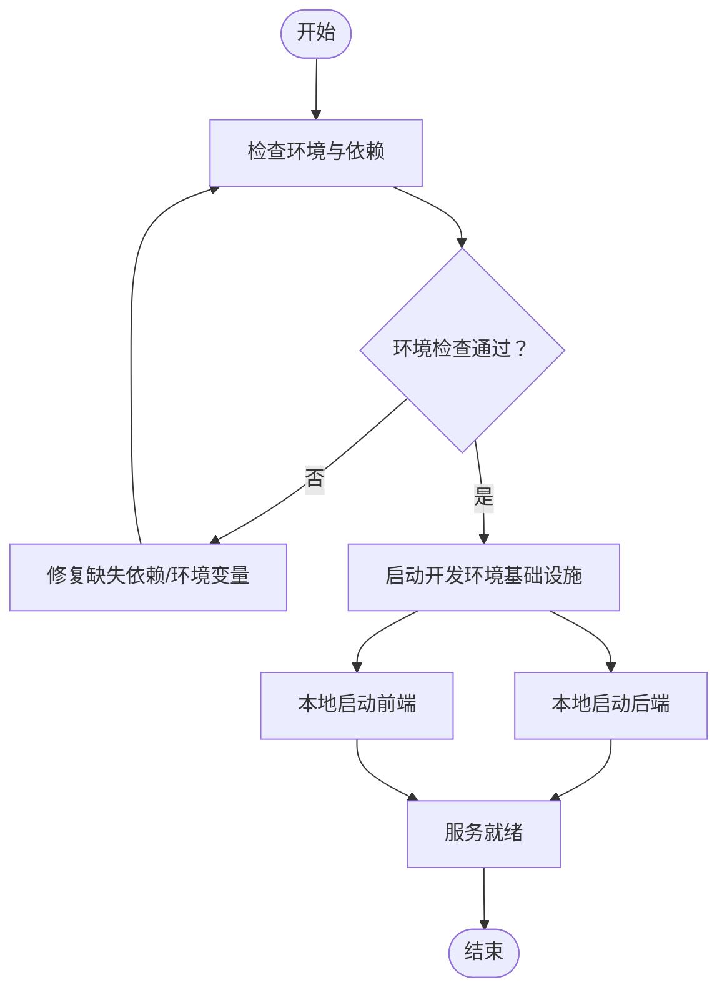
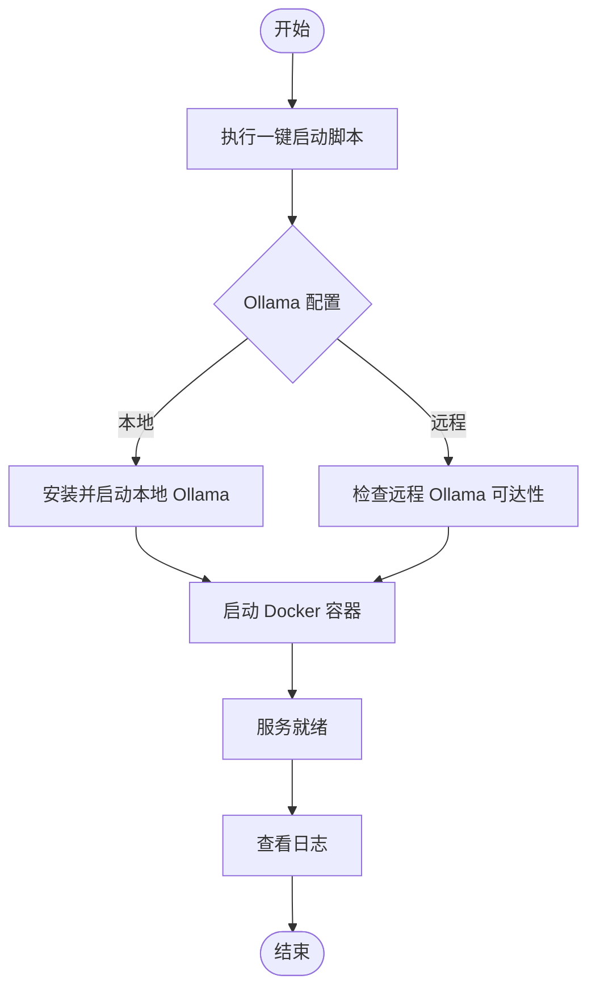

# 本地部署

<cite>
**本文引用的文件**
- [README.md](file://README.md)
- [Makefile](file://Makefile)
- [scripts/dev.sh](file://scripts/dev.sh)
- [scripts/quick-dev.sh](file://scripts/quick-dev.sh)
- [scripts/start_all.sh](file://scripts/start_all.sh)
- [scripts/check-env.sh](file://scripts/check-env.sh)
- [docker-compose.yml](file://docker-compose.yml)
- [docker-compose.dev.yml](file://docker-compose.dev.yml)
- [frontend/vite.config.ts](file://frontend/vite.config.ts)
- [frontend/package.json](file://frontend/package.json)
- [frontend/src/utils/request.ts](file://frontend/src/utils/request.ts)
- [cmd/server/main.go](file://cmd/server/main.go)
- [go.mod](file://go.mod)
- [config/config.yaml](file://config/config.yaml)
</cite>

## 目录
1. [简介](#简介)
2. [项目结构](#项目结构)
3. [核心组件](#核心组件)
4. [架构总览](#架构总览)
5. [详细组件分析](#详细组件分析)
6. [依赖关系分析](#依赖关系分析)
7. [性能考虑](#性能考虑)
8. [故障排查指南](#故障排查指南)
9. [结论](#结论)
10. [附录](#附录)

## 简介
本指南面向希望在本地快速搭建 WeKnora 开发与测试环境的开发者，覆盖前置条件检查、依赖安装、环境变量配置、开发模式与快速开发模式差异、本地调试与热重载、开发工具链使用，以及常见问题排查。文档同时提供完整本地部署流程图与配置要点，帮助你在 Windows、macOS、Linux 平台上高效完成本地环境搭建。

## 项目结构
WeKnora 采用前后端分离与多服务容器化的架构：后端为 Go 微服务，前端为 Vue 3 + Vite 应用，文档解析服务为独立子项目，另有 MCP 服务与多种可选基础设施（向量库、对象存储、图数据库、链路追踪等）。开发与部署主要通过 Docker Compose 管理，Makefile 提供常用命令封装。

图表来源
- [docker-compose.dev.yml:1-420](file://docker-compose.dev.yml#L1-L420)
- [docker-compose.yml:1-613](file://docker-compose.yml#L1-L613)
- [frontend/vite.config.ts:38-54](file://frontend/vite.config.ts#L38-L54)
- [cmd/server/main.go:62-67](file://cmd/server/main.go#L62-L67)

章节来源
- [README.md:226-261](file://README.md#L226-L261)
- [Makefile:305-327](file://Makefile#L305-L327)

## 核心组件
- 后端服务（Go）
  - 通过依赖注入容器启动，监听配置的主机与端口，支持优雅关闭与信号处理。
  - 默认监听 8080 端口，健康检查路径为 /health。
- 前端服务（Vue 3 + Vite）
  - 本地开发默认端口 5173，通过代理将 /api 与 /files 请求转发至后端 8080 端口。
- 基础设施服务（Docker Compose）
  - 包括 PostgreSQL、Redis、DocReader、Qdrant、Milvus、Neo4j、Jaeger、MinIO 等，按需启用。
- 开发脚本与一键启动
  - 提供开发模式启动脚本、快速开发一键脚本、环境检查脚本与一键启动脚本，简化本地部署。

章节来源
- [cmd/server/main.go:43-123](file://cmd/server/main.go#L43-L123)
- [frontend/vite.config.ts:38-54](file://frontend/vite.config.ts#L38-L54)
- [docker-compose.dev.yml:1-420](file://docker-compose.dev.yml#L1-L420)
- [docker-compose.yml:1-613](file://docker-compose.yml#L1-L613)
- [scripts/dev.sh:1-362](file://scripts/dev.sh#L1-L362)
- [scripts/quick-dev.sh:1-125](file://scripts/quick-dev.sh#L1-L125)
- [scripts/start_all.sh:1-773](file://scripts/start_all.sh#L1-L773)
- [scripts/check-env.sh:1-212](file://scripts/check-env.sh#L1-L212)

## 架构总览
下图展示了本地开发与生产部署两种模式的关键差异：开发模式仅启动基础设施，后端与前端在本地运行；生产模式通过 Docker Compose 启动全部服务镜像。

图表来源
- [scripts/dev.sh:105-198](file://scripts/dev.sh#L105-L198)
- [scripts/dev.sh:240-300](file://scripts/dev.sh#L240-L300)
- [scripts/dev.sh:302-325](file://scripts/dev.sh#L302-L325)
- [docker-compose.yml:1-613](file://docker-compose.yml#L1-L613)

章节来源
- [README.md:310-331](file://README.md#L310-L331)

## 详细组件分析

### 开发模式与快速开发模式
- 开发模式（推荐）
  - 通过脚本启动基础设施（PostgreSQL、Redis、DocReader、可选 Qdrant/Milvus/Neo4j/Jaeger/MinIO/Dex 等），后端与前端分别在本地运行。
  - 后端支持 Air 热重载；前端支持 Vite 热更新。
  - 适合频繁改动代码的日常开发。
- 快速开发模式
  - 一键启动脚本在单终端内启动基础设施，并可选择在当前终端启动后端或前端，便于快速验证。
  - 适合希望一步到位完成本地联调的场景。

章节来源
- [README.md:310-331](file://README.md#L310-L331)
- [scripts/dev.sh:1-362](file://scripts/dev.sh#L1-L362)
- [scripts/quick-dev.sh:1-125](file://scripts/quick-dev.sh#L1-L125)

### 环境变量与配置文件
- .env 与 .env.example
  - 项目提供示例环境变量文件，需复制为 .env 并按需编辑。
  - 关键变量包括数据库驱动、主机、端口、用户名、密码、数据库名、存储类型、MinIO/S3/TOS 配置、Redis 地址、Ollama 基础地址、模型初始化名称等。
- 后端配置
  - 服务监听主机与端口由配置文件决定，默认 8080。
- 前端代理
  - Vite 开发服务器将 /api 与 /files 代理到后端 8080 端口，便于本地联调。

章节来源
- [scripts/start_all.sh:86-111](file://scripts/start_all.sh#L86-L111)
- [scripts/check-env.sh:39-50](file://scripts/check-env.sh#L39-L50)
- [config/config.yaml:1-113](file://config/config.yaml#L1-L113)
- [frontend/vite.config.ts:42-53](file://frontend/vite.config.ts#L42-L53)

### 依赖安装与前置条件
- Docker 与 Docker Compose
  - 本地开发与一键启动脚本均依赖 Docker 与 Docker Compose（优先 docker compose 插件，回退 docker-compose v1）。
- Go 环境
  - 后端使用 Go 1.24.x，建议安装对应版本。
- Node.js 与 npm
  - 前端使用 Vite，需安装 Node.js 与 npm。
- 可选：Air 热重载工具
  - 安装后可在本地后端启动时自动热重载，提升开发效率。

章节来源
- [scripts/start_all.sh:268-297](file://scripts/start_all.sh#L268-L297)
- [scripts/check-env.sh:130-188](file://scripts/check-env.sh#L130-L188)
- [go.mod:3-3](file://go.mod#L3-L3)
- [frontend/package.json:1-64](file://frontend/package.json#L1-L64)

### 启动步骤（开发模式）
- 启动基础设施
  - 使用 Makefile 或脚本启动开发环境基础设施，按需启用 MinIO、Qdrant、Neo4j、Jaeger、Dex 等可选服务。
- 启动后端
  - 在新终端执行本地后端启动命令，支持 Air 热重载；若未安装 Air，则普通模式启动。
- 启动前端
  - 在新终端执行本地前端启动命令，Vite 默认端口 5173，自动代理到后端 8080。
- 访问服务
  - 前端：http://localhost:5173
  - 后端 API：http://localhost:8080
  - 可选：MinIO 控制台 http://localhost:9001，Jaeger UI http://localhost:16686

章节来源
- [Makefile:305-327](file://Makefile#L305-L327)
- [scripts/dev.sh:105-198](file://scripts/dev.sh#L105-L198)
- [scripts/dev.sh:240-300](file://scripts/dev.sh#L240-L300)
- [scripts/dev.sh:302-325](file://scripts/dev.sh#L302-L325)
- [README.md:262-269](file://README.md#L262-L269)

### 启动步骤（快速开发模式）
- 一键启动
  - 运行快速开发脚本，按提示选择是否在当前终端启动后端与前端。
- 后台进程管理
  - 脚本会记录 PID 并输出日志文件位置，便于后续停止与查看日志。
- 访问服务
  - 与开发模式一致。

章节来源
- [scripts/quick-dev.sh:1-125](file://scripts/quick-dev.sh#L1-L125)

### 一键启动（生产模式）
- 一键启动脚本
  - 支持启动 Ollama 与 Docker 容器，自动拉取镜像、检查环境、预拉取沙箱镜像等。
- 环境检查
  - 检查 Docker、.env、Ollama（本地/远程）、沙箱镜像、磁盘与内存、CPU 等。
- 停止服务
  - 支持停止 Ollama 与 Docker 容器。

章节来源
- [scripts/start_all.sh:1-773](file://scripts/start_all.sh#L1-L773)
- [scripts/check-env.sh:1-212](file://scripts/check-env.sh#L1-L212)

### 本地调试与热重载
- 后端热重载
  - 若安装 Air，后端修改代码后自动重启；未安装则需手动重启。
- 前端热重载
  - Vite 默认开启热更新，修改前端代码后自动刷新页面。
- 代理与跨域
  - 前端通过 Vite 代理将 /api 与 /files 请求转发至后端 8080，避免跨域问题。

章节来源
- [scripts/dev.sh:288-299](file://scripts/dev.sh#L288-L299)
- [frontend/vite.config.ts:38-54](file://frontend/vite.config.ts#L38-L54)

### API 调用与认证
- 前端请求拦截
  - 自动注入 Authorization Bearer Token、Accept-Language、X-Request-ID 等头部。
  - 对 401 错误进行刷新 Token 的处理，必要时跳转登录页。
- 后端安全定义
  - Swagger 注释中定义了 Bearer 与 API Key 两种鉴权方式，便于本地联调与测试。

章节来源
- [frontend/src/utils/request.ts:29-62](file://frontend/src/utils/request.ts#L29-L62)
- [frontend/src/utils/request.ts:94-217](file://frontend/src/utils/request.ts#L94-L217)
- [cmd/server/main.go:14-23](file://cmd/server/main.go#L14-L23)

## 依赖关系分析

图表来源
- [scripts/dev.sh:1-362](file://scripts/dev.sh#L1-L362)
- [scripts/quick-dev.sh:1-125](file://scripts/quick-dev.sh#L1-L125)
- [scripts/start_all.sh:1-773](file://scripts/start_all.sh#L1-L773)
- [docker-compose.dev.yml:1-420](file://docker-compose.dev.yml#L1-L420)
- [docker-compose.yml:1-613](file://docker-compose.yml#L1-L613)
- [frontend/vite.config.ts:38-54](file://frontend/vite.config.ts#L38-L54)
- [cmd/server/main.go:62-67](file://cmd/server/main.go#L62-L67)

章节来源
- [Makefile:305-327](file://Makefile#L305-L327)

## 性能考虑
- 向量数据库与检索
  - 可选 Qdrant、Milvus、Weaviate 等，按需启用以满足不同规模与性能需求。
- 缓存与队列
  - Redis 用于缓存与异步任务队列，建议合理设置密码与连接参数。
- 存储
  - 支持本地、MinIO、S3、TOS 等对象存储，按需配置桶与访问凭据。
- 链路追踪
  - Jaeger 用于分布式链路追踪，便于定位性能瓶颈。

章节来源
- [docker-compose.yml:299-363](file://docker-compose.yml#L299-L363)
- [docker-compose.dev.yml:61-124](file://docker-compose.dev.yml#L61-L124)

## 故障排查指南
- 端口冲突
  - 前端默认 5173、后端默认 8080、MinIO 控制台 9001、Jaeger UI 16686。若被占用，可在 .env 中调整对应端口变量后重启。
- 权限问题
  - Docker 服务未运行或权限不足会导致容器启动失败；确保 Docker 服务已启动且具备相应权限。
- 依赖缺失
  - 未安装 Go、Node.js/npm、Docker/Docker Compose 会触发相应错误；按提示安装后重试。
- 环境变量错误
  - .env 文件缺失或关键变量未设置（如 DB_DRIVER、DB_HOST、DB_PORT、DB_USER、DB_PASSWORD、DB_NAME、STORAGE_TYPE 等）会导致启动失败；使用环境检查脚本快速定位。
- Ollama 连接
  - 本地与远程 Ollama 配置不同，若为远程服务需确保地址可达；本地服务需确认端口与进程状态。
- 健康检查失败
  - 容器健康检查失败时，查看对应服务日志，确认数据库初始化、网络连通性与配置正确。

章节来源
- [scripts/check-env.sh:39-50](file://scripts/check-env.sh#L39-L50)
- [scripts/check-env.sh:60-188](file://scripts/check-env.sh#L60-L188)
- [scripts/start_all.sh:174-232](file://scripts/start_all.sh#L174-L232)
- [scripts/start_all.sh:530-610](file://scripts/start_all.sh#L530-L610)
- [docker-compose.yml:44-49](file://docker-compose.yml#L44-L49)
- [docker-compose.dev.yml:17-23](file://docker-compose.dev.yml#L17-L23)

## 结论
通过本指南，你可以在本地快速搭建 WeKnora 的开发与测试环境。开发模式适合频繁改动代码的日常开发，快速开发模式适合一次性完成联调验证。结合环境检查脚本与一键启动脚本，可显著降低本地部署门槛与维护成本。遇到问题时，可依据故障排查指南逐项定位并解决。

## 附录

### 本地部署流程图（开发模式）

图表来源
- [scripts/check-env.sh:190-211](file://scripts/check-env.sh#L190-L211)
- [scripts/dev.sh:105-198](file://scripts/dev.sh#L105-L198)
- [scripts/dev.sh:240-325](file://scripts/dev.sh#L240-L325)

### 本地部署流程图（一键启动）

图表来源
- [scripts/start_all.sh:174-232](file://scripts/start_all.sh#L174-L232)
- [scripts/start_all.sh:339-388](file://scripts/start_all.sh#L339-L388)
- [scripts/start_all.sh:747-770](file://scripts/start_all.sh#L747-L770)