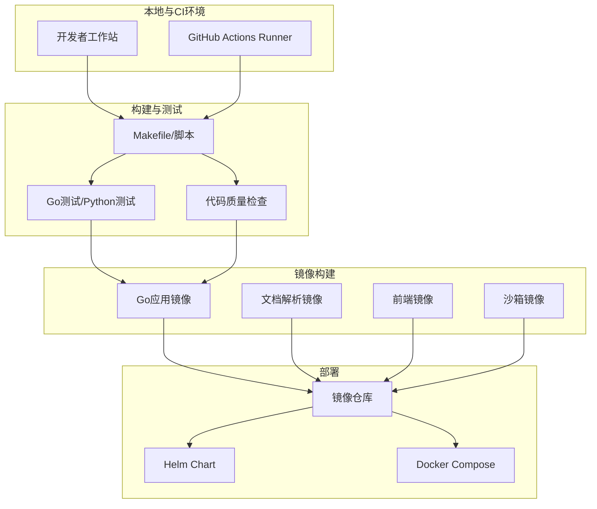
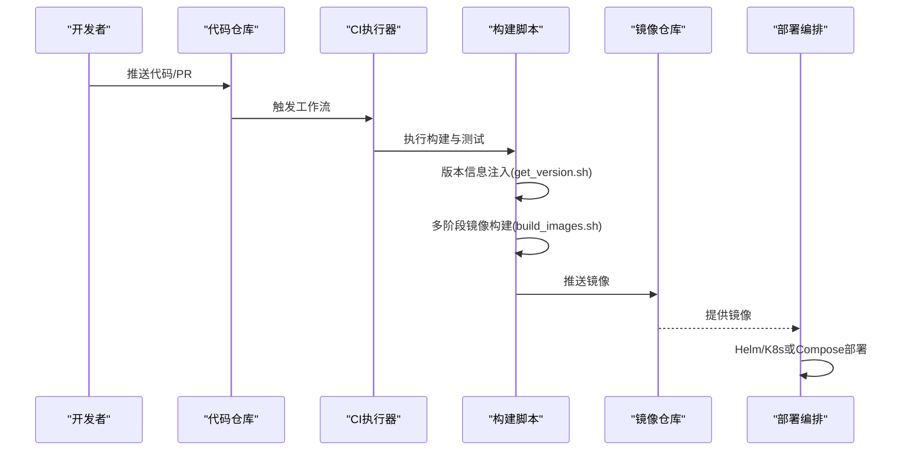
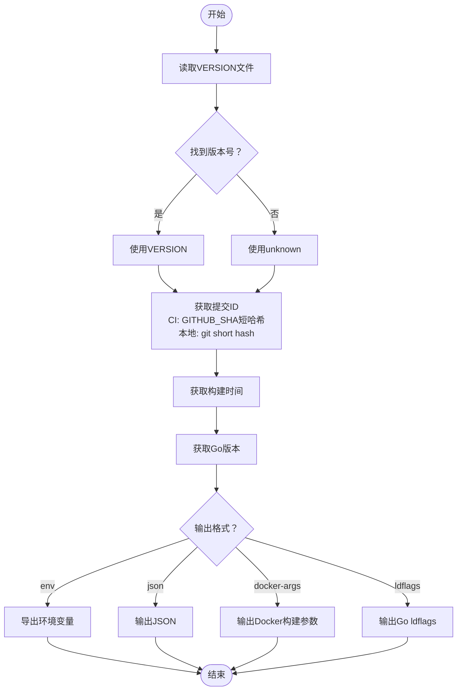
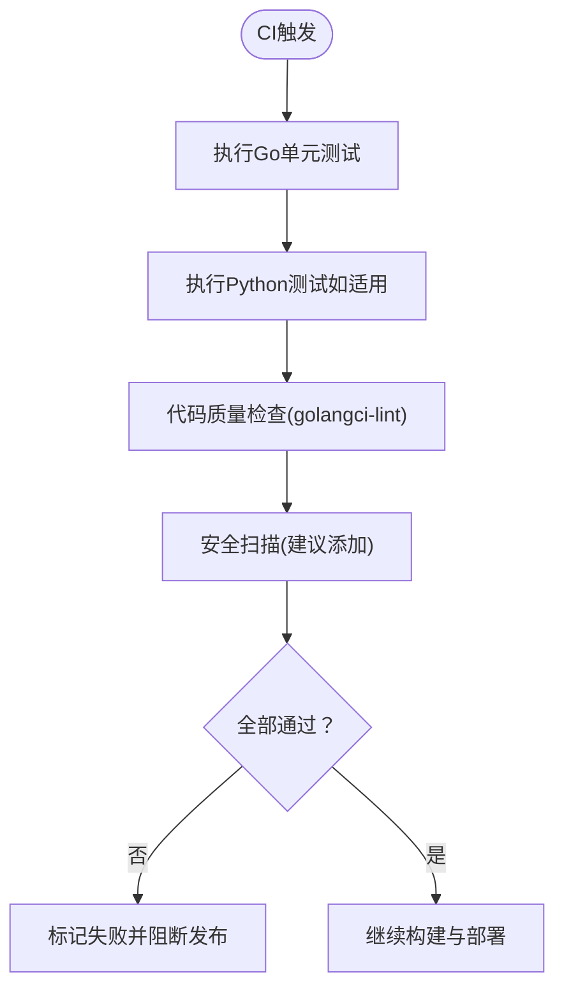
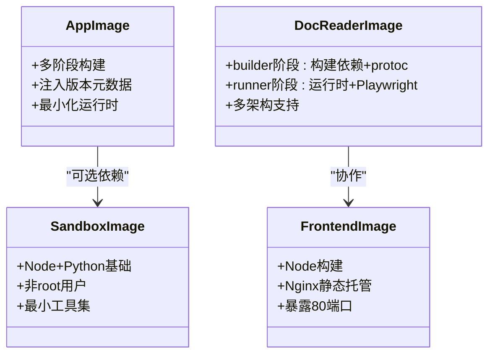
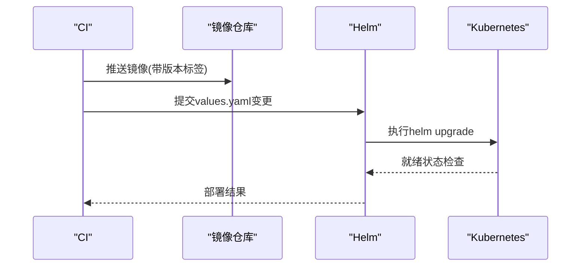
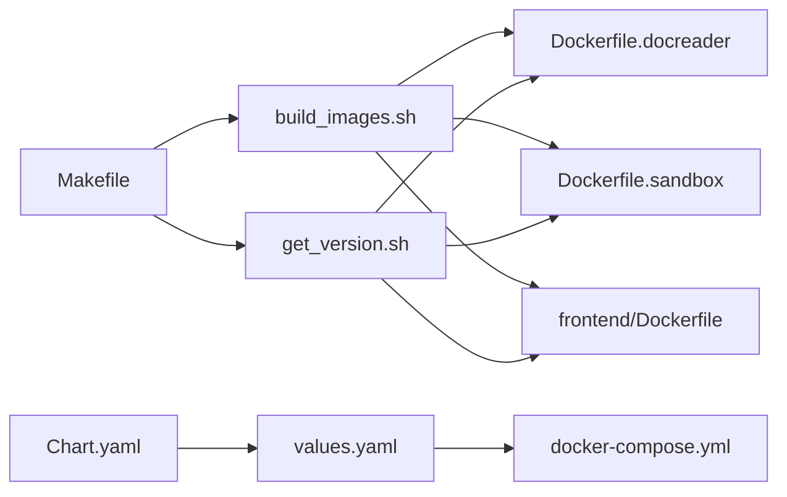

# CI/CD流水线配置

<cite>
**本文档引用的文件**
- [Makefile](file://Makefile)
- [scripts/get_version.sh](file://scripts/get_version.sh)
- [scripts/build_images.sh](file://scripts/build_images.sh)
- [scripts/test-homebrew.sh](file://scripts/test-homebrew.sh)
- [docker/Dockerfile.docreader](file://docker/Dockerfile.docreader)
- [docker/Dockerfile.sandbox](file://docker/Dockerfile.sandbox)
- [frontend/Dockerfile](file://frontend/Dockerfile)
- [helm/Chart.yaml](file://helm/Chart.yaml)
- [helm/values.yaml](file://helm/values.yaml)
- [docker-compose.yml](file://docker-compose.yml)
- [docker-compose.dev.yml](file://docker-compose.dev.yml)
- [.github/pull_request_template.md](file://.github/pull_request_template.md)
</cite>

## 目录
1. [简介](#简介)
2. [项目结构](#项目结构)
3. [核心组件](#核心组件)
4. [架构总览](#架构总览)
5. [详细组件分析](#详细组件分析)
6. [依赖关系分析](#依赖关系分析)
7. [性能考虑](#性能考虑)
8. [故障排除指南](#故障排除指南)
9. [结论](#结论)
10. [附录](#附录)

## 简介
本文件系统性梳理WeKnora项目的持续集成与持续部署（CI/CD）流水线配置，覆盖以下方面：
- GitHub Actions工作流设计思路与建议（基于现有仓库脚本与配置的映射）
- 代码质量检查、单元测试、集成测试与安全扫描的执行路径
- Docker镜像构建与推送的自动化流程（多阶段构建与镜像优化）
- 版本管理与发布策略（语义化版本控制与变更日志生成）
- 自动化部署流程（预发布与生产环境策略）
- 回滚机制与紧急修复流程
- 监控与告警在CI/CD中的集成建议
- 最佳实践与常见问题解决方案

## 项目结构
WeKnora采用多模块、多语言混合架构，CI/CD围绕以下关键要素展开：
- Go后端服务与CLI工具
- Python文档解析服务（docreader）
- 前端Vue应用（Nginx静态托管）
- 可选组件（Neo4j、Qdrant、MinIO等）
- Helm Chart用于Kubernetes部署
- Docker Compose用于本地与开发环境编排

**图表来源**
- [Makefile:1-328](file://Makefile#L1-L328)
- [scripts/get_version.sh:1-91](file://scripts/get_version.sh#L1-L91)
- [scripts/build_images.sh:1-393](file://scripts/build_images.sh#L1-L393)
- [docker/Dockerfile.docreader:1-158](file://docker/Dockerfile.docreader#L1-L158)
- [docker/Dockerfile.sandbox:1-31](file://docker/Dockerfile.sandbox#L1-L31)
- [frontend/Dockerfile:1-43](file://frontend/Dockerfile#L1-L43)
- [helm/Chart.yaml:1-27](file://helm/Chart.yaml#L1-L27)
- [helm/values.yaml:1-493](file://helm/values.yaml#L1-L493)
- [docker-compose.yml](file://docker-compose.yml)
- [docker-compose.dev.yml](file://docker-compose.dev.yml)

**章节来源**
- [Makefile:1-328](file://Makefile#L1-L328)
- [helm/Chart.yaml:1-27](file://helm/Chart.yaml#L1-L27)
- [helm/values.yaml:1-493](file://helm/values.yaml#L1-L493)

## 核心组件
- 版本与元数据注入：统一通过脚本获取版本、提交ID、构建时间、Go版本，并以环境变量或ldflags形式注入到构建产物中，确保可追溯性。
- 镜像构建：多阶段Dockerfile分别针对Go应用、Python文档解析器、前端Nginx静态站点与沙箱环境，实现最小化镜像体积与运行时依赖。
- 部署编排：Helm Chart定义了应用、前端、文档解析器、PostgreSQL/ParadeDB、Redis、可选MinIO/Neo4j/Qdrant等组件的资源与参数；Docker Compose提供本地快速验证。
- 测试与质量：Makefile提供测试与代码质量检查入口；Python docreader模块提供独立测试；Homebrew打包流程包含安装验证。

**章节来源**
- [scripts/get_version.sh:1-91](file://scripts/get_version.sh#L1-L91)
- [Makefile:94-221](file://Makefile#L94-L221)
- [scripts/test-homebrew.sh:1-179](file://scripts/test-homebrew.sh#L1-L179)
- [docker/Dockerfile.docreader:1-158](file://docker/Dockerfile.docreader#L1-L158)
- [docker/Dockerfile.sandbox:1-31](file://docker/Dockerfile.sandbox#L1-L31)
- [frontend/Dockerfile:1-43](file://frontend/Dockerfile#L1-L43)
- [helm/Chart.yaml:1-27](file://helm/Chart.yaml#L1-L27)
- [helm/values.yaml:1-493](file://helm/values.yaml#L1-L493)

## 架构总览
下图展示了从代码提交到镜像构建、推送与部署的关键路径，映射到实际仓库中的脚本与配置文件。

**图表来源**
- [Makefile:103-123](file://Makefile#L103-L123)
- [scripts/get_version.sh:1-91](file://scripts/get_version.sh#L1-L91)
- [scripts/build_images.sh:1-393](file://scripts/build_images.sh#L1-L393)
- [helm/Chart.yaml:1-27](file://helm/Chart.yaml#L1-L27)
- [helm/values.yaml:1-493](file://helm/values.yaml#L1-L493)
- [docker-compose.yml](file://docker-compose.yml)

## 详细组件分析

### 版本管理与发布策略
- 版本来源：优先读取VERSION文件，回退至unknown；提交ID在CI环境下使用GITHUB_SHA短哈希，在本地使用git rev-parse。
- 元数据注入：支持以环境变量、JSON、Docker构建参数、Go ldflags等多种格式输出，便于在构建链路中传递。
- 发布策略建议：
  - 语义化版本控制：遵循主.次.修订规则，结合标签打点发布。
  - 变更日志：基于Git提交与标签生成，保留每个版本的变更摘要与破坏性更新说明。
  - 分支策略：主分支保护，hotfix分支从release标签切出，feature分支通过PR合并。

**图表来源**
- [scripts/get_version.sh:1-91](file://scripts/get_version.sh#L1-L91)

**章节来源**
- [scripts/get_version.sh:1-91](file://scripts/get_version.sh#L1-L91)

### 代码质量检查与测试
- 单元测试：Makefile提供test目标，直接调用go test -v ./...，覆盖Go后端各模块。
- 代码质量：Makefile提供lint目标，使用golangci-lint执行静态分析。
- Python测试：docreader模块提供独立测试入口，配合多阶段构建与运行时依赖安装。
- 集成测试：Helm Chart与Docker Compose组合验证端到端连通性（应用、前端、PostgreSQL/ParadeDB、Redis）。
- 安全扫描：建议在CI中集成容器镜像漏洞扫描（如Clair、Trivy）与依赖扫描（如Dependabot/GitHub Security Alerts）。

**图表来源**
- [Makefile:94-221](file://Makefile#L94-L221)
- [docker/Dockerfile.docreader:1-158](file://docker/Dockerfile.docreader#L1-L158)

**章节来源**
- [Makefile:94-221](file://Makefile#L94-L221)

### Docker镜像构建与推送
- 多阶段构建：
  - Go应用镜像：最小化运行时，仅包含必要二进制与依赖。
  - 文档解析器镜像：分builder与runner两阶段，builder安装构建依赖与protoc，runner仅保留运行时依赖与Playwright浏览器。
  - 前端镜像：Node构建产物复制到Nginx静态目录，暴露80端口。
  - 沙箱镜像：Node与Python基础环境组合，非root用户执行，最小化工具集。
- 平台与架构：脚本自动检测平台（x86_64/aarch64），设置--platform参数，确保跨平台一致性。
- 构建参数：通过build-arg传入版本、提交ID、构建时间、Go版本等，注入镜像元数据。
- 推送策略：建议在CI中根据分支/标签触发推送，区分nightly、rc与正式版镜像标签。

**图表来源**
- [docker/Dockerfile.docreader:1-158](file://docker/Dockerfile.docreader#L1-L158)
- [docker/Dockerfile.sandbox:1-31](file://docker/Dockerfile.sandbox#L1-L31)
- [frontend/Dockerfile:1-43](file://frontend/Dockerfile#L1-L43)
- [scripts/build_images.sh:1-393](file://scripts/build_images.sh#L1-L393)

**章节来源**
- [docker/Dockerfile.docreader:1-158](file://docker/Dockerfile.docreader#L1-L158)
- [docker/Dockerfile.sandbox:1-31](file://docker/Dockerfile.sandbox#L1-L31)
- [frontend/Dockerfile:1-43](file://frontend/Dockerfile#L1-L43)
- [scripts/build_images.sh:1-393](file://scripts/build_images.sh#L1-L393)

### 自动化部署流程（预发布与生产）
- 预发布环境：使用Helm values中的预设参数，启用最小化组件集合，关闭TLS与Ingress，便于快速验证。
- 生产环境：通过Helm values.yaml配置完整组件（PostgreSQL/ParadeDB、Redis、可选MinIO/Neo4j/Qdrant），开启Ingress与TLS，设置持久化存储。
- 部署策略：建议采用滚动更新与就地探针（liveness/readiness）保障平滑升级；为关键组件设置资源限制与节点亲和。
- 回滚机制：Helm历史版本管理支持一键回滚；Kubernetes原生回滚策略（Deployment rollback）与镜像tag固定化相结合。

**图表来源**
- [helm/Chart.yaml:1-27](file://helm/Chart.yaml#L1-L27)
- [helm/values.yaml:1-493](file://helm/values.yaml#L1-L493)

**章节来源**
- [helm/Chart.yaml:1-27](file://helm/Chart.yaml#L1-L27)
- [helm/values.yaml:1-493](file://helm/values.yaml#L1-L493)

### 回滚机制与紧急修复
- 回滚策略：
  - Helm：使用helm history与helm rollback快速回到上一个稳定版本。
  - Kubernetes：对Deployment/StatefulSet执行滚动回滚，结合镜像tag固定避免“latest漂移”。
- 紧急修复：
  - 快速发布hotfix分支，修复后立即触发CI构建与部署。
  - 在Helm values中临时禁用风险组件或降级资源配额，降低影响面。
- 监控与告警：建议在CI中集成部署后的健康检查与指标上报，异常时自动触发通知与回滚。

**章节来源**
- [helm/values.yaml:1-493](file://helm/values.yaml#L1-L493)

### 监控与告警在CI/CD中的集成
- 健康检查：在Helm Chart中配置liveness/readiness探针，CI中等待就绪后再标记成功。
- 指标采集：在应用层集成Prometheus指标导出，CI中通过Helm values启用Sidecar或InitContainer。
- 告警通道：将CI/CD事件接入Slack/Teams等通知渠道，异常自动告警并附带日志链接。

**章节来源**
- [helm/values.yaml:112-130](file://helm/values.yaml#L112-L130)

## 依赖关系分析
- 构建链路依赖：
  - Makefile -> scripts/get_version.sh -> scripts/build_images.sh
  - Dockerfile依赖各自语言生态（Go/Python/Node/Nginx）
- 部署链路依赖：
  - Helm Chart.values.yaml -> Kubernetes资源定义
  - Docker Compose -> 本地快速验证
- 版本与元数据：
  - get_version.sh统一注入到镜像与二进制，确保可追溯性

**图表来源**
- [Makefile:1-328](file://Makefile#L1-L328)
- [scripts/get_version.sh:1-91](file://scripts/get_version.sh#L1-L91)
- [scripts/build_images.sh:1-393](file://scripts/build_images.sh#L1-L393)
- [docker/Dockerfile.docreader:1-158](file://docker/Dockerfile.docreader#L1-L158)
- [docker/Dockerfile.sandbox:1-31](file://docker/Dockerfile.sandbox#L1-L31)
- [frontend/Dockerfile:1-43](file://frontend/Dockerfile#L1-L43)
- [helm/Chart.yaml:1-27](file://helm/Chart.yaml#L1-L27)
- [helm/values.yaml:1-493](file://helm/values.yaml#L1-L493)
- [docker-compose.yml](file://docker-compose.yml)

**章节来源**
- [Makefile:1-328](file://Makefile#L1-L328)
- [scripts/get_version.sh:1-91](file://scripts/get_version.sh#L1-L91)
- [scripts/build_images.sh:1-393](file://scripts/build_images.sh#L1-L393)
- [helm/values.yaml:1-493](file://helm/values.yaml#L1-L493)

## 性能考虑
- 镜像体积优化：多阶段构建减少运行时依赖；前端镜像仅包含Nginx与构建产物。
- 构建缓存：利用Docker BuildKit与Go模块缓存，减少重复构建时间。
- 并行化：CI中并行执行测试与构建不同组件的镜像，缩短总耗时。
- 资源限制：Helm values为各组件设置合理的requests/limits，避免资源争抢。

**章节来源**
- [docker/Dockerfile.docreader:1-158](file://docker/Dockerfile.docreader#L1-L158)
- [frontend/Dockerfile:1-43](file://frontend/Dockerfile#L1-L43)
- [helm/values.yaml:68-76](file://helm/values.yaml#L68-L76)

## 故障排除指南
- 镜像构建失败：
  - 检查平台检测与--platform参数是否匹配。
  - 确认Docker守护进程运行与权限。
  - 核对build-arg传参（版本、提交ID、构建时间、Go版本）。
- 测试失败：
  - 使用make test定位失败用例；关注跨平台兼容性。
  - Python测试需确保Playwright浏览器安装与依赖满足。
- 部署异常：
  - 检查Helm values中的Secrets与持久化配置。
  - 关注探针配置与资源限制导致的Pod反复重启。
- Homebrew打包验证：
  - 使用scripts/test-homebrew.sh进行本地验证，确保Formula正确安装与服务可用。

**章节来源**
- [scripts/build_images.sh:58-75](file://scripts/build_images.sh#L58-L75)
- [Makefile:94-221](file://Makefile#L94-L221)
- [scripts/test-homebrew.sh:1-179](file://scripts/test-homebrew.sh#L1-L179)
- [helm/values.yaml:382-402](file://helm/values.yaml#L382-L402)

## 结论
WeKnora的CI/CD体系以脚本化构建与多阶段Docker镜像为核心，结合Helm Chart与Docker Compose实现从开发到生产的全链路自动化。通过统一的版本与元数据注入、完善的测试与质量检查、以及可追溯的镜像与部署策略，能够稳定支撑预发布与生产环境的持续交付。建议在现有基础上补充容器漏洞扫描、指标与告警集成，进一步提升安全性与可观测性。

## 附录
- GitHub PR模板：用于规范变更描述与审查流程，建议在CI中强制填写变更类型与影响范围。
- 开发与运维脚本：Makefile与scripts目录提供了完整的本地开发、测试与打包能力，适合作为CI流水线的基础。

**章节来源**
- [.github/pull_request_template.md](file://.github/pull_request_template.md)