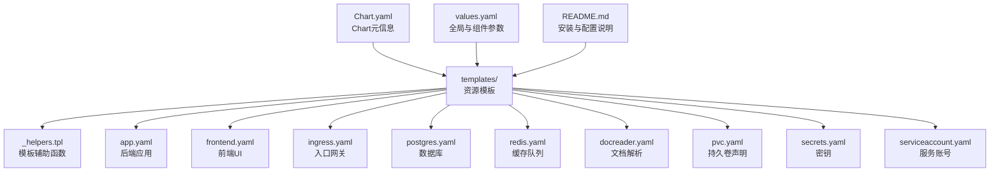
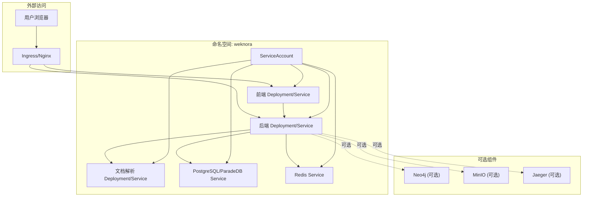
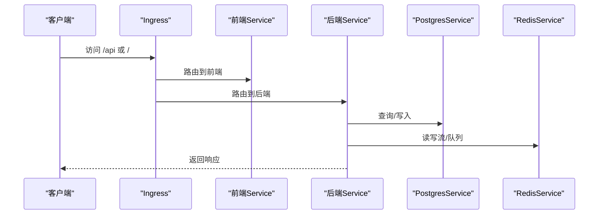
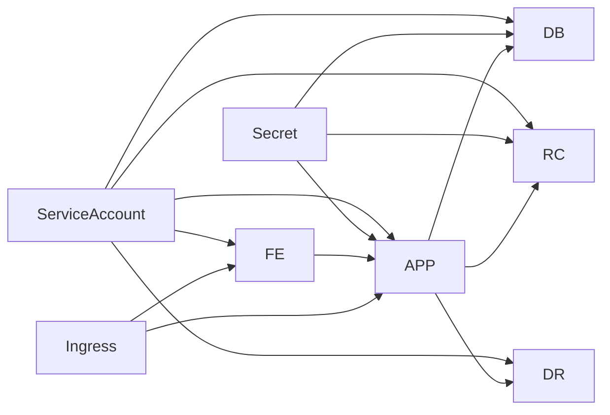

# Kubernetes与Helm部署

<cite>
**本文引用的文件**
- [Chart.yaml](file://helm/Chart.yaml)
- [values.yaml](file://helm/values.yaml)
- [README.md](file://helm/README.md)
- [_helpers.tpl](file://helm/templates/_helpers.tpl)
- [app.yaml](file://helm/templates/app.yaml)
- [frontend.yaml](file://helm/templates/frontend.yaml)
- [ingress.yaml](file://helm/templates/ingress.yaml)
- [postgres.yaml](file://helm/templates/postgres.yaml)
- [redis.yaml](file://helm/templates/redis.yaml)
- [docreader.yaml](file://helm/templates/docreader.yaml)
- [pvc.yaml](file://helm/templates/pvc.yaml)
- [secrets.yaml](file://helm/templates/secrets.yaml)
- [serviceaccount.yaml](file://helm/templates/serviceaccount.yaml)
- [main.go](file://cmd/server/main.go)
- [docker-compose.yml](file://docker-compose.yml)
- [Dockerfile.docreader](file://docker/Dockerfile.docreader)
- [Dockerfile.sandbox](file://docker/Dockerfile.sandbox)
</cite>

## 目录
1. [简介](#简介)
2. [项目结构](#项目结构)
3. [核心组件](#核心组件)
4. [架构总览](#架构总览)
5. [详细组件分析](#详细组件分析)
6. [依赖关系分析](#依赖关系分析)
7. [性能考量](#性能考量)
8. [故障排查指南](#故障排查指南)
9. [结论](#结论)
10. [附录](#附录)

## 简介
本指南面向运维与平台工程团队，提供WeKnora在Kubernetes上的Helm部署专业指南。内容涵盖：
- Helm Chart的配置与自定义选项，重点解读values.yaml参数与最佳实践
- Kubernetes资源清单模板化设计，包括Deployment、Service、Ingress、ConfigMap与PVC
- 生产环境资源配置建议（CPU/内存请求与限制、HPA）
- 持久化存储配置（PVC与StorageClass选择）
- 网络与安全策略（Ingress、TLS、RBAC、Pod安全上下文）
- 滚动更新与蓝绿部署策略
- 监控与日志采集集成

## 项目结构
WeKnora的Kubernetes/Helm部署位于helm目录，采用“模板化+参数化”的结构：
- Chart元信息与版本：Chart.yaml
- 全局与组件级参数：values.yaml
- 模板：templates/ 下的各组件清单
- 使用说明与最佳实践：README.md

图表来源
- [Chart.yaml:1-27](file://helm/Chart.yaml#L1-L27)
- [values.yaml:1-493](file://helm/values.yaml#L1-L493)
- [_helpers.tpl:1-196](file://helm/templates/_helpers.tpl#L1-L196)
- [app.yaml:1-200](file://helm/templates/app.yaml#L1-L200)
- [frontend.yaml:1-113](file://helm/templates/frontend.yaml#L1-L113)
- [ingress.yaml:1-53](file://helm/templates/ingress.yaml#L1-L53)
- [postgres.yaml:1-129](file://helm/templates/postgres.yaml#L1-L129)
- [redis.yaml:1-125](file://helm/templates/redis.yaml#L1-L125)
- [docreader.yaml:1-103](file://helm/templates/docreader.yaml#L1-L103)
- [pvc.yaml:1-82](file://helm/templates/pvc.yaml#L1-L82)
- [secrets.yaml:1-40](file://helm/templates/secrets.yaml#L1-L40)
- [serviceaccount.yaml:1-25](file://helm/templates/serviceaccount.yaml#L1-L25)

章节来源
- [Chart.yaml:1-27](file://helm/Chart.yaml#L1-L27)
- [values.yaml:1-493](file://helm/values.yaml#L1-L493)
- [README.md:1-327](file://helm/README.md#L1-L327)

## 核心组件
- 应用后端（App）：Go/Gin实现，提供REST API与健康检查端点
- 前端UI（Frontend）：Nginx静态站点，反向代理至后端
- 文档解析（Docreader）：Python gRPC服务，负责文档解析与图片提取
- 数据库（PostgreSQL/ParadeDB）：支持向量检索与全文检索
- 缓存队列（Redis）：流式任务队列与会话状态
- 可选组件：Neo4j（知识图谱）、MinIO（对象存储）、Jaeger（分布式追踪）

章节来源
- [app.yaml:1-200](file://helm/templates/app.yaml#L1-L200)
- [frontend.yaml:1-113](file://helm/templates/frontend.yaml#L1-L113)
- [docreader.yaml:1-103](file://helm/templates/docreader.yaml#L1-L103)
- [postgres.yaml:1-129](file://helm/templates/postgres.yaml#L1-L129)
- [redis.yaml:1-125](file://helm/templates/redis.yaml#L1-L125)
- [values.yaml:53-140](file://helm/values.yaml#L53-L140)
- [values.yaml:144-187](file://helm/values.yaml#L144-L187)
- [values.yaml:191-237](file://helm/values.yaml#L191-L237)
- [values.yaml:241-283](file://helm/values.yaml#L241-L283)
- [values.yaml:287-329](file://helm/values.yaml#L287-L329)
- [values.yaml:424-472](file://helm/values.yaml#L424-L472)

## 架构总览
下图展示了WeKnora在Kubernetes中的典型拓扑与流量路径。

图表来源
- [ingress.yaml:1-53](file://helm/templates/ingress.yaml#L1-L53)
- [frontend.yaml:1-113](file://helm/templates/frontend.yaml#L1-L113)
- [app.yaml:1-200](file://helm/templates/app.yaml#L1-L200)
- [docreader.yaml:1-103](file://helm/templates/docreader.yaml#L1-L103)
- [postgres.yaml:1-129](file://helm/templates/postgres.yaml#L1-L129)
- [redis.yaml:1-125](file://helm/templates/redis.yaml#L1-L125)
- [serviceaccount.yaml:1-25](file://helm/templates/serviceaccount.yaml#L1-L25)
- [values.yaml:424-472](file://helm/values.yaml#L424-L472)

## 详细组件分析

### Helm Chart与参数体系
- Chart元信息：版本、Kubernetes版本要求、图标与关键词
- 全局参数：storageClass、镜像拉取密钥、Pod/容器安全上下文
- 组件参数：每个组件的启用开关、副本数、镜像仓库/标签、资源请求/限制、探针、节点选择与亲和性
- 密钥管理：支持现有Secret或由Chart创建的Opaque Secret
- 可选组件：MinIO、Neo4j、Qdrant、Jaeger等

章节来源
- [Chart.yaml:1-27](file://helm/Chart.yaml#L1-L27)
- [values.yaml:11-49](file://helm/values.yaml#L11-L49)
- [values.yaml:53-140](file://helm/values.yaml#L53-L140)
- [values.yaml:144-187](file://helm/values.yaml#L144-L187)
- [values.yaml:191-237](file://helm/values.yaml#L191-L237)
- [values.yaml:241-283](file://helm/values.yaml#L241-L283)
- [values.yaml:287-329](file://helm/values.yaml#L287-L329)
- [values.yaml:408-472](file://helm/values.yaml#L408-L472)
- [README.md:143-234](file://helm/README.md#L143-L234)

### 模板辅助函数（Helpers）
- 名称与标签：统一生成chart名称、完整名称、选择器标签、组件标签
- 镜像拼接：组件镜像仓库与标签组合
- 存储类：支持“使用集群默认”或指定StorageClass
- 安全上下文：合并全局与组件覆盖

章节来源
- [_helpers.tpl:12-196](file://helm/templates/_helpers.tpl#L12-L196)

### 应用后端（App）
- 部署策略：滚动更新（maxSurge=1, maxUnavailable=0），确保零停机
- 端口：8080/tcp
- 探针：HTTP /health，分健康与就绪探针
- 环境变量：数据库、Redis、JWT、存储类型、并发池大小、GraphRAG开关、文档解析地址等
- 卷挂载：/data/files（上传文件存储）
- 资源：requests/limits（CPU/内存）可按生产需求调整
- 依赖：ServiceAccount、Secret、Postgres、Redis、Docreader

图表来源
- [ingress.yaml:32-51](file://helm/templates/ingress.yaml#L32-L51)
- [frontend.yaml:95-112](file://helm/templates/frontend.yaml#L95-L112)
- [app.yaml:182-199](file://helm/templates/app.yaml#L182-L199)
- [postgres.yaml:111-128](file://helm/templates/postgres.yaml#L111-L128)
- [redis.yaml:107-124](file://helm/templates/redis.yaml#L107-L124)

章节来源
- [app.yaml:1-200](file://helm/templates/app.yaml#L1-L200)
- [main.go:43-124](file://cmd/server/main.go#L43-L124)

### 前端（Frontend）
- 部署策略：滚动更新
- 端口：80/tcp
- 探针：HTTP /
- 卷挂载：Nginx缓存与运行目录（emptyDir）
- 环境变量：APP_HOST/APP_PORT（默认指向后端Service）

章节来源
- [frontend.yaml:1-113](file://helm/templates/frontend.yaml#L1-L113)

### 文档解析（Docreader）
- 部署策略：滚动更新
- 端口：50051/grpc
- 探针：grpc_health_probe
- 环境变量：STORAGE_TYPE
- 依赖：后端通过DOCREADER_ADDR访问

章节来源
- [docreader.yaml:1-103](file://helm/templates/docreader.yaml#L1-L103)
- [Dockerfile.docreader:1-158](file://docker/Dockerfile.docreader#L1-L158)

### 数据库（PostgreSQL/ParadeDB）
- 部署策略：Recreate（避免数据损坏）
- 端口：5432/tcp
- 探针：pg_isready
- 卷挂载：/var/lib/postgresql/data
- PVC：默认10Gi，可调整

章节来源
- [postgres.yaml:1-129](file://helm/templates/postgres.yaml#L1-L129)
- [pvc.yaml:8-25](file://helm/templates/pvc.yaml#L8-L25)

### 缓存队列（Redis）
- 部署策略：Recreate
- 端口：6379/tcp
- 探针：redis-cli ping
- 卷挂载：/data
- PVC：默认1Gi，可调整

章节来源
- [redis.yaml:1-125](file://helm/templates/redis.yaml#L1-L125)
- [pvc.yaml:27-44](file://helm/templates/pvc.yaml#L27-L44)

### Ingress与TLS
- Ingress类名：nginx（可配置className）
- 主机名：host（可配置）
- TLS：可启用并指定Secret
- 路由规则：/api -> 后端Service，/ -> 前端Service
- 注解：代理缓冲区大小、连接/读写超时等

章节来源
- [ingress.yaml:1-53](file://helm/templates/ingress.yaml#L1-L53)
- [values.yaml:345-370](file://helm/values.yaml#L345-L370)

### 密钥与安全上下文
- Secret：DB_USER/DB_PASSWORD/DB_NAME、REDIS_USERNAME/REDIS_PASSWORD、JWT_SECRET、AES密钥
- 现有Secret：可直接复用
- 安全上下文：全局seccomp/RuntimeDefault、禁止提权、可选非root运行（官方镜像默认root）

章节来源
- [secrets.yaml:1-40](file://helm/templates/secrets.yaml#L1-L40)
- [values.yaml:18-35](file://helm/values.yaml#L18-L35)
- [app.yaml:36-43](file://helm/templates/app.yaml#L36-L43)
- [frontend.yaml:36-43](file://helm/templates/frontend.yaml#L36-L43)
- [docreader.yaml:36-43](file://helm/templates/docreader.yaml#L36-L43)
- [postgres.yaml:35-42](file://helm/templates/postgres.yaml#L35-L42)
- [redis.yaml:35-42](file://helm/templates/redis.yaml#L35-L42)

### ServiceAccount与RBAC
- 可创建独立ServiceAccount，支持注解与标签
- 建议最小权限原则，结合Pod安全上下文

章节来源
- [serviceaccount.yaml:1-25](file://helm/templates/serviceaccount.yaml#L1-L25)
- [values.yaml:36-49](file://helm/values.yaml#L36-L49)

### 持久化存储（PVC）
- PostgreSQL/Redis/Neo4j/DataFiles均可启用PVC
- StorageClass：支持使用集群默认或指定名称
- 可使用已有PVC（existingClaim）

章节来源
- [pvc.yaml:1-82](file://helm/templates/pvc.yaml#L1-L82)
- [values.yaml:14-16](file://helm/values.yaml#L14-L16)
- [values.yaml:266-274](file://helm/values.yaml#L266-L274)
- [values.yaml:312-320](file://helm/values.yaml#L312-L320)
- [values.yaml:455-463](file://helm/values.yaml#L455-L463)
- [values.yaml:334-341](file://helm/values.yaml#L334-L341)

### 可选组件
- MinIO：S3兼容对象存储，启用后创建PVC
- Neo4j：知识图谱，启用后创建PVC并注入凭据
- Qdrant：向量数据库
- Jaeger：分布式追踪

章节来源
- [values.yaml:408-423](file://helm/values.yaml#L408-L423)
- [values.yaml:424-472](file://helm/values.yaml#L424-L472)

## 依赖关系分析
- 后端依赖：Postgres、Redis、Docreader
- 前端依赖：后端Service
- Ingress依赖：frontend与app两个Service
- Secret与ServiceAccount贯穿所有组件

图表来源
- [serviceaccount.yaml:1-25](file://helm/templates/serviceaccount.yaml#L1-L25)
- [secrets.yaml:1-40](file://helm/templates/secrets.yaml#L1-L40)
- [frontend.yaml:95-112](file://helm/templates/frontend.yaml#L95-L112)
- [app.yaml:182-199](file://helm/templates/app.yaml#L182-L199)
- [docreader.yaml:84-102](file://helm/templates/docreader.yaml#L84-L102)
- [postgres.yaml:111-128](file://helm/templates/postgres.yaml#L111-L128)
- [redis.yaml:107-124](file://helm/templates/redis.yaml#L107-L124)
- [ingress.yaml:32-51](file://helm/templates/ingress.yaml#L32-L51)

## 性能考量
- 资源规划
  - CPU/内存请求与限制应基于实际负载压测结果设定，生产建议逐步扩容并开启HPA
  - 后端与前端可分别设置独立requests/limits
- 水平Pod自动伸缩（HPA）
  - 基于CPU利用率或自定义指标（如每Pod请求数、队列长度）配置HPA
  - 建议为后端与前端分别建立HPA，避免相互影响
- 滚动更新策略
  - 后端使用maxSurge=1、maxUnavailable=0，确保零停机
  - 前端与Docreader同理
- 存储
  - 根据数据规模与IO特征选择高性能StorageClass
  - PVC容量预留充足，避免频繁扩容
- 网络
  - Ingress超时参数（proxy-connect/read/send-timeout）按业务场景调优
  - 对外暴露端口与TLS证书管理规范化

[本节为通用指导，无需特定文件引用]

## 故障排查指南
- 常见问题定位
  - Pod处于Pending：检查PVC是否Bound、StorageClass是否存在
  - 连接被拒绝：等待Pod就绪、检查Service Endpoints
  - 数据库连接错误：核对Secret、数据库日志
- 日志与诊断
  - 后端/前端日志：按组件标签筛选
  - 数据库/缓存探针：确认liveness/readiness返回正常
- 升级与回滚
  - 使用--reuse-values升级，必要时回滚到上一版本

章节来源
- [README.md:282-327](file://helm/README.md#L282-L327)

## 结论
WeKnora的Helm Chart提供了模块化、可配置的Kubernetes部署方案。通过合理的资源规划、持久化策略、网络与安全配置，可在生产环境中稳定运行。建议结合监控与日志体系，持续优化性能与可用性。

[本节为总结，无需特定文件引用]

## 附录

### values.yaml关键参数速览（节选）
- 全局
  - global.storageClass：存储类
  - global.imagePullSecrets：镜像拉取密钥
  - global.podSecurityContext/global.containerSecurityContext：安全上下文
  - serviceAccount.*：ServiceAccount配置
- app
  - enabled、replicaCount、image.*、resources、env、extraEnv、service、探针、nodeSelector/affinity/tolerations
- frontend
  - enabled、replicaCount、image.*、resources、securityContext、service、nodeSelector/affinity/tolerations
- docreader
  - enabled、replicaCount、image.*、resources、env、service、nodeSelector/affinity/tolerations
- postgresql
  - enabled、image.*、resources、securityContext、persistence.enabled/size/existingClaim、nodeSelector/affinity/tolerations
- redis
  - enabled、image.*、resources、securityContext、persistence.enabled/size/existingClaim、nodeSelector/affinity/tolerations
- dataFiles
  - persistence.enabled/size/existingClaim
- ingress
  - enabled、className、host、tls.enabled/secretName、annotations
- secrets
  - dbUser/dbPassword/dbName、redisUsername/redisPassword、jwtSecret、tenantAesKey/systemAesKey、existingSecret
- 可选组件
  - minio.enabled/image/rootUser/rootPassword/persistence
  - neo4j.enabled/image/username/password/resources/securityContext/persistence
  - qdrant.enabled/image/persistence
  - jaeger.enabled/image

章节来源
- [values.yaml:11-49](file://helm/values.yaml#L11-L49)
- [values.yaml:53-140](file://helm/values.yaml#L53-L140)
- [values.yaml:144-187](file://helm/values.yaml#L144-L187)
- [values.yaml:191-237](file://helm/values.yaml#L191-L237)
- [values.yaml:241-283](file://helm/values.yaml#L241-L283)
- [values.yaml:287-329](file://helm/values.yaml#L287-L329)
- [values.yaml:334-341](file://helm/values.yaml#L334-L341)
- [values.yaml:345-370](file://helm/values.yaml#L345-L370)
- [values.yaml:382-403](file://helm/values.yaml#L382-L403)
- [values.yaml:408-472](file://helm/values.yaml#L408-L472)

### 安装与升级示例
- 基础安装：创建命名空间并设置密钥
- 启用Ingress与TLS：配置host与tls.secretName
- 外部LLM（Ollama）：通过extraEnv注入地址与模型名
- 生产安装：使用独立values-production.yaml并指定storageClass与副本数

章节来源
- [README.md:23-141](file://helm/README.md#L23-L141)

### 与Docker Compose的对应关系
- 前端/后端/Docreader/Postgres/Redis等服务在Helm中一一对应
- 可选组件（MinIO、Neo4j、Qdrant、Jaeger）通过values中的enabled开关启用

章节来源
- [docker-compose.yml:1-613](file://docker-compose.yml#L1-L613)