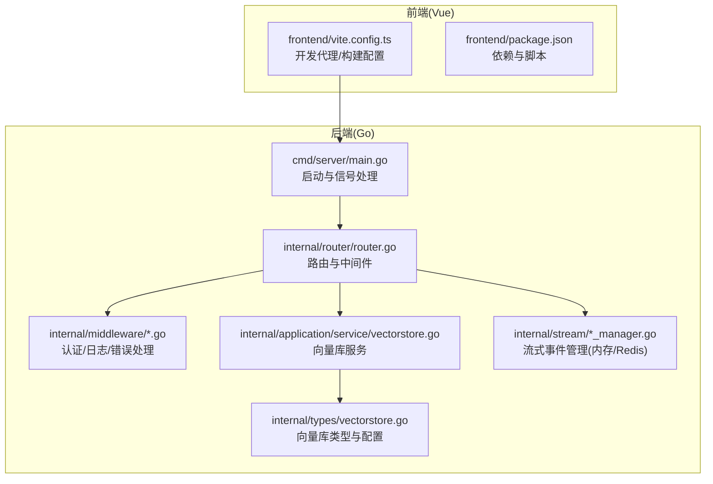
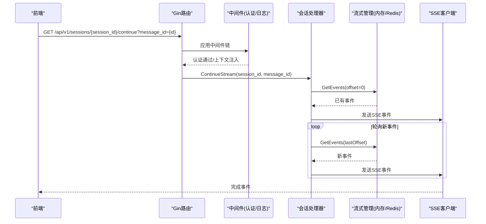
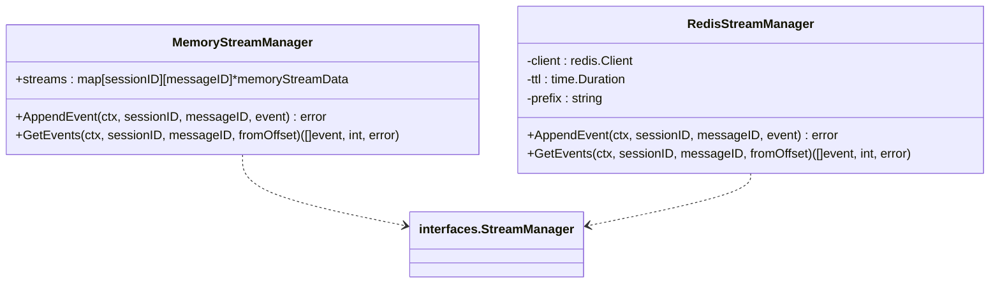
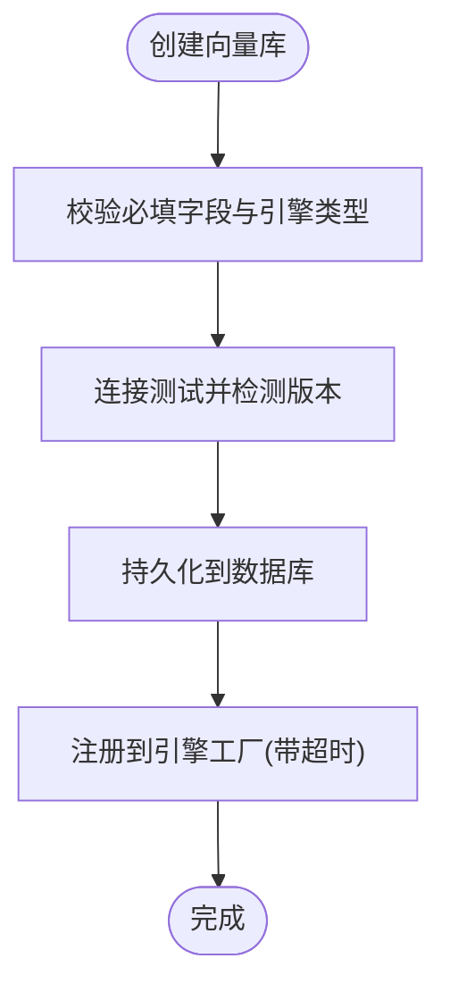
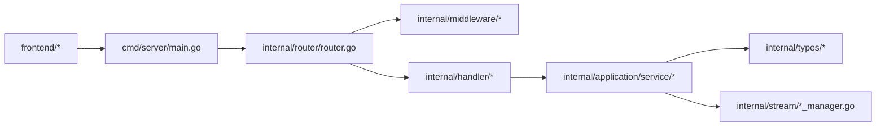

# 性能优化策略

<cite>
**本文引用的文件**
- [cmd/server/main.go](file://cmd/server/main.go)
- [internal/config/config.go](file://internal/config/config.go)
- [internal/router/router.go](file://internal/router/router.go)
- [internal/middleware/auth.go](file://internal/middleware/auth.go)
- [internal/middleware/logger.go](file://internal/middleware/logger.go)
- [internal/stream/memory_manager.go](file://internal/stream/memory_manager.go)
- [internal/stream/redis_manager.go](file://internal/stream/redis_manager.go)
- [internal/application/service/vectorstore.go](file://internal/application/service/vectorstore.go)
- [internal/types/vectorstore.go](file://internal/types/vectorstore.go)
- [config/config.yaml](file://config/config.yaml)
- [frontend/vite.config.ts](file://frontend/vite.config.ts)
- [frontend/package.json](file://frontend/package.json)
- [internal/handler/session/stream.go](file://internal/handler/session/stream.go)
</cite>

## 目录
1. [简介](#简介)
2. [项目结构](#项目结构)
3. [核心组件](#核心组件)
4. [架构总览](#架构总览)
5. [详细组件分析](#详细组件分析)
6. [依赖分析](#依赖分析)
7. [性能考量](#性能考量)
8. [故障排查指南](#故障排查指南)
9. [结论](#结论)
10. [附录](#附录)

## 简介
本指南面向WeKnora项目的生产环境，聚焦应用性能优化与成本控制，覆盖以下方面：
- Gin框架性能调优、中间件优化与路由优化
- 数据库与向量数据库性能优化（连接池、查询、索引、引擎配置）
- 缓存策略（Redis、多级缓存、失效策略）
- 前端性能优化（静态资源压缩、CDN、懒加载）
- 并发处理优化（goroutine池、阻塞操作）
- 性能监控与基准测试
- 资源使用优化与成本控制

## 项目结构
WeKnora采用Go后端与Vue前端分离的双栈架构，后端通过Gin提供REST API，前端通过Vite构建并代理开发环境请求。

图表来源
- [cmd/server/main.go:43-123](file://cmd/server/main.go#L43-L123)
- [internal/router/router.go:71-161](file://internal/router/router.go#L71-L161)
- [internal/application/service/vectorstore.go:23-99](file://internal/application/service/vectorstore.go#L23-L99)
- [internal/types/vectorstore.go:30-50](file://internal/types/vectorstore.go#L30-L50)
- [internal/stream/memory_manager.go:18-30](file://internal/stream/memory_manager.go#L18-L30)
- [internal/stream/redis_manager.go:13-50](file://internal/stream/redis_manager.go#L13-L50)
- [frontend/vite.config.ts:27-55](file://frontend/vite.config.ts#L27-L55)

章节来源
- [cmd/server/main.go:43-123](file://cmd/server/main.go#L43-L123)
- [internal/router/router.go:71-161](file://internal/router/router.go#L71-L161)
- [frontend/vite.config.ts:27-55](file://frontend/vite.config.ts#L27-L55)

## 核心组件
- 服务器入口与生命周期管理：负责Gin模式设置、容器注入、优雅停机与信号处理。
- 路由与中间件：统一CORS、请求ID、语言、日志、恢复、错误处理、认证、Langfuse可观测性。
- 流式事件管理：内存与Redis两种实现，支持SSE持续推送与断线重连。
- 向量数据库服务：统一的引擎类型、连接配置、索引配置与注册机制。
- 前端构建与代理：开发环境代理后端API，生产环境建议结合CDN与静态资源压缩。

章节来源
- [cmd/server/main.go:43-123](file://cmd/server/main.go#L43-L123)
- [internal/router/router.go:71-161](file://internal/router/router.go#L71-L161)
- [internal/stream/memory_manager.go:18-30](file://internal/stream/memory_manager.go#L18-L30)
- [internal/stream/redis_manager.go:13-50](file://internal/stream/redis_manager.go#L13-L50)
- [internal/application/service/vectorstore.go:23-99](file://internal/application/service/vectorstore.go#L23-L99)
- [internal/types/vectorstore.go:30-50](file://internal/types/vectorstore.go#L30-L50)
- [frontend/vite.config.ts:27-55](file://frontend/vite.config.ts#L27-L55)

## 架构总览
后端通过Gin路由聚合各类业务接口，认证中间件在路由组前执行，日志与错误处理贯穿请求链路。流式事件通过内存或Redis持久化，前端通过SSE持续拉取事件，支持断点续推与停止指令。

图表来源
- [internal/router/router.go:130-158](file://internal/router/router.go#L130-L158)
- [internal/middleware/auth.go:65-228](file://internal/middleware/auth.go#L65-L228)
- [internal/handler/session/stream.go:31-176](file://internal/handler/session/stream.go#L31-L176)
- [internal/stream/memory_manager.go:85-115](file://internal/stream/memory_manager.go#L85-L115)
- [internal/stream/redis_manager.go:89-129](file://internal/stream/redis_manager.go#L89-L129)

## 详细组件分析

### Gin框架性能调优
- 模式设置：通过环境变量选择Release/Debug模式，生产建议Release以减少日志开销。
- 中间件顺序：CORS置于首位，基础中间件紧随其后，认证中间件在业务路由组前，避免对健康检查与Swagger等非认证接口施加额外负担。
- Swagger：仅在非Release模式启用，避免生产环境暴露文档服务带来的额外CPU与内存消耗。
- 静态文件：Lite版本内置前端静态资源，需注意路径与缓存头设置，避免不必要的磁盘IO。

章节来源
- [cmd/server/main.go:44-49](file://cmd/server/main.go#L44-L49)
- [internal/router/router.go:71-107](file://internal/router/router.go#L71-L107)
- [internal/router/router.go:110-112](file://internal/router/router.go#L110-L112)
- [internal/router/router.go:684-722](file://internal/router/router.go#L684-L722)

### 中间件优化
- 认证中间件：对OPTIONS预检请求放行；对无需认证的路径白名单快速返回；JWT与API Key双通道校验，避免重复鉴权逻辑。
- 日志中间件：限制请求/响应体大小，跳过非文本类型与特定路径（如静态资源），防止日志过大影响性能；敏感字段脱敏。
- 错误处理与恢复：统一错误包装与恢复，避免panic导致进程重启；对上游依赖失败进行降级与限流。

章节来源
- [internal/middleware/auth.go:20-45](file://internal/middleware/auth.go#L20-L45)
- [internal/middleware/auth.go:71-228](file://internal/middleware/auth.go#L71-L228)
- [internal/middleware/logger.go:18-20](file://internal/middleware/logger.go#L18-L20)
- [internal/middleware/logger.go:140-236](file://internal/middleware/logger.go#L140-L236)

### 路由优化
- 分组路由：将认证与非认证接口分离，减少每请求的鉴权判断次数。
- 健康检查与Swagger：轻量接口优先，避免复杂逻辑与外部依赖。
- 前端静态：Lite版本内嵌SPA，避免反向代理层的额外转发开销。

章节来源
- [internal/router/router.go:130-158](file://internal/router/router.go#L130-L158)
- [internal/router/router.go:93-96](file://internal/router/router.go#L93-L96)
- [internal/router/router.go:109-112](file://internal/router/router.go#L109-L112)

### 流式事件管理（内存/Redis）
- 内存实现：适合单实例、低延迟场景；事件按会话与消息ID组织，读写锁保护，拷贝返回避免竞态。
- Redis实现：基于List追加与范围读取，支持TTL清理，适合分布式与高可用场景；事件序列化为JSON，注意体积与编码开销。
- SSE推送：前端轮询间隔可调，建议在处理器中动态调整tick频率以平衡实时性与CPU占用。

图表来源
- [internal/stream/memory_manager.go:18-119](file://internal/stream/memory_manager.go#L18-L119)
- [internal/stream/redis_manager.go:13-138](file://internal/stream/redis_manager.go#L13-L138)

章节来源
- [internal/stream/memory_manager.go:18-119](file://internal/stream/memory_manager.go#L18-L119)
- [internal/stream/redis_manager.go:13-138](file://internal/stream/redis_manager.go#L13-L138)
- [internal/handler/session/stream.go:134-176](file://internal/handler/session/stream.go#L134-L176)

### 向量数据库性能调优
- 引擎类型与配置：支持Elasticsearch、Qdrant、Milvus、Weaviate、PostgreSQL/SQLite等；通过ConnectionConfig/IndexConfig统一管理连接与索引参数。
- 索引命名与校验：严格校验索引名字符集与长度，避免非法字符引发引擎异常；提供默认值与环境变量回退。
- 版本检测与注册：创建向量库时进行连接测试并记录版本，注册到引擎工厂，超时保护避免阻塞。
- 环境变量驱动：RETRIEVE_DRIVER可配置多种引擎，便于无状态部署与多环境复用。

图表来源
- [internal/application/service/vectorstore.go:36-99](file://internal/application/service/vectorstore.go#L36-L99)
- [internal/types/vectorstore.go:83-95](file://internal/types/vectorstore.go#L83-L95)
- [internal/types/vectorstore.go:393-434](file://internal/types/vectorstore.go#L393-L434)

章节来源
- [internal/application/service/vectorstore.go:23-160](file://internal/application/service/vectorstore.go#L23-L160)
- [internal/types/vectorstore.go:30-50](file://internal/types/vectorstore.go#L30-L50)
- [internal/types/vectorstore.go:393-434](file://internal/types/vectorstore.go#L393-L434)

### 前端性能优化
- 构建与代理：开发环境通过Vite代理后端API，生产环境建议使用CDN与静态资源压缩；按需引入第三方库，避免打包冗余。
- 依赖管理：锁定关键依赖版本，减少打包体积与安全风险；合理拆分包体，启用Tree Shaking。
- 懒加载策略：路由级懒加载与组件级懒加载，降低首屏渲染压力。

章节来源
- [frontend/vite.config.ts:27-55](file://frontend/vite.config.ts#L27-L55)
- [frontend/package.json:14-39](file://frontend/package.json#L14-L39)

### 并发处理优化
- 会话与消息：SSE轮询采用定时器，建议根据负载动态调整轮询周期；对长连接进行心跳与超时控制。
- 流式事件：内存与Redis实现均提供读写锁与拷贝返回，避免共享状态竞争；建议在高并发场景优先Redis实现。
- 停止指令：通过事件总线与流式管理器写入停止事件，前端收到后立即终止渲染，降低无效计算。

章节来源
- [internal/handler/session/stream.go:134-176](file://internal/handler/session/stream.go#L134-L176)
- [internal/handler/session/stream.go:296-440](file://internal/handler/session/stream.go#L296-L440)
- [internal/stream/memory_manager.go:62-83](file://internal/stream/memory_manager.go#L62-L83)
- [internal/stream/redis_manager.go:57-87](file://internal/stream/redis_manager.go#L57-L87)

## 依赖分析
- 服务器入口依赖容器与Tracing，路由依赖中间件与Handler，Handler依赖Service与StreamManager，Service依赖Repository与EngineFactory，类型定义贯穿配置与DTO。
- 前端通过Vite代理与后端交互，生产环境建议结合Nginx/CDN与静态资源压缩。

图表来源
- [cmd/server/main.go:55-60](file://cmd/server/main.go#L55-L60)
- [internal/router/router.go:31-69](file://internal/router/router.go#L31-L69)
- [internal/application/service/vectorstore.go:23-34](file://internal/application/service/vectorstore.go#L23-L34)
- [internal/stream/memory_manager.go:18-23](file://internal/stream/memory_manager.go#L18-L23)
- [frontend/vite.config.ts:42-53](file://frontend/vite.config.ts#L42-L53)

章节来源
- [cmd/server/main.go:55-60](file://cmd/server/main.go#L55-L60)
- [internal/router/router.go:31-69](file://internal/router/router.go#L31-L69)
- [internal/application/service/vectorstore.go:23-34](file://internal/application/service/vectorstore.go#L23-L34)
- [internal/stream/memory_manager.go:18-23](file://internal/stream/memory_manager.go#L18-L23)
- [frontend/vite.config.ts:42-53](file://frontend/vite.config.ts#L42-L53)

## 性能考量
- Gin模式与中间件：生产使用Release模式，谨慎启用日志与Swagger；对静态资源与健康检查接口最小化处理。
- 认证与鉴权：白名单与快速返回，避免重复鉴权；API Key与JWT双通道，减少鉴权失败的重试风暴。
- 流式SSE：合理设置轮询间隔，避免高频轮询；对已完成流发送完成事件，及时释放连接。
- 向量库：根据数据规模与查询频次选择合适引擎与索引参数；启用连接测试与版本检测，避免协议不匹配导致的失败重试。
- 前端：按需加载与代码分割，CDN加速与缓存头设置，减少首屏等待时间。
- 并发：goroutine数量与阻塞操作分离，避免长时间持有锁；对Redis/数据库操作设置超时与重试上限。

## 故障排查指南
- 服务器启动与优雅停机：确认监听端口与信号处理，检查关闭超时与资源清理回调。
- 认证失败：核对Authorization与X-API-Key头部，检查租户ID与用户上下文注入。
- 日志异常：关注日志中间件对非文本类型与SSE的跳过逻辑，避免误判为异常。
- 流式事件丢失：检查内存/Redis实现的TTL与键空间，确认offset推进与事件序列化。
- 向量库不可达：查看连接测试与版本检测日志，核对引擎配置与索引参数。

章节来源
- [cmd/server/main.go:72-119](file://cmd/server/main.go#L72-L119)
- [internal/middleware/auth.go:71-228](file://internal/middleware/auth.go#L71-L228)
- [internal/middleware/logger.go:140-236](file://internal/middleware/logger.go#L140-L236)
- [internal/stream/redis_manager.go:31-50](file://internal/stream/redis_manager.go#L31-L50)
- [internal/application/service/vectorstore.go:75-85](file://internal/application/service/vectorstore.go#L75-L85)

## 结论
通过合理的Gin配置、中间件与路由优化，配合流式事件的内存/Redis双实现、向量数据库的引擎与索引策略、前端的CDN与懒加载，以及并发与监控体系，WeKnora可在生产环境中实现稳定、高效且低成本的运行。建议在上线前完成性能压测与容量规划，并建立完善的监控告警与应急处置流程。

## 附录
- 配置参考：服务器端口、对话参数、知识库分块、租户跨域访问等可通过配置文件与环境变量进行调整。
- 前端构建：生产构建建议开启压缩与分包，代理仅用于开发环境。

章节来源
- [config/config.yaml:1-113](file://config/config.yaml#L1-L113)
- [frontend/vite.config.ts:27-55](file://frontend/vite.config.ts#L27-L55)