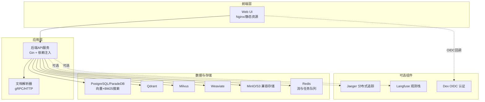
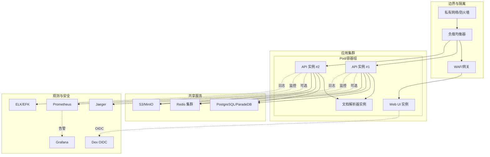
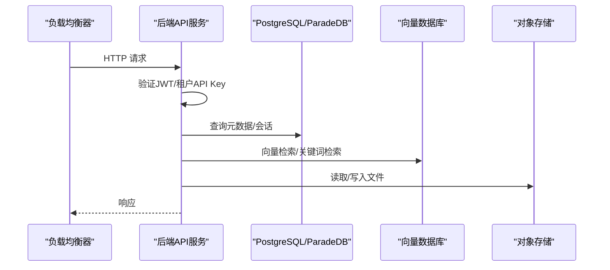
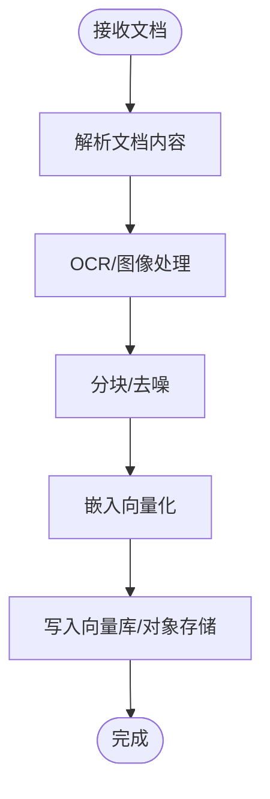
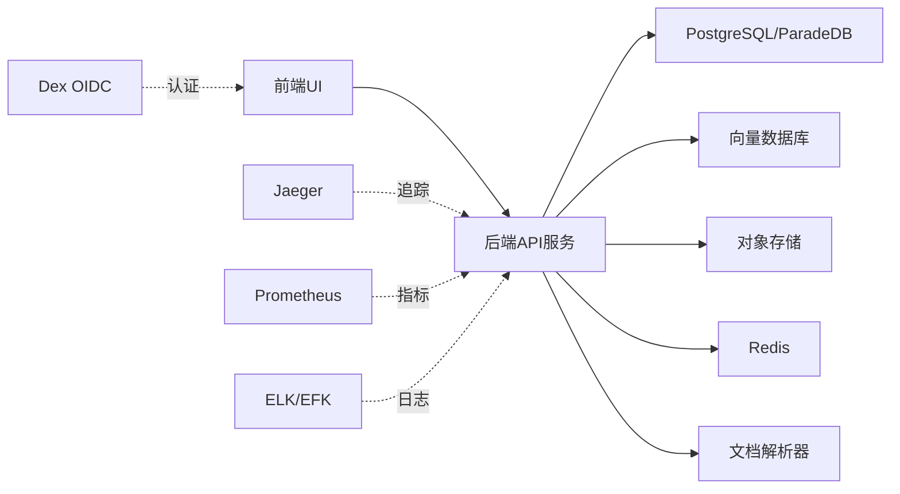

# 生产环境部署

<cite>
**本文档引用的文件**
- [README.md](file://README.md)
- [docker-compose.yml](file://docker-compose.yml)
- [Chart.yaml](file://helm/Chart.yaml)
- [values.yaml](file://helm/values.yaml)
- [weknora-lite.service](file://deploy/weknora-lite.service)
- [config.yaml](file://config/config.yaml)
- [build_images.sh](file://scripts/build_images.sh)
- [start_all.sh](file://scripts/start_all.sh)
- [main.go](file://cmd/server/main.go)
- [config.go](file://internal/config/config.go)
- [Makefile](file://Makefile)
- [get_version.sh](file://scripts/get_version.sh)
- [migrate.sh](file://scripts/migrate.sh)
- [dex-config.yaml](file://misc/dex-config.yaml)
</cite>

## 目录
1. [简介](#简介)
2. [项目结构](#项目结构)
3. [核心组件](#核心组件)
4. [架构总览](#架构总览)
5. [详细组件分析](#详细组件分析)
6. [依赖关系分析](#依赖关系分析)
7. [性能考虑](#性能考虑)
8. [故障排除指南](#故障排除指南)
9. [结论](#结论)
10. [附录](#附录)

## 简介
本指南面向WeKnora项目的生产环境部署，提供从架构设计、安全配置、高可用部署、监控日志、CI/CD流水线到性能优化与安全加固的完整实践方案。WeKnora是一个企业级文档理解与语义检索框架，支持快速问答与智能推理两种模式，并提供知识图谱、多向量数据库、对象存储、IM渠道集成等能力。生产部署建议采用容器化与编排技术，结合网络隔离、访问控制与数据加密，确保高可用与可维护性。

## 项目结构
WeKnora采用模块化设计，包含后端服务、前端UI、文档解析器、代理服务、向量数据库、对象存储、消息队列、分布式追踪与可选的Langfuse可观测栈。生产部署可基于Docker Compose或Kubernetes Helm Chart实现。

**图表来源**
- [docker-compose.yml:1-613](file://docker-compose.yml#L1-L613)
- [Chart.yaml:1-27](file://helm/Chart.yaml#L1-L27)
- [values.yaml:1-493](file://helm/values.yaml#L1-L493)

**章节来源**
- [README.md:164-211](file://README.md#L164-L211)
- [docker-compose.yml:1-613](file://docker-compose.yml#L1-L613)
- [Chart.yaml:1-27](file://helm/Chart.yaml#L1-L27)
- [values.yaml:1-493](file://helm/values.yaml#L1-L493)

## 核心组件
- 后端API服务：基于Gin框架，提供REST API、健康检查、优雅关闭与信号处理。
- 文档解析器：支持gRPC/HTTP协议，负责文档解析与图像处理。
- 数据与存储：PostgreSQL/ParadeDB（向量+BM25）、Qdrant、Milvus、Weaviate等向量数据库，MinIO/S3兼容对象存储，Redis作为流与任务队列。
- 可选组件：Jaeger分布式追踪、Langfuse可观测栈、Dex OIDC认证。
- 配置与治理：集中式配置文件、环境变量覆盖、数据库迁移脚本。

**章节来源**
- [main.go:43-124](file://cmd/server/main.go#L43-L124)
- [config.go:17-758](file://internal/config/config.go#L17-L758)
- [docker-compose.yml:28-177](file://docker-compose.yml#L28-L177)
- [values.yaml:53-140](file://helm/values.yaml#L53-L140)

## 架构总览
生产环境推荐采用容器化与编排技术，结合网络隔离、访问控制与数据加密，确保高可用与可维护性。下图展示了生产部署的典型拓扑与组件交互。

**图表来源**
- [docker-compose.yml:1-613](file://docker-compose.yml#L1-L613)
- [values.yaml:345-370](file://helm/values.yaml#L345-L370)
- [dex-config.yaml:1-21](file://misc/dex-config.yaml#L1-L21)

## 详细组件分析

### 后端API服务（生产部署要点）
- 优雅关闭：监听系统信号，支持二次信号强制关闭，确保连接释放与资源清理。
- 健康检查：提供/health端点，便于编排系统探活。
- 配置加载：支持YAML配置文件与环境变量覆盖，验证关键参数范围与必填项。
- 安全：启用JWT认证与租户API Key认证，支持禁用注册、跨租户访问控制与加密密钥管理。

**图表来源**
- [main.go:62-118](file://cmd/server/main.go#L62-L118)
- [config.go:440-495](file://internal/config/config.go#L440-L495)

**章节来源**
- [main.go:43-124](file://cmd/server/main.go#L43-L124)
- [config.go:17-758](file://internal/config/config.go#L17-L758)
- [config.yaml:1-113](file://config/config.yaml#L1-L113)

### 文档解析器（生产部署要点）
- 协议支持：gRPC与HTTP双栈，便于与后端服务集成。
- 健康检查：提供健康探针，确保容器编排系统能及时发现异常。
- 存储：解析产物写入共享卷或对象存储，便于多实例共享。

**图表来源**
- [docker-compose.yml:173-199](file://docker-compose.yml#L173-L199)

**章节来源**
- [docker-compose.yml:173-199](file://docker-compose.yml#L173-L199)

### 数据库与存储（生产部署要点）
- PostgreSQL/ParadeDB：启用持久化卷，配置资源限制与安全上下文，支持备份与快照。
- 向量数据库：可选Qdrant、Milvus、Weaviate，按需启用并配置TLS/鉴权。
- 对象存储：MinIO/S3兼容，配置访问密钥与桶策略，启用传输加密与访问审计。
- Redis：启用密码认证与持久化，配置资源限制与节点亲和性。

**章节来源**
- [docker-compose.yml:200-362](file://docker-compose.yml#L200-L362)
- [values.yaml:241-329](file://helm/values.yaml#L241-L329)

### 观测与安全（生产部署要点）
- Jaeger：启用OTLP导出，统一链路追踪，便于定位性能瓶颈。
- Langfuse：可选可观测栈，复用PostgreSQL与Redis，独立部署ClickHouse与MinIO。
- Dex：OIDC认证，支持密码数据库与多种授权类型，适配企业身份系统。
- Prometheus/Grafana：采集指标，建立告警规则，可视化系统健康度。
- ELK/EFK：集中化日志收集与检索，支持日志轮转与索引生命周期管理。

**章节来源**
- [docker-compose.yml:253-594](file://docker-compose.yml#L253-L594)
- [values.yaml:345-370](file://helm/values.yaml#L345-L370)
- [dex-config.yaml:1-21](file://misc/dex-config.yaml#L1-L21)

### 部署方式对比（Docker Compose vs Kubernetes）
- Docker Compose：适合中小规模与快速上线，一键启动核心服务与可选组件。
- Kubernetes：适合大规模与高可用场景，通过Helm Chart管理，支持多副本、滚动升级、弹性伸缩与资源调度。

**章节来源**
- [docker-compose.yml:1-613](file://docker-compose.yml#L1-L613)
- [Chart.yaml:1-27](file://helm/Chart.yaml#L1-L27)
- [values.yaml:1-493](file://helm/values.yaml#L1-L493)

## 依赖关系分析
WeKnora生产环境各组件之间存在明确的依赖关系与耦合度。后端API服务依赖数据库、向量数据库、对象存储与消息队列；文档解析器作为独立服务被后端调用；前端通过API网关访问后端；可选组件（Jaeger、Langfuse、Dex）与监控日志系统提供可观测性与安全能力。

**图表来源**
- [docker-compose.yml:1-613](file://docker-compose.yml#L1-L613)
- [values.yaml:1-493](file://helm/values.yaml#L1-L493)

**章节来源**
- [docker-compose.yml:1-613](file://docker-compose.yml#L1-L613)
- [values.yaml:1-493](file://helm/values.yaml#L1-L493)

## 性能考虑
- 缓存配置：Redis作为流与任务队列，建议开启持久化与合理TTL；对热点查询结果进行应用层缓存。
- 数据库优化：PostgreSQL/ParadeDB启用合适的索引与统计信息更新；针对向量检索配置合适的距离度量与索引参数。
- 资源调优：为各组件设置合理的CPU/内存请求与限制，启用HPA实现弹性伸缩；对大文件上传与并发请求设置限流与队列长度。
- 网络优化：启用连接池与长连接，减少握手开销；对跨地域部署启用就近访问与CDN加速。
- 向量检索：根据业务场景选择合适的向量数据库与检索策略，定期评估召回率与延迟指标。

[本节为通用指导，无需特定文件引用]

## 故障排除指南
- 健康检查失败：检查容器日志与依赖服务状态，确认端口映射与网络连通性。
- 数据库连接异常：核对连接字符串、SSL模式与凭据，确保网络策略允许访问。
- 向量检索延迟高：检查向量库索引状态与查询参数，评估硬件资源与并发。
- 文档解析错误：确认解析器版本与文件格式支持，检查共享存储权限。
- OIDC认证失败：核对Dex配置与回调地址，检查客户端凭据与作用域。

**章节来源**
- [docker-compose.yml:44-49](file://docker-compose.yml#L44-L49)
- [migrate.sh:26-60](file://scripts/migrate.sh#L26-L60)
- [start_all.sh:530-610](file://scripts/start_all.sh#L530-L610)

## 结论
WeKnora生产环境部署应以“容器化+编排+可观测+安全”为核心原则，结合网络隔离、访问控制与数据加密，确保系统高可用、可扩展与可维护。通过合理的资源配置、监控告警与CI/CD流水线，可以显著提升交付效率与运维稳定性。

[本节为总结性内容，无需特定文件引用]

## 附录

### A. 生产环境部署清单
- 硬件与网络：预留足够的CPU/内存/存储与带宽，配置内网访问与防火墙规则。
- 安全基线：启用TLS、强密码、最小权限、审计日志与漏洞扫描。
- 高可用：多副本部署、负载均衡、健康检查与故障转移。
- 监控与日志：Prometheus/Grafana、ELK/EFK、Jaeger/Langfuse。
- 备份与恢复：数据库与对象存储的定期备份与演练。

[本节为通用指导，无需特定文件引用]

### B. CI/CD流水线配置建议
- 构建阶段：使用Makefile或脚本统一版本信息与镜像构建，支持多架构。
- 测试阶段：集成单元测试、集成测试与安全扫描。
- 部署阶段：基于Helm Chart进行蓝绿/金丝雀发布，配合滚动升级与回滚策略。
- 发布阶段：自动化生成变更日志与发布说明，记录版本与构建信息。

**章节来源**
- [Makefile:102-124](file://Makefile#L102-L124)
- [build_images.sh:127-156](file://scripts/build_images.sh#L127-L156)
- [get_version.sh:40-91](file://scripts/get_version.sh#L40-L91)

### C. Lite模式部署（零外部依赖）
- 适用场景：单机演示、离线环境或轻量部署。
- 配置要点：使用SQLite与内存队列，简化依赖；通过systemd服务管理进程生命周期。
- 启动方式：使用提供的service文件与环境变量文件，确保权限与工作目录正确。

**章节来源**
- [weknora-lite.service:1-24](file://deploy/weknora-lite.service#L1-L24)
- [Makefile:240-267](file://Makefile#L240-L267)

### D. 数据库迁移与版本管理
- 迁移工具：使用golang-migrate，支持up/down、版本查询与强制迁移。
- 环境变量：通过DB_URL或DB_HOST/DB_PORT/DB_USER/DB_NAME组合，自动添加sslmode=disable。
- 最佳实践：在升级前备份数据库，先在预生产环境验证迁移脚本，再执行生产迁移。

**章节来源**
- [migrate.sh:26-60](file://scripts/migrate.sh#L26-L60)
- [migrate.sh:63-120](file://scripts/migrate.sh#L63-L120)