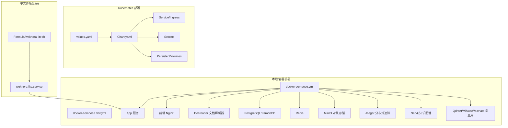
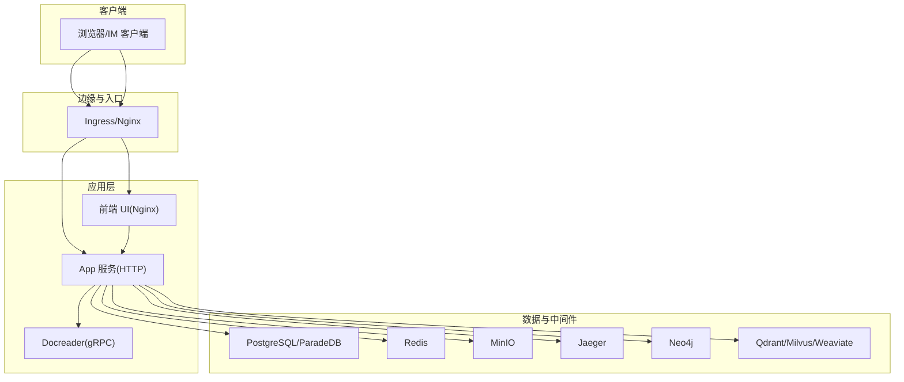
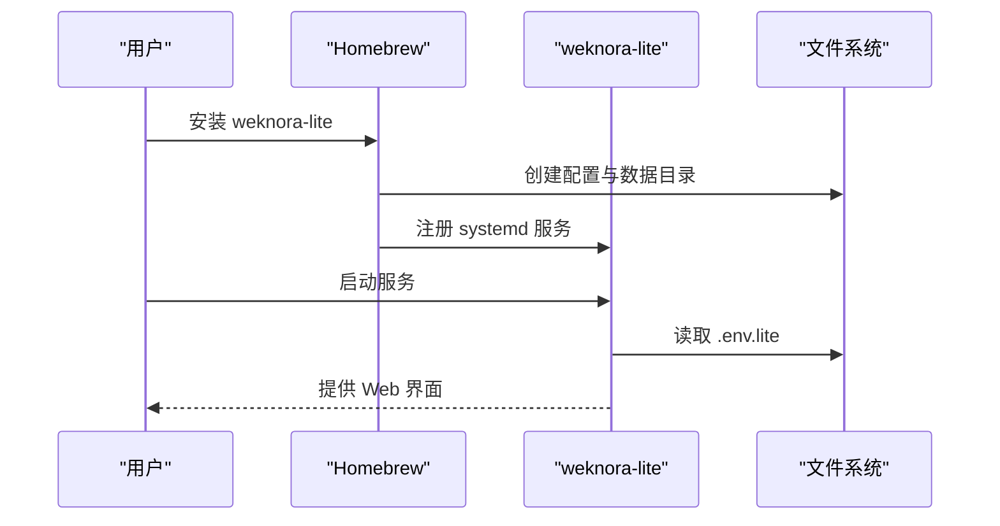
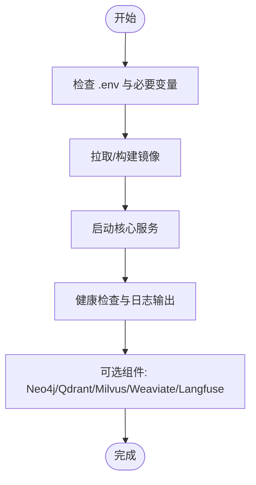
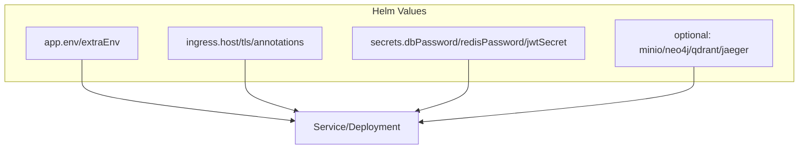
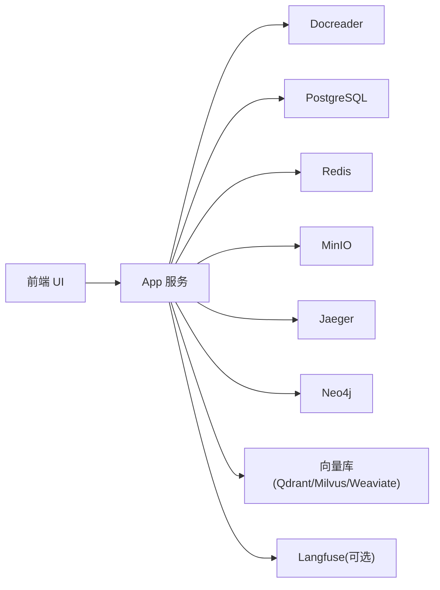
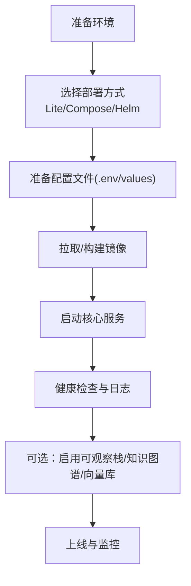

# 部署方式介绍

<cite>
**本文引用的文件**
- [docker-compose.yml](file://docker-compose.yml)
- [docker-compose.dev.yml](file://docker-compose.dev.yml)
- [Chart.yaml](file://helm/Chart.yaml)
- [values.yaml](file://helm/values.yaml)
- [weknora-lite.service](file://deploy/weknora-lite.service)
- [Dockerfile.sandbox](file://docker/Dockerfile.sandbox)
- [Dockerfile.docreader](file://docker/Dockerfile.docreader)
- [frontend/Dockerfile](file://frontend/Dockerfile)
- [scripts/check-env.sh](file://scripts/check-env.sh)
- [scripts/start_all.sh](file://scripts/start_all.sh)
- [Formula/weknora-lite.rb](file://Formula/weknora-lite.rb)
- [docs/wiki/运维排障/常见问题.md](file://docs/wiki/运维排障/常见问题.md)
- [config/config.yaml](file://config/config.yaml)
- [README.md](file://README.md)
</cite>

## 目录
1. [简介](#简介)
2. [项目结构](#项目结构)
3. [核心组件](#核心组件)
4. [架构总览](#架构总览)
5. [详细组件分析](#详细组件分析)
6. [依赖关系分析](#依赖关系分析)
7. [性能考量](#性能考量)
8. [故障排查指南](#故障排查指南)
9. [结论](#结论)
10. [附录](#附录)

## 简介
本章节面向希望在本地、容器与 Kubernetes 环境中部署 WeKnora 的用户，提供从安装准备、环境要求、配置参数到部署流程、优缺点对比、维护成本与性能优化的完整指南。WeKnora 是一个面向企业级文档理解与语义检索的知识管理与问答框架，支持多种 LLM、向量数据库与对象存储后端，并提供本地单文件版（Lite）与容器/Kubernetes 多组件部署方案。

## 项目结构
WeKnora 的部署相关能力主要分布在以下位置：
- Docker Compose 一键编排：包含 Web 前端、后端 API、文档解析器、数据库、缓存、对象存储、分布式追踪、知识图谱与可观测栈等服务。
- Helm Chart：提供 Kubernetes 部署的 Chart 与 values，覆盖 App、前端、文档解析器、PostgreSQL、Redis、Ingress、Secrets 等。
- 单文件版（Lite）：提供 Homebrew 包与 systemd 服务配置，适合小规模或个人使用。
- 脚本与工具：环境检查、一键启动/停止、镜像预拉取等自动化脚本。
- 配置文件：后端配置模板与默认值，便于理解各组件参数。

图表来源
- [docker-compose.yml](file://docker-compose.yml)
- [docker-compose.dev.yml](file://docker-compose.dev.yml)
- [Chart.yaml](file://helm/Chart.yaml)
- [values.yaml](file://helm/values.yaml)
- [weknora-lite.service](file://deploy/weknora-lite.service)
- [Formula/weknora-lite.rb](file://Formula/weknora-lite.rb)

章节来源
- [README.md](file://README.md)
- [docker-compose.yml](file://docker-compose.yml)
- [docker-compose.dev.yml](file://docker-compose.dev.yml)
- [Chart.yaml](file://helm/Chart.yaml)
- [values.yaml](file://helm/values.yaml)
- [weknora-lite.service](file://deploy/weknora-lite.service)
- [Formula/weknora-lite.rb](file://Formula/weknora-lite.rb)

## 核心组件
- 应用服务（App）：后端 API 服务器，负责会话、知识库、消息、工具调用、向量检索、存储与安全策略等。
- 前端（UI）：静态页面与 Nginx，提供 Web 界面与反向代理。
- 文档解析器（Docreader）：gRPC 服务，负责文档解析、图片提取与基础 OCR/VLM 能力。
- 数据库（PostgreSQL/ParadeDB）：存储元数据、会话、知识条目与索引。
- 缓存（Redis）：流式任务队列、会话状态与并发控制。
- 对象存储（MinIO）：文件上传、图片与附件存储。
- 分布式追踪（Jaeger）：OTLP/Zipkin 兼容，便于生产排障。
- 知识图谱（Neo4j）：可选，启用 GraphRAG。
- 向量库（Qdrant/Milvus/Weaviate/Elasticsearch/Postgres）：可选，按 RETRIEVE_DRIVER 配置切换。
- 观测栈（Langfuse）：可选，复用现有 Postgres/Redis，新增 ClickHouse 与 MinIO。

章节来源
- [docker-compose.yml](file://docker-compose.yml)
- [docker-compose.dev.yml](file://docker-compose.dev.yml)
- [values.yaml](file://helm/values.yaml)

## 架构总览
下图展示了 WeKnora 的典型部署拓扑，涵盖容器编排与 Kubernetes Chart 的关键组件关系。

图表来源
- [docker-compose.yml](file://docker-compose.yml)
- [values.yaml](file://helm/values.yaml)

## 详细组件分析

### 本地部署（单文件版 Lite）
- 适用场景：个人使用、演示、小规模内部部署，无需 Docker/K8s。
- 安装方式：通过 Homebrew 安装，自动创建配置与数据目录，支持 systemd 服务管理。
- 启动与配置：首次运行自动创建 .env.lite，可配置数据库路径、存储目录、Web 资源目录与 LLM 地址等。
- 维护：日志位于系统日志目录，服务随系统自启。

图表来源
- [Formula/weknora-lite.rb](file://Formula/weknora-lite.rb)
- [weknora-lite.service](file://deploy/weknora-lite.service)

章节来源
- [Formula/weknora-lite.rb](file://Formula/weknora-lite.rb)
- [weknora-lite.service](file://deploy/weknora-lite.service)

### Docker 本地部署（Compose）
- 适用场景：快速验证、开发调试、单机生产。
- 一键启动：提供脚本自动检查环境、拉取镜像、启动服务并输出日志。
- 核心服务：前端、App、Docreader、PostgreSQL、Redis、MinIO、Jaeger、Neo4j、Qdrant、Milvus、Weaviate、Langfuse（可选）。
- 环境变量：通过 .env 与 compose 环境块统一注入，覆盖数据库、存储、向量库、Redis、LLM/Ollama、加密与可观测等参数。
- 开发模式：提供 dev compose，仅启动基础设施，App/Frontend 本地运行，便于联调。

图表来源
- [scripts/start_all.sh](file://scripts/start_all.sh)
- [docker-compose.yml](file://docker-compose.yml)
- [docker-compose.dev.yml](file://docker-compose.dev.yml)

章节来源
- [docker-compose.yml](file://docker-compose.yml)
- [docker-compose.dev.yml](file://docker-compose.dev.yml)
- [scripts/start_all.sh](file://scripts/start_all.sh)
- [scripts/check-env.sh](file://scripts/check-env.sh)

### Kubernetes 部署（Helm）
- 适用场景：生产级高可用、弹性扩缩容、集中管理与升级。
- Chart 结构：包含 App、前端、Docreader、PostgreSQL、Redis、Ingress、Secrets、PVC 等模板。
- 关键参数：副本数、资源限制、探针、节点选择、亲和性、存储类、镜像拉取策略、安全上下文等。
- 可选组件：MinIO、Neo4j、Qdrant、Jaeger 等以 values 中开关控制。
- Secret 管理：建议使用外部 Secret 管理（如 External Secrets Operator、Vault），避免明文注入。

图表来源
- [Chart.yaml](file://helm/Chart.yaml)
- [values.yaml](file://helm/values.yaml)

章节来源
- [Chart.yaml](file://helm/Chart.yaml)
- [values.yaml](file://helm/values.yaml)

### Dockerfile 与镜像构建要点
- Docreader：多阶段构建，仅保留运行时依赖，支持离线 protoc 安装与 Playwright 浏览器安装，暴露 gRPC 端口。
- 前端：Node 构建 + Nginx 静态服务，支持模板化配置与入口脚本。
- Sandbox：轻量 Python 基础镜像，内置 Node/npm/npx，创建非 root 用户，用于 Agent Skills 沙箱执行。

章节来源
- [Dockerfile.docreader](file://docker/Dockerfile.docreader)
- [frontend/Dockerfile](file://frontend/Dockerfile)
- [Dockerfile.sandbox](file://docker/Dockerfile.sandbox)

### 配置参数总览（按用途分类）
- 数据库与存储
  - DB_DRIVER/DB_HOST/DB_PORT/DB_USER/DB_PASSWORD/DB_NAME
  - STORAGE_TYPE/LOCAL_STORAGE_BASE_DIR/MINIO_* 等
- 缓存与流式
  - REDIS_* 与 STREAM_MANAGER_TYPE
- 检索与向量库
  - RETRIEVE_DRIVER（postgres/elasticsearch/qdrant 等）
  - QDRANT_* / MILVUS_* / WEAVIATE_* / ELASTICSEARCH_*
- LLM/Ollama
  - OLLAMA_BASE_URL/INIT_LLM_MODEL_NAME/INIT_EMBEDDING_MODEL_NAME 等
- 安全与加密
  - JWT_SECRET/TENANT_AES_KEY/SYSTEM_AES_KEY/CRYPTO_MASTER_KEY/Crypto 相关
- 观测与追踪
  - OTEL_* / LANGFUSE_* / SSRF_WHITELIST
- 文件大小与并发
  - MAX_FILE_SIZE_MB/CONCURRENCY_POOL_SIZE
- 可选组件
  - ENABLE_GRAPH_RAG/NEO4J_* / 自建 Langfuse（ClickHouse/MinIO/Worker/Web）

章节来源
- [docker-compose.yml](file://docker-compose.yml)
- [docker-compose.dev.yml](file://docker-compose.dev.yml)
- [values.yaml](file://helm/values.yaml)
- [config/config.yaml](file://config/config.yaml)

## 依赖关系分析
- 组件耦合
  - App 依赖数据库、缓存、对象存储、Docreader、向量库、可选 Neo4j/Langfuse。
  - 前端通过 Nginx 反代 App，静态资源由 Nginx 提供。
  - Docreader 作为 gRPC 服务被 App 调用，独立于 App 生命周期。
- 外部依赖
  - Docker/Docker Compose、Kubernetes、Helm、Git、Node.js、Go（开发）。
- 可能的循环依赖
  - 无直接循环依赖；服务间通过明确的端口与协议交互。
- 配置契约
  - values.yaml 与 docker-compose.yml 的环境变量命名保持一致，便于迁移。

图表来源
- [docker-compose.yml](file://docker-compose.yml)
- [values.yaml](file://helm/values.yaml)

章节来源
- [docker-compose.yml](file://docker-compose.yml)
- [values.yaml](file://helm/values.yaml)

## 性能考量
- 资源规划
  - App/Docreader/PostgreSQL/Redis/MinIO 建议独立资源池，避免争抢。
  - 向量库（Qdrant/Milvus/Weaviate）对 CPU/内存/磁盘 IO 较敏感，建议 SSD 与充足内存。
- 并发与限流
  - 通过 CONCURRENCY_POOL_SIZE 控制并发；Redis 作为队列承载高并发任务。
- 存储与 I/O
  - MinIO/本地存储建议使用高性能磁盘；PVC 持久化需合理设置容量与 IOPS。
- 网络与延迟
  - 将 App 与 Docreader 部署在同一子网内，减少跨节点 gRPC 延迟。
- 观测与调优
  - 启用 Jaeger/OTEL，结合 Langfuse（可选）定位热点与慢调用。
- 镜像与构建
  - 使用多阶段构建减少镜像体积；离线安装依赖降低构建时间。

## 故障排查指南
- 常见问题定位
  - 查看容器日志：docker compose logs -f app docreader postgres。
  - 模型与嵌入：确认 INIT_LLM_MODEL_NAME/INIT_EMBEDDING_MODEL_NAME 与维度配置正确。
  - 图片与存储：检查 MinIO 是否启动、Bucket 权限与 MINIO_PUBLIC_ENDPOINT。
  - SSRF 白名单：按需配置 SSRF_WHITELIST，避免内部服务不可达。
- 开发模式启停
  - 使用脚本一键启动/停止，支持拉取镜像、预拉取 Sandbox 镜像、列出容器、检查环境等。
- 单文件版(Lite)
  - 首次运行自动创建 .env.lite，日志位于系统日志目录，可通过 Homebrew 服务管理。

章节来源
- [docs/wiki/运维排障/常见问题.md](file://docs/wiki/运维排障/常见问题.md)
- [scripts/start_all.sh](file://scripts/start_all.sh)
- [scripts/check-env.sh](file://scripts/check-env.sh)

## 结论
WeKnora 提供从单文件版到容器/Kubernetes 的多层次部署方案。对于个人与演示场景，推荐 Lite；对于开发与单机验证，推荐 Docker Compose；对于生产与规模化场景，推荐 Helm Chart。通过合理的资源配置、可观测性与安全策略，可在不同环境中稳定运行并获得良好性能。

## 附录

### 部署前环境检查清单
- Docker 与 Compose 已安装并运行。
- .env 文件存在且关键变量已配置（数据库、存储、Redis、LLM/Ollama 等）。
- 磁盘空间与内存满足最低要求。
- 网络连通性：App 能访问 Docreader、数据库、缓存、对象存储与可选组件。
- 如启用 Langfuse，确保 Postgres/Redis 可用，MinIO ClickHouse 已准备。

章节来源
- [scripts/check-env.sh](file://scripts/check-env.sh)
- [docker-compose.yml](file://docker-compose.yml)

### 部署流程图（概念）

[本图为概念流程，不对应具体文件，故无图表来源]