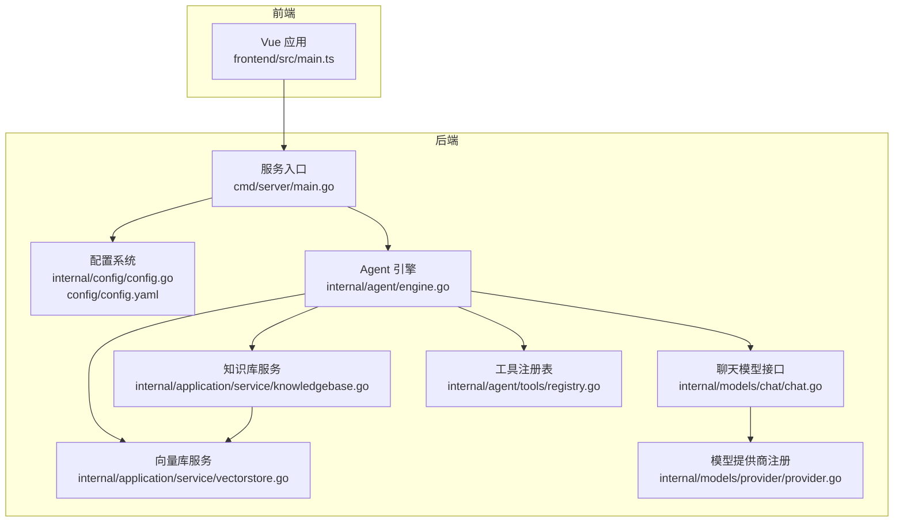
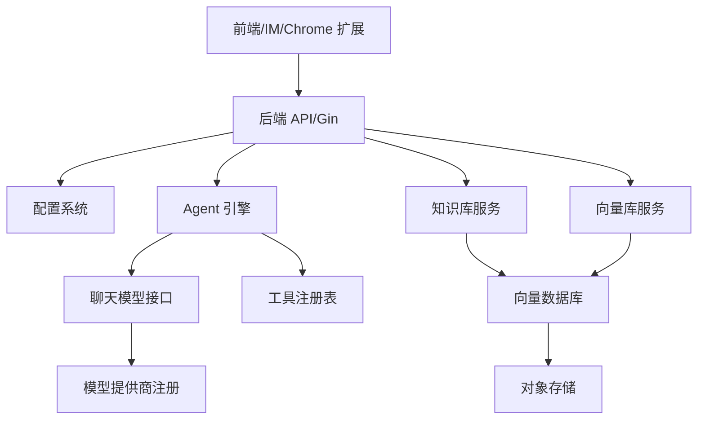
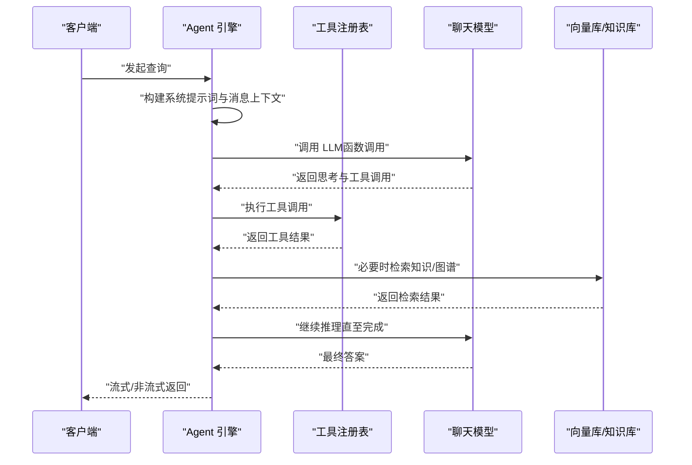
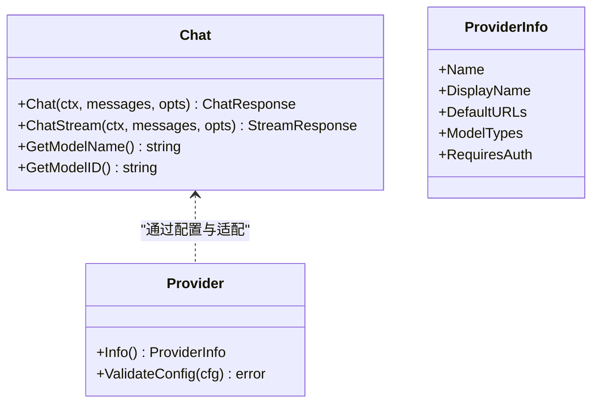
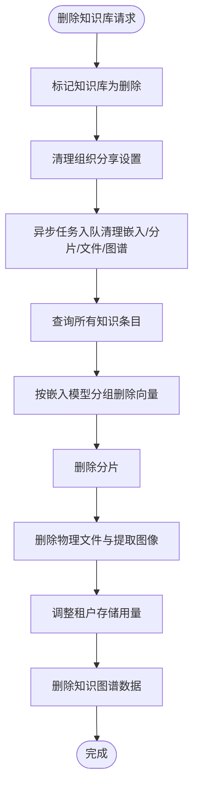
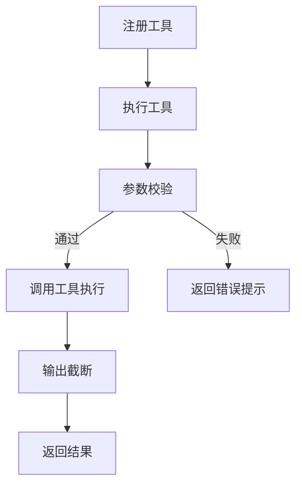
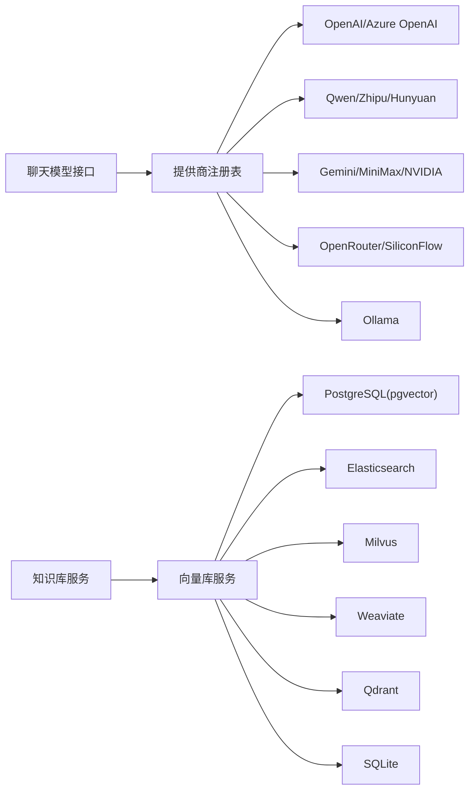

# 项目概述

<cite>
**本文引用的文件**
- [README.md](file://README.md)
- [README_CN.md](file://README_CN.md)
- [go.mod](file://go.mod)
- [cmd/server/main.go](file://cmd/server/main.go)
- [frontend/src/main.ts](file://frontend/src/main.ts)
- [internal/agent/engine.go](file://internal/agent/engine.go)
- [internal/models/chat/chat.go](file://internal/models/chat/chat.go)
- [config/config.yaml](file://config/config.yaml)
- [internal/config/config.go](file://internal/config/config.go)
- [internal/application/service/knowledgebase.go](file://internal/application/service/knowledgebase.go)
- [internal/application/service/vectorstore.go](file://internal/application/service/vectorstore.go)
- [internal/models/provider/provider.go](file://internal/models/provider/provider.go)
- [internal/agent/tools/registry.go](file://internal/agent/tools/registry.go)
- [internal/types/agent.go](file://internal/types/agent.go)
</cite>

## 目录
1. [简介](#简介)
2. [项目结构](#项目结构)
3. [核心组件](#核心组件)
4. [架构总览](#架构总览)
5. [详细组件分析](#详细组件分析)
6. [依赖分析](#依赖分析)
7. [性能考虑](#性能考虑)
8. [故障排查指南](#故障排查指南)
9. [结论](#结论)
10. [附录](#附录)

## 简介
WeKnora 是一款面向企业级场景的 LLM 驱动智能知识管理与问答框架，具备两大问答模式：
- 快速问答（Quick Q&A）：基于 RAG 的检索增强生成，适用于日常知识查询，强调速度与准确性。
- 智能推理（Intelligent Reasoning）：基于 ReAct Agent 的渐进式多步推理，可自主编排知识检索、MCP 工具与网络搜索，适合复杂任务与多源信息整合。

框架提供模块化设计、可扩展性与多厂商兼容能力，覆盖文档理解、向量检索、模型与存储替换、IM 集成、以及本地/私有云部署，满足企业对数据主权与灵活性的需求。

版本亮点（v0.4.0）包括：WeKnora Cloud 托管服务、Chrome 扩展、ClawHub 技能市场、微信 IM 集成、附件处理、Azure OpenAI 支持、阿里云 OSS、Notion 连接器、百度与 Ollama 网页搜索、VectorStore 管理、以及多项修复。

**章节来源**
- [README.md:41-67](file://README.md#L41-L67)
- [README_CN.md:41-66](file://README_CN.md#L41-L66)

## 项目结构
WeKnora 采用前后端分离与模块化后端的组织方式：
- cmd：应用入口与服务启动（Gin 路由、信号处理、优雅关停）
- config：运行时配置与提示词模板加载
- internal：核心业务逻辑（Agent 引擎、模型适配、检索、知识库、向量库、IM、MCP、工具注册等）
- client：Go 客户端 SDK
- frontend：Vue 前端应用
- docker/helm/scripts：容器化与部署脚本
- mcp-server：MCP 服务端（可选）

**图表来源**
- [cmd/server/main.go:43-123](file://cmd/server/main.go#L43-L123)
- [frontend/src/main.ts:20-30](file://frontend/src/main.ts#L20-L30)
- [internal/config/config.go:342-438](file://internal/config/config.go#L342-L438)
- [config/config.yaml:1-113](file://config/config.yaml#L1-L113)
- [internal/agent/engine.go:28-92](file://internal/agent/engine.go#L28-L92)
- [internal/models/chat/chat.go:82-146](file://internal/models/chat/chat.go#L82-L146)
- [internal/application/service/knowledgebase.go:36-62](file://internal/application/service/knowledgebase.go#L36-L62)
- [internal/application/service/vectorstore.go:24-34](file://internal/application/service/vectorstore.go#L24-L34)
- [internal/models/provider/provider.go:156-180](file://internal/models/provider/provider.go#L156-L180)
- [internal/agent/tools/registry.go:22-27](file://internal/agent/tools/registry.go#L22-L27)

**章节来源**
- [README.md:333-354](file://README.md#L333-L354)
- [README_CN.md:338-353](file://README_CN.md#L338-L353)

## 核心组件
- 服务入口与路由
  - Gin 服务器启动、优雅关停、信号处理与资源清理，统一对外 API 基座。
- 配置系统
  - YAML 配置加载、模板回填、提示词解析、校验与环境变量覆盖。
- Agent 引擎
  - ReAct 推理循环、工具调用、上下文窗口管理、Langfuse 追踪、事件总线。
- 聊天模型接口
  - 统一 Chat 接口，支持本地 Ollama 与远端多厂商模型（OpenAI、Azure OpenAI、Qwen、Gemini 等）。
- 知识库服务
  - 知识库 CRUD、计数统计、异步删除清理、嵌入与图谱数据联动。
- 向量库服务
  - 向量库 CRUD、连接测试、注册表动态更新、索引配置校验。
- 工具注册表
  - 工具注册、参数校验、执行与清理、输出截断与错误提示。
- 前端应用
  - Vue + TDesign，主题初始化、国际化、路由就绪挂载。

**章节来源**
- [cmd/server/main.go:43-123](file://cmd/server/main.go#L43-L123)
- [internal/config/config.go:342-438](file://internal/config/config.go#L342-L438)
- [config/config.yaml:1-113](file://config/config.yaml#L1-L113)
- [internal/agent/engine.go:158-298](file://internal/agent/engine.go#L158-L298)
- [internal/models/chat/chat.go:82-146](file://internal/models/chat/chat.go#L82-L146)
- [internal/application/service/knowledgebase.go:36-62](file://internal/application/service/knowledgebase.go#L36-L62)
- [internal/application/service/vectorstore.go:24-34](file://internal/application/service/vectorstore.go#L24-L34)
- [internal/agent/tools/registry.go:22-27](file://internal/agent/tools/registry.go#L22-L27)
- [frontend/src/main.ts:20-30](file://frontend/src/main.ts#L20-L30)

## 架构总览
WeKnora 的整体架构围绕“模块化、可替换”的设计展开：
- 输入层：前端 Web/REST/Chrome 扩展，IM 通道（企业微信、飞书、Slack、Telegram、钉钉、Mattermost、微信）。
- 业务层：Agent 引擎、聊天模型、工具系统、检索引擎、知识库与向量库服务。
- 数据层：PostgreSQL、Elasticsearch、Milvus、Weaviate、Qdrant、SQLite 等向量数据库；S3/MinIO/OSS/COS/TOS 等对象存储。
- 扩展层：MCP 服务、WeKnora Cloud、Notion/飞书等数据源连接器。

**图表来源**
- [README.md:164-169](file://README.md#L164-L169)
- [README_CN.md:162-166](file://README_CN.md#L162-L166)
- [internal/models/provider/provider.go:156-180](file://internal/models/provider/provider.go#L156-L180)
- [internal/application/service/vectorstore.go:162-189](file://internal/application/service/vectorstore.go#L162-L189)

## 详细组件分析

### Agent 引擎（ReAct 推理）
- 设计理念
  - 通过“思考-分析-行动-观察”循环，结合知识检索、MCP 工具与网络搜索，逐步逼近最终结论。
  - 支持上下文窗口压缩、令牌估算、Langfuse 追踪、事件总线与多轮会话。
- 关键流程
  - 构建系统提示词（支持技能元数据与多语言）、准备消息上下文、构建工具定义、执行迭代循环、处理空响应与卡死检测、最终合成答案。
- 并行工具调用
  - 可配置并行工具调用，提升复杂任务处理效率。

**图表来源**
- [internal/agent/engine.go:158-298](file://internal/agent/engine.go#L158-L298)
- [internal/agent/tools/registry.go:87-159](file://internal/agent/tools/registry.go#L87-L159)
- [internal/models/chat/chat.go:82-94](file://internal/models/chat/chat.go#L82-L94)

**章节来源**
- [internal/agent/engine.go:28-92](file://internal/agent/engine.go#L28-L92)
- [internal/agent/engine.go:341-405](file://internal/agent/engine.go#L341-L405)
- [internal/agent/engine.go:422-603](file://internal/agent/engine.go#L422-L603)
- [internal/agent/tools/registry.go:43-85](file://internal/agent/tools/registry.go#L43-L85)

### 聊天模型接口与多厂商兼容
- 统一 Chat 接口
  - 支持非流式与流式聊天，抽象模型名称与 ID，封装响应格式与工具调用。
- 远端模型适配
  - 基于提供商注册表，自动识别与定制请求/端点/头部，兼容 OpenAI、Azure OpenAI、Qwen、Gemini、MiniMax、NVIDIA、Novita AI、OpenRouter、Ollama 等。
- 本地模型
  - Ollama 本地推理，支持调试包装与 Langfuse 包装。

**图表来源**
- [internal/models/chat/chat.go:82-146](file://internal/models/chat/chat.go#L82-L146)
- [internal/models/provider/provider.go:141-147](file://internal/models/provider/provider.go#L141-L147)
- [internal/models/provider/provider.go:95-103](file://internal/models/provider/provider.go#L95-L103)

**章节来源**
- [internal/models/chat/chat.go:132-146](file://internal/models/chat/chat.go#L132-L146)
- [internal/models/provider/provider.go:156-180](file://internal/models/provider/provider.go#L156-L180)

### 知识库与向量库服务
- 知识库服务
  - 提供知识库的创建、查询、更新、删除与计数统计；异步删除任务清理嵌入、分片、文件与图谱数据。
- 向量库服务
  - 支持 CRUD、连接测试、版本探测、注册表动态注册；按引擎类型校验连接与索引配置。

**图表来源**
- [internal/application/service/knowledgebase.go:352-408](file://internal/application/service/knowledgebase.go#L352-L408)
- [internal/application/service/knowledgebase.go:410-543](file://internal/application/service/knowledgebase.go#L410-L543)
- [internal/application/service/vectorstore.go:36-99](file://internal/application/service/vectorstore.go#L36-L99)

**章节来源**
- [internal/application/service/knowledgebase.go:36-62](file://internal/application/service/knowledgebase.go#L36-L62)
- [internal/application/service/knowledgebase.go:157-211](file://internal/application/service/knowledgebase.go#L157-L211)
- [internal/application/service/vectorstore.go:162-189](file://internal/application/service/vectorstore.go#L162-L189)

### 工具注册表与执行
- 注册与执行
  - 工具按名称注册，首次获胜策略防止劫持；执行前参数类型转换与 JSON Schema 校验；执行后输出截断与错误提示增强。
- 生命周期
  - 会话结束时清理实现 Cleanable 接口的工具资源。

**图表来源**
- [internal/agent/tools/registry.go:43-85](file://internal/agent/tools/registry.go#L43-L85)
- [internal/agent/tools/registry.go:87-159](file://internal/agent/tools/registry.go#L87-L159)

**章节来源**
- [internal/agent/tools/registry.go:161-171](file://internal/agent/tools/registry.go#L161-L171)

### 配置系统与提示词模板
- 配置加载
  - 优先级：YAML 文件 → 环境变量替换 → 默认值回填 → 模板 ID 解析 → 校验。
- 提示词模板
  - 支持系统提示词、上下文模板、重写、兜底、摘要、关键词抽取、Agent 系统提示、图谱抽取、生成问题、意图提示等多类模板。
- 会话与知识库配置
  - 会话轮次、关键词/向量/重排阈值、摘要参数、图谱抽取参数等。

**章节来源**
- [internal/config/config.go:342-438](file://internal/config/config.go#L342-L438)
- [internal/config/config.go:573-657](file://internal/config/config.go#L573-L657)
- [config/config.yaml:8-113](file://config/config.yaml#L8-L113)

### 前端应用与运行时
- 前端初始化
  - Vue 应用挂载、主题初始化、国际化、路由就绪后再挂载，避免闪烁与跳转异常。
- 服务端运行
  - Gin 模式设置、容器构建、HTTP 服务器监听、信号处理与优雅关停。

**章节来源**
- [frontend/src/main.ts:20-30](file://frontend/src/main.ts#L20-L30)
- [cmd/server/main.go:43-123](file://cmd/server/main.go#L43-L123)

## 依赖分析
- 外部依赖与兼容性
  - 模型：OpenAI、Azure OpenAI、DeepSeek、Qwen、Zhipu、Hunyuan、Gemini、MiniMax、NVIDIA、Novita AI、SiliconFlow、OpenRouter、Ollama 等。
  - 向量库：PostgreSQL(pgvector)、Elasticsearch、Milvus、Weaviate、Qdrant、SQLite。
  - 存储：本地、MinIO、AWS S3、火山引擎 TOS、阿里云 OSS、腾讯云 COS。
  - IM：企业微信、飞书、Slack、Telegram、钉钉、Mattermost、微信。
  - 搜索：DuckDuckGo、Bing、Google、Tavily、Baidu、Ollama。
- 依赖清单（节选）
  - Gin、OpenAI SDK、Redis、Asynq、pgx、milvus、weaviate、qdrant、minio、aws-sdk、neo4j、ollama、wails 等。

**图表来源**
- [README.md:194-201](file://README.md#L194-L201)
- [README_CN.md:192-199](file://README_CN.md#L192-L199)
- [go.mod:5-81](file://go.mod#L5-L81)

**章节来源**
- [README.md:194-201](file://README.md#L194-L201)
- [README_CN.md:192-199](file://README_CN.md#L192-L199)
- [go.mod:5-81](file://go.mod#L5-L81)

## 性能考虑
- 上下文窗口管理
  - 令牌估算与压缩、工具调用与结果的保留策略，避免上下文溢出。
- 并行工具调用
  - 支持并发执行多个工具调用，缩短复杂任务处理时间。
- 检索优化
  - 混合检索（BM25 + 稀疏/稠密向量 + 重排）、父-子分块、图谱增强、索引策略优化。
- 异步任务
  - 删除与重解析等重任务通过 Asynq 异步执行，降低主流程阻塞。
- 连接测试与版本探测
  - 向量库连接测试与版本探测，避免错误 SDK 使用导致协议错误。

**章节来源**
- [internal/agent/engine.go:146-156](file://internal/agent/engine.go#L146-L156)
- [internal/agent/engine.go:588-603](file://internal/agent/engine.go#L588-L603)
- [internal/application/service/vectorstore.go:75-85](file://internal/application/service/vectorstore.go#L75-L85)

## 故障排查指南
- 配置校验
  - OIDC 配置完整性、会话阈值范围、知识库分块参数合法性、服务器端口范围等。
- 向量库连接
  - 端点与索引重复检测、环境变量冲突、连接测试失败与版本探测。
- 模型与提供商
  - BaseURL 识别、请求定制器与头部定制器、API Key 与自定义头部配置。
- Agent 执行
  - 工具参数校验失败、工具执行错误、空响应重试、卡死循环检测、最终答案合成。

**章节来源**
- [internal/config/config.go:440-495](file://internal/config/config.go#L440-L495)
- [internal/application/service/vectorstore.go:36-99](file://internal/application/service/vectorstore.go#L36-L99)
- [internal/models/provider/provider.go:215-267](file://internal/models/provider/provider.go#L215-L267)
- [internal/agent/tools/registry.go:113-125](file://internal/agent/tools/registry.go#L113-L125)
- [internal/agent/engine.go:528-547](file://internal/agent/engine.go#L528-L547)

## 结论
WeKnora 以模块化与可替换为核心，构建了从文档解析、向量化、检索到 LLM 推理的完整流水线，支持企业级部署与多厂商兼容。两大问答模式覆盖从日常查询到复杂推理的广泛场景，结合知识图谱、MCP 工具、IM 集成与托管服务，形成高扩展、高可用、强安全的智能知识管理平台。

## 附录
- 版本与更新
  - v0.4.0：WeKnora Cloud、Chrome 扩展、ClawHub 技能、微信 IM、附件处理、Azure OpenAI、阿里云 OSS、Notion 连接器、百度与 Ollama 搜索、VectorStore 管理、多项修复。
  - 更早版本：ASR、飞书自动同步、OIDC、IM 引用回复、线程会话、文档摘要、Tavily 搜索、MCP 自动重连、并行工具调用、Agent @提及范围限制、登录页性能优化、Telegram/DingTalk/Mattermost、斜杠命令与 QA 队列、推荐问题、VLM 自动描述、Novita AI、MCP 名称稳定性、来源频道标记、重要修复等。
- 快速开始
  - Docker Compose 启动、可选 profile（neo4j/minio/jaeger/full）、服务地址（Web UI/API/Tracing）。
- 开发指南
  - 快速开发模式（前端热重载、后端快速重启、IDE 断点调试）。

**章节来源**
- [README.md:52-161](file://README.md#L52-L161)
- [README_CN.md:51-159](file://README_CN.md#L51-L159)
- [README.md:226-267](file://README.md#L226-L267)
- [README_CN.md:224-267](file://README_CN.md#L224-L267)